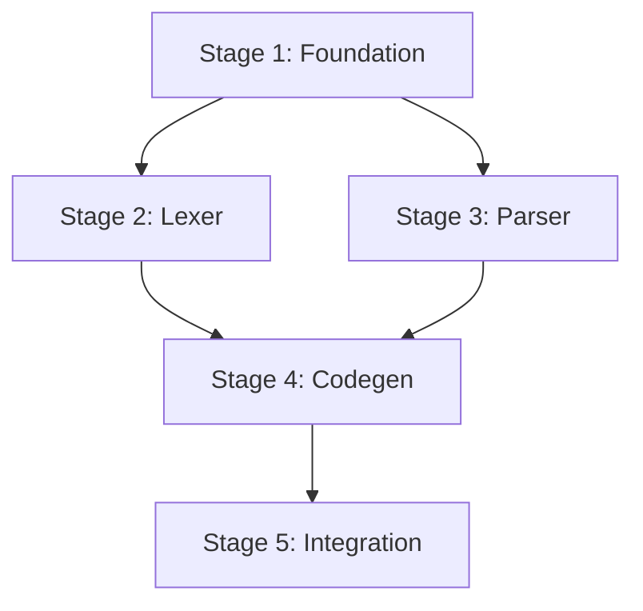

# Spec Protocol — Stage-Gated Execution

## Tier Detection

| Tier | Trigger | Action |
|------|---------|--------|
| 0 | Simple task | No spec needed |
| 1 | 3+ files OR 3+ steps | Create PLAN.md |
| 2 | 5+ files OR multi-layer | Create spec with stages |
| 3 | 20+ files OR compiler/kernel | MANDATORY full spec |

## Required Files (Tier 2+)

ALL spec files MUST be CAPITALIZED and stored in `.claude/specs/`:

```
.claude/specs/<session-id>/
├── .active              # Points to current spec name
└── <spec-name>/
    ├── SPEC.md          # Requirements + acceptance criteria
    ├── PLAN.md          # Stage overview + dependencies
    ├── STATUS.md        # Live progress with test counts
    ├── MEMORY.md        # Survives compaction + error cases
    ├── ENVIRONMENT.md   # Hardware/resource requirements (NEW)
    └── stages/
        └── STAGE-NN.md  # Detailed stage files
```

### ENVIRONMENT.md (Mandatory for All Tiers)

Documents the execution environment:
- Hardware available (CPU, memory, disk, GPU)
- External resources (remote servers, USB devices, APIs)
- Software dependencies (compilers, runtimes)
- Network requirements (endpoints, protocols)

## Stage Execution

```
For each stage:
1. Read stages/stage-NN.md
2. TDD: Write tests → headers → implementation
3. Run acceptance tests
4. If fail → fix code → retry (max 10 times)
5. Run security checklist
6. Update memory.md
7. Mark COMPLETE in STATUS.md
```

## Gate Requirements

A stage is COMPLETE only when:
- All files in stage definition exist
- All acceptance tests pass
- Security checklist passes

## Parallel Stages

Stages can run in parallel when they have no dependencies on each other.
This MUST be documented in PLAN.md and enforced during execution.

### Parallel Execution Rules

1. **Dependency Graph**: PLAN.md must show which stages can run in parallel
2. **Isolation**: Parallel stages must not modify the same files
3. **Synchronization**: All parallel stages must complete before dependent stages start
4. **MEMORY.md Updates**: Each parallel agent must update MEMORY.md with its learnings

### PLAN.md Parallel Documentation Format

```markdown
## Dependency Graph



## Parallel Execution Plan

| Stage Group | Stages | Can Parallelize |
|-------------|--------|-----------------|
| Group 1 | Stage 1 | No (foundation) |
| Group 2 | Stage 2, 3 | Yes (independent) |
| Group 3 | Stage 4, 5 | No (sequential) |
```

### Agent Spawning for Parallel Stages (Worktree Isolation)

ALWAYS use `isolation: "worktree"` for parallel agents. This creates a separate
git branch per agent — no file conflicts between concurrent work.

```
Agent({
  description: "Stage N: <name>",
  isolation: "worktree",
  mode: "bypassPermissions",
  prompt: """
    <FULL stage file content pasted here — not a reference>
    <Relevant MEMORY.md decisions>
    <Bounded retry protocol>
    <Instructions to update STATUS.md after every action>
    <Instructions to commit with descriptive messages — NO AI attribution>
  """
})
```

### Wave-Based Execution

Group stages into waves based on dependency graph:

```
WAVE 1: Independent foundation stages (parallel worktrees)
  GATE: All merged before Wave 2

WAVE 2: Stages depending on Wave 1 (parallel worktrees)
  GATE: All merged before Wave 3

WAVE 3: Stages depending on Wave 2 (parallel worktrees)
  GATE: All merged before Wave 4
  ...
```

After each wave:
1. Merge all worktree branches: `git merge worktree-<name> --no-edit`
2. Run typecheck/tests to verify merge
3. Run post-stage reconciliation for each merged stage
4. Deploy to staging if applicable
5. Launch next wave

### CRITICAL: Launch ALL wave agents in a SINGLE message

Parallel agents MUST be launched in one response with multiple Agent tool calls.
Do NOT launch them sequentially — that defeats parallelism.

## Compaction Survival

**Before compaction** (hook triggers):
- Update memory.md with current context
- Update STATUS.md with exact position

**After compaction** (boot sequence):
1. Read STATUS.md → current stage
2. Read memory.md → restore context
3. Resume from saved position

## MEMORY.md Format

MEMORY.md must capture learnings AND error cases discovered during testing.
Update after EVERY stage completion and after discovering significant errors.

```markdown
# Project Memory

## Architecture Decisions
| Decision | Rationale | Date |
|----------|-----------|------|
| [choice] | [why] | [date] |

## Stage N Complete - [date]

### Decisions Made
- [key choices and why]

### Tests Written
- [test file]: [count] tests covering [what]

### Errors Discovered
- **Error**: [description]
- **Root cause**: [what caused it]
- **Fix**: [how it was resolved]
- **Prevention**: [how to avoid in future]

### Learnings
- [what worked/failed]

### Gotchas
- [non-obvious issues for future reference]

## Current Context
- **Stage**: [current stage number]
- **Task**: [what you're working on]
- **Blockers**: [any blockers]
- **Next**: [immediate next step]
```
