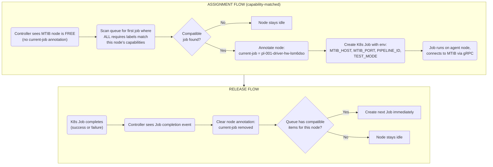

# Validation System - Final Architecture (ARCHIVED)

> **ARCHIVED** — this is the original aspirational blueprint. The implementation
> diverged: the per-product `fixture_controller.py` modules described here were
> replaced by `corekinect.fixture.Fixture` declarative subclasses, and
> `MtibV2Client` was replaced by `MtibV1Client`. See
> `docs/platform/validation-system/index.md` for the current component map.

---

## Design Decisions Summary

| Decision | Choice | Rationale |
|----------|--------|-----------|
| Trigger mechanism | Bitbucket webhooks → Concord API + manual UI trigger | Full automatic like GitHub Actions, centralized orchestration |
| Build location | K8s Deployment (long-running build service) on agent nodes | Zero startup latency, ccache warm, uses .devcontainer images |
| Test pod location | Agent/server nodes (amd64), connect to MTIB via gRPC over network | MTIB nodes ONLY run MTIB server, compute stays on agents |
| MTIB version | V2 exclusively | 71 RPCs: FlashProgram, UartStream, PowerMeasure, GPIO, BLE, etc. |
| HW test orchestration | Python test runner using individual MTIB RPCs | Not Twister device runner or `mtib_twister_run` — we need power correlation + artifact control |
| Artifact storage | MinIO with structured prefix hierarchy | Decoupled, existing pattern, persistent, shared |
| Stage progression | K8s Job watcher (event-driven) | HTTP API stays stateless, no polling |
| State management | K8s-native (labels, annotations, Job status) | K8s is source of truth for live orchestration; PostgreSQL for historical results/UI only |
| Bitbucket reporting | Commit statuses + Concord dashboard | Dual visibility |
| Driver repos | Grouped by sensor type (accelerometers, ppg, temperature) | Simpler submodule management |
| Stage 4 cadence | Tag-filtered: commit (fast subset), weekly (full suite incl. endurance/FUOTA), release (everything) | Per-commit catches regressions fast; weekly validates expensive/long-running tests; CronJobs for scheduled runs |
| Stage 4 backend | Backend-in-the-loop via CoreKinect REST API | Validates device-cloud path, not just device behavior |
| Stage 4 fixture | MTIB-controlled physical test fixture (charger, button, motion, on-skin, temperature, LEDs) | Black-box tests need physical stimulation; fixture profile maps abstract actions to MTIB pins |
| Test ownership | Developers own Stages 1-3 test definitions (in repos); Concord owns Stage 4 + all execution infrastructure | Proximity: tests version with code. Stage 4 exception: inseparable from physical test infra |
| Pipeline config | Repo-first (`.concord/pipeline.yaml`) with DB override; triggers, schedules, concurrency, notifications, retry all in-repo | GitHub Actions-like developer experience; self-service onboarding; version-controlled; admin override for emergencies |
| Integration test location | Firmware repos (`.concord/tests/integration/`), not Concord monorepo | Version with firmware; same-PR test updates; TestContext contract for MTIB abstraction |
| First target driver | LSM6DSO (in accelerometers group) | Pure portable C, standard bus, moderate complexity |
| MTIB node strategy | New dedicated validation nodes with purpose + product labels | Separate from manufacturing pool |

---

## Cluster Topology

```mermaid
%%{ init: { 'flowchart': { 'wrappingWidth': 600 } } }%%
flowchart TD
    subgraph cloud ["CLOUD / COMPUTE (amd64, Ubuntu 24.04, K3s v1.33.5)"]
        subgraph cp ["Control Plane (role=server, purpose=platform)"]
            s1("`concordserver01
            10.4.45.11`")
            s2("`concordserver02
            10.4.45.12`")
            s3("`concordserver03
            10.4.45.13`")
        end
        subgraph workers ["Workers (role=agent, purpose=manufacturing|validation)"]
            a1("`concordagent01
            10.4.45.21`")
            a2("`concordagent02
            10.4.45.22`")
            a3("`concordagent03
            10.4.45.23`")
        end
        services("`**RUNS:** http-api, frontend, build-service
        pipeline-controller, test-runner pods
        PostgreSQL, MinIO, InfluxDB, Vault`")
    end

    subgraph edge ["EDGE / MTIB (arm64, Torizon OS, K3s v1.28.7)"]
        subgraph mfg ["Manufacturing MTIB Nodes (role=edge, purpose=manufacturing)"]
            m1("`verdin-imx8mm-*
            product=sigma5|alpha|theta`")
        end
        subgraph val ["Validation MTIB Nodes (role=edge, purpose=validation)"]
            subgraph val_product ["Product Fixtures (fixture_type=product)"]
                v1("`verdin-imx8mm-*
                product=alpha|sigma5`")
            end
            subgraph val_devkit ["Dev-Kit Fixtures (fixture_type=devkit)"]
                v2("`verdin-imx8mm-*
                chip=lsm6dso|lis2de12, bus=spi|i2c
                power_isolation=true`")
            end
        end
        mtib_services("`**RUNS:** mtib-server-v2 ONLY
        **PROVIDES:** Flash, UART, power, GPIO
        BLE, debug, Twister execution via gRPC`")
    end

    cloud -->|"gRPC over 10.4.45.x network"| edge

---

## K8s-Native State Management

**Core principle: Kubernetes IS the orchestration state store. The HTTP API is stateless - it creates K8s resources and reads K8s state. PostgreSQL stores only historical results for querying and the UI.**

### How State Lives in K8s

**Pipeline identity** → K8s labels on all related Jobs:
```yaml
labels:
  corekinect.com/pipeline-id: "pl-abc123"
  corekinect.com/pipeline-stage: "software"       # software, driver_hw, integration, validation
  corekinect.com/pipeline-stage-order: "1"        # numeric ordering
  corekinect.com/pipeline-product: "alpha"
  corekinect.com/pipeline-board: "alpha_b0"
  corekinect.com/pipeline-driver: "accel_drv"
  corekinect.com/pipeline-trigger: "webhook"      # webhook, manual, cron
  corekinect.com/pipeline-run-type: "commit"      # commit, regression, weekly, release
  corekinect.com/pipeline-repo: "accel_drv"
  corekinect.com/pipeline-commit: "a1b2c3d"
```

**Pipeline status** → derived from K8s Job statuses:
```
GET all Jobs WHERE labels match pipeline-id = "pl-abc123"
  → Group by pipeline-stage
  → For each stage: count active/succeeded/failed Jobs
  → Stage status = PASSED if all succeeded, FAILED if any failed, RUNNING if any active
  → Pipeline status = status of highest-order stage that has started
```

**MTIB node assignment** → K8s annotations on Jobs + node labels:
```yaml
# Job annotation (set by pipeline controller)
annotations:
  corekinect.com/mtib-node: "verdin-imx8mm-15702160"
  corekinect.com/mtib-host: "10.4.45.33"
  corekinect.com/mtib-port: "50052"

# Node annotation (set by pipeline controller for reservation)
annotations:
  corekinect.com/current-job: "pl-abc123-driver-hw-lsm6dso"
  corekinect.com/job-started: "2026-02-24T13:00:00Z"
```

**Build artifacts** → K8s Job annotations:
```yaml
annotations:
  corekinect.com/artifact-paths: '["validation/pipelines/pl-abc123/stages/software/..."]'
  corekinect.com/build-id: "build-xyz789"
  corekinect.com/firmware-version: "0.1.4"
```

### What PostgreSQL Stores (Historical Only)

PostgreSQL is populated **asynchronously by the build system controller** for:
- Historical pipeline records (for querying past runs)
- Test results with structured data (for dashboard charts, trends)
- Audit logs (who triggered what, when)
- Submodule→product mapping configuration

The HTTP API reads **live state from K8s** and **historical data from PostgreSQL**.

### Benefits

1. **HTTP API is truly stateless** - can be restarted/upgraded without losing pipeline state
2. **K8s Job controller handles retries and completions** natively
3. **kubectl** can be used to inspect/debug pipelines directly
4. **No state sync issues** between K8s and PostgreSQL for active build runs
5. **Pipeline controller crash recovery** - just re-reads current K8s state on startup

---

## Component Architecture

### 1. Pipeline Trigger API (HTTP API extension)

New endpoint on the existing Flask HTTP API:

```
POST /v2/validation/pipelines/trigger
  Body: {
    repo, branch, commit, changed_files[],
    trigger_type: "webhook"|"manual"|"cron",
    run_type?: "commit"|"regression"|"weekly"|"release"  # optional, default: "commit"
      # Determines which Stage 4 test groups execute (filtered by tag).
      # Webhooks default to "commit". Scheduled triggers pass the run_type from
      # the on.schedule entry. Manual triggers can specify any allowed_run_type.
  }
  Auth: Webhook secret or @require_permissions(VALIDATION_PIPELINES_TRIGGER)

  Trigger evaluation (for webhook triggers):
    1. Resolve effective config (repo pipeline.yaml + DB override merge)
    2. Check on.push.branches — does the pushed branch match?
    3. Check on.push.paths / ignore_paths — do changed_files intersect?
       (If paths is set and no changed file matches → skip pipeline)
       (If all changed files match ignore_paths → skip pipeline)
    4. If both checks pass → create pipeline. Otherwise → respond 200 with
       { "skipped": true, "reason": "no matching path" } (no error, just no-op).

GET /v2/validation/pipelines
  Query: status, product, repo, page, limit
  Source: K8s API for active build runs, PostgreSQL for completed/historical
  Returns: Paginated pipeline list with stage statuses

GET /v2/validation/pipelines/{id}
  Source: K8s API (Job list with label selector) for live state
  Returns: Full pipeline detail with all stages, jobs, results

POST /v2/validation/pipelines/{id}/cancel
  Action: Deletes pending K8s Jobs with matching pipeline-id label
  No PostgreSQL write needed - controller will see the deletions

POST /v2/validation/pipelines/{id}/retry
  Action: Re-creates failed Jobs for the failed stage
  K8s handles scheduling
```

**The API is stateless** - it creates K8s Jobs with the right labels and reads K8s state via the K8s API. It does NOT manage pipeline state in PostgreSQL. The build system controller asynchronously syncs completed results to PostgreSQL for historical querying.

### 2. Pipeline Controller (K8s Job Watcher)

A long-running Deployment pod that watches K8s Job events and manages pipeline progression. **All orchestration state is derived from K8s.** PostgreSQL writes are fire-and-forget for historical records.

```
pipeline-controller pod (Deployment, 1 replica)
  ├── Watches: K8s Job events (ADDED, MODIFIED, DELETED)
  │   └── Filter: labels matching corekinect.com/pipeline-id
  │
  ├── On Job completion (succeeded):
  │   ├── Read K8s: list all Jobs for this build run-id + stage
  │   ├── Derive stage status: all succeeded? any active? any failed?
  │   ├── If stage complete + all passed:
  │   │   ├── Create K8s Jobs for next stage (with proper labels)
  │   │   ├── Assign MTIB nodes (annotate Jobs + annotate nodes)
  │   │   ├── Report Bitbucket commit status (stage = SUCCESS)
  │   │   └── Async: write stage completion to PostgreSQL
  │   └── If not complete → no action (wait for more events)
  │
  ├── On Job failure:
  │   ├── Delete remaining pending Jobs for this build run (kubectl delete)
  │   ├── Release MTIB node annotations
  │   ├── Report Bitbucket commit status (pipeline = FAILURE)
  │   └── Async: write failure details to PostgreSQL
  │
  ├── On timeout (configurable per stage):
  │   ├── Delete timed-out K8s Jobs
  │   ├── Same as failure flow
  │
  ├── Crash recovery:
  │   └── On startup, list all Jobs with pipeline labels
  │       → Reconstruct state from K8s
  │       → Resume watching from current state
  │       → No data loss because K8s is the source of truth
  │
  └── Runs on: agent nodes (nodeSelector: role=agent)
```

**Implementation**: Python pod using `kubernetes.watch.Watch()` on batch/v1 Jobs. Derives all state from K8s resources. Writes to PostgreSQL asynchronously for historical querying. Bitbucket REST API for commit statuses.

### 3. Build Service (Long-Running Deployment)

A long-running pod that handles firmware compilation. Uses the same container images as each firmware project's `.devcontainer`.

**Key design choice**: The build service does NOT hardcode build commands. Each repo defines its own build recipe via a `.concord/build.yaml` manifest. The build service provides the environment (container, ccache, modules) and executes whatever the manifest says. This keeps build logic in the repo where it belongs — not buried in infrastructure code.

```
build-service pod (Deployment, 1 replica per container image)
  ├── Container: from pipeline config (e.g., ncs-fw-dev:2.4.2)
  │   Each firmware project may use a different container image.
  │   The build service runs the image specified in the build system config.
  │
  ├── Runs on: agent nodes (nodeSelector: role=agent)
  │
  ├── Volume mounts:
  │   ├── ccache-pvc (persistent, shared across builds)
  │   ├── west-modules-pvc (cached Zephyr/NCS modules)
  │   └── workspace-pvc (build workspace, can be ephemeral)
  │
  ├── Accepts build requests via:
  │   └── gRPC service (BuildService)
  │       ├── Build(repo, commit, manifest_override?) → build_id
  │       ├── GetBuildStatus(build_id) → status, progress
  │       ├── StreamBuildLogs(build_id) → stream of log lines
  │       └── Internal queue for serialization
  │
  ├── Build flow (direct repo build):
  │   1. git clone/fetch repo at specific commit
  │   2. Read .concord/build.yaml from the repo (or use override from request)
  │   3. Execute named build steps defined in manifest
  │   4. Upload specified artifacts to MinIO
  │   5. Return artifact paths
  │
  ├── Build flow (dependent/cross-repo build):
  │   When a DRIVER repo changes, the build system needs to build FIRMWARE repo
  │   tests with the new driver version. The build service handles this:
  │   1. git clone FIRMWARE repo (e.g., alpha_fw) at its HEAD or specified commit
  │   2. Apply submodule overrides: point the driver submodule to the triggered commit
  │      (e.g., accel_drv submodule → triggered commit abc123)
  │      Implementation: git submodule set-url + git submodule update, or
  │      west manifest --override if using west workspace
  │   3. Read .concord/build.yaml from the FIRMWARE repo
  │   4. Execute the named build (e.g., "test_native" for stub-based app tests)
  │   5. Upload artifacts to MinIO
  │   This is how Stage 1 app-level stub tests work:
  │   - Driver repo push triggers build run
  │   - Build service builds alpha_fw/tests/app/ with new driver version
  │   - Stage 1 Job runs those tests on native_sim
  │
  ├── Source code authentication:
  │   ├── Git SSH key sourced from Vault (kv/config/validation/git-ssh-key)
  │   ├── Mounted as volume: /root/.ssh/id_ed25519
  │   ├── known_hosts pre-configured for Bitbucket
  │   ├── Submodule auth: git config uses same SSH key (insteadOf https → ssh)
  │   └── Build pod ServiceAccount has Vault K8s auth for secret retrieval
  │
  └── If no .concord/build.yaml exists in repo:
      └── Use buildConfig from ValidationPipelineConfig (PostgreSQL)
          as fallback. This allows configuring builds via the API/UI
          without requiring a file in the repo.
```

#### Build Manifest (`.concord/build.yaml`)

Lives in each firmware/driver repo. Defines how to build that specific project.

```yaml
# Example: alpha_fw/.concord/build.yaml
version: 1
container: containers.ad.corekinect.com/ncs-fw-dev:2.4.2

builds:
  # Full product firmware (dual MCU)
  firmware:
    steps:
      - west update
      - ./build_all.sh --board alpha_b0
    artifacts:
      - build/nrf52840/zephyr/merged.hex
      - build/nrf9151/zephyr/merged.hex
      - build/nrf52840/zephyr/mcuboot_signed.hex

  # Twister tests for native_sim (stub-based app tests)
  test_native:
    steps:
      - west update
      - twister -p native_sim -T tests/app/ --outdir twister-out
    artifacts:
      - twister-out/twister_report.xml
      - twister-out/  # full output directory

  # Twister test firmware for hardware testing
  # NOTE: Firmware repos CAN list boards because they know their own board.
  # Driver repos do NOT — the build system provides ${BOARD} from SubmoduleMapping.
  test_device:
    boards: [alpha_b0/nrf52840]
    steps:
      - west update
      - twister -p ${BOARD} --prep-artifacts-for-testing -T tests/ --outdir twister-out
    artifacts:
      - twister-out/
```

```yaml
# Example: accel_drv/.concord/build.yaml
version: 1
container: containers.ad.corekinect.com/ncs-fw-dev:2.4.2

builds:
  # Interface contract tests — always native_sim, product-agnostic
  test_native:
    steps:
      - west update
      - twister -p native_sim -T tests/interface/ --outdir twister-out
    artifacts:
      - twister-out/twister_report.xml

  # Hardware test firmware — board is provided by pipeline, NOT hardcoded here.
  # The build service substitutes ${BOARD} from the SubmoduleMapping.
  # E.g., pipeline knows alpha uses lsm6dso on alpha_b0 → passes BOARD=alpha_b0/nrf52840.
  test_device:
    steps:
      - west update
      - twister -p ${BOARD} --prep-artifacts-for-testing -T tests/${CHIP}/ --outdir twister-out
      - cp tests/${CHIP}/test_spec.yaml twister-out/ 2>/dev/null || true
      - python3 scripts/extract_board_features.py --dts twister-out/${CHIP}/build/zephyr/zephyr.dts --node ${CHIP}0 --board ${BOARD} --chip ${CHIP} -o twister-out/board_features.json
    artifacts:
      - twister-out/
      - tests/${CHIP}/test_spec.yaml
      - twister-out/board_features.json
```

**Why no `boards:` field in the driver's build manifest**: The driver repo does NOT know which products use it. That mapping lives in `SubmoduleMapping` (PostgreSQL). When the build system triggers, the HTTP API looks up SubmoduleMapping and issues separate `BuildRequest` calls for each product/board/chip combination. The build manifest just defines *how* to build — the build system decides *for what*.

```yaml
# Example: A repo with a custom/ugly build process
version: 1
container: containers.ad.corekinect.com/custom-build-env:1.0

builds:
  firmware:
    env:
      NRF_TOOLCHAIN_VERSION: "2.6.0"
      EXTRA_CMAKE_FLAGS: "-DCONFIG_DEBUG=y -DCONFIG_LOG_LEVEL=4"
    steps:
      - source /opt/ncs/setup.sh
      - west update --narrow
      - west build -b ${BOARD} -- ${EXTRA_CMAKE_FLAGS}
      - west build -t dfu_package
    artifacts:
      - build/zephyr/merged.hex
      - build/zephyr/dfu_application.zip
```

**Why this works**:
- **Repo-specific build logic stays in the repo**: If alpha_fw has a `build_all.sh` that does dual-MCU orchestration, that script is called from the manifest. The build service doesn't need to know about dual-MCU builds.
- **New repos are self-onboarding**: Add a `.concord/build.yaml`, configure the webhook, and the build system works.
- **Build commands can be ugly**: The manifest is just a list of shell commands. Whatever your build process needs, it can do.
- **`${BOARD}` and `${CHIP}` variable expansion**: For per-board builds, the build service substitutes `${BOARD}` and `${CHIP}` from the `BuildRequest` parameters. For driver repos, these come from SubmoduleMapping (the build system decides). For firmware repos, `${BOARD}` comes from the manifest's `boards` list (the firmware repo knows its own board).
- **Fallback to DB config**: If a repo doesn't have `.concord/build.yaml` (e.g., during onboarding), the build config from `ValidationPipelineConfig` in PostgreSQL is used. This lets admins configure builds via the API/UI.

**Key optimization**: ccache PVC keeps compilation cache warm. First build is slow (5-15 min), subsequent builds with cache are fast (30s-2min for incremental changes).

#### Build Service Concurrency Model

```
The build service processes builds from an internal queue:

- Queue: in-memory, FIFO, bounded (max 50 pending builds)
- Workers: configurable concurrency (default: 2 concurrent builds)
  - Each worker uses a separate workspace directory (workspace-0/, workspace-1/)
  - ccache is shared across workers (thread-safe by design)
  - west module cache is shared (read-mostly, locking handled by west)

- Queueing behavior:
  - Build() RPC returns immediately with build_id and status=QUEUED
  - Worker picks up next build from queue when free
  - If queue is full → Build() returns RESOURCE_EXHAUSTED error
  - Pipeline controller retries with exponential backoff

- Build timeout:
  - Per-build timeout from BuildRequest.timeout_seconds (default: 900s)
  - Worker kills build process if timeout exceeded → status=FAILED, error="build timeout"

- Multi-image strategy:
  - Different repos may need different container images (e.g., ncs-fw-dev:2.4.2 vs 2.6.0)
  - Phase 1: single build service with the primary container image (ncs-fw-dev:2.4.2)
  - Phase 2: if needed, deploy multiple build-service replicas with different images
    labeled by image tag. Pipeline controller routes build requests to the correct
    replica based on the container field in .concord/build.yaml.
```

#### HTTP API → Build Service Communication

```
The HTTP API sends build requests to the build service via gRPC:

1. HTTP API receives webhook → resolves affected products and builds needed
2. For each build: calls BuildService.Build(BuildRequest) → gets build_id
3. Stores build_ids in a K8s ConfigMap:
   Name: pipeline-builds-{build_run_id}
   Data: { "builds": [{ "build_id": "...", "build_name": "...", "status": "QUEUED" }] }
4. Returns build_run_id + build_ids to the webhook caller

The build system controller picks up from here:
1. Watches ConfigMaps with label pipeline-id={id}
2. Polls BuildService.GetBuildStatus(build_id) every 10s for each pending build
   (polling, not streaming, because builds are infrequent and short)
3. Updates ConfigMap data as builds complete
4. When ALL builds complete → creates Stage 1 Jobs

Alternative considered: gRPC streaming from build service to controller.
Rejected because: adds complexity for a low-frequency operation. Polling at 10s
is sufficient — builds take 1-15 minutes, a 10s check interval is negligible.
```

#### Pipeline Controller High Availability

```
The build system controller is a single-replica Deployment. HA is achieved through
crash recovery, not multi-replica consensus:

- Single replica: avoids split-brain issues with K8s watchers.
  Two controllers watching the same Jobs would create duplicate next-stage Jobs.
- Crash recovery: on restart, controller reconstructs ALL state from K8s
  (Jobs, Node annotations, ConfigMaps). No state is lost.
- Startup sequence:
  1. List all nodes with corekinect.com/current-job annotation → rebuild MTIB pool state
  2. List all Jobs with corekinect.com/pipeline-id label → rebuild system states
  3. Cross-reference: clear stale annotations (node annotated but no matching Job)
  4. List ConfigMaps with pipeline-builds label → check for pending builds
  5. Start K8s Watch from current resourceVersion (no missed events)
  6. Start 60s reconciliation loop (backstop for missed watch events)
- Liveness probe: HTTP /healthz endpoint (returns 200 if watch stream is active)
- Restart policy: Always (K8s restarts on crash, OOM, probe failure)
- Leader election: NOT needed for single replica. If we later need HA (multi-replica),
  use K8s Lease-based leader election (client-go LeaderElection). Only the leader
  runs the watch loop; standbys wait.

DB migration ordering:
- Pipeline controller does NOT run DB migrations on startup.
- Migrations are run by a separate K8s Job (concord-migration) that runs BEFORE
  the controller Deployment in the Helm install/upgrade:
    helm hooks: pre-install, pre-upgrade
  This ensures the database schema is ready before any controller logic runs.
  The migration Job uses the same Prisma schema as the HTTP API.
```

### 4. Test Runner Pods (K8s Jobs)

Short-lived K8s Jobs that execute test logic. Different pod types per pipeline stage.

#### Stage 1: Software Test Runner (native_sim, no hardware)
```yaml
# Runs app-level stub driver tests on native_sim.
# Stubs pre-configured with known sensor values → tests verify app logic
# (state machines, thresholds, alert conditions, sensor fusion).
# No hardware needed - runs on any agent node.
# We do NOT run register emulation tests — see philosophy doc Section 3.1a.
container: ncs-fw-dev:2.4.2
nodeSelector: { corekinect.com/role: agent }
env:
  - PIPELINE_ID, STAGE, JOB_ID
  - MINIO_URL, BUILD_ARTIFACT_PATH
flow:
  1. Download build artifacts from MinIO (built by build-service)
  2. Run twister -p native_sim -T tests/app/ (firmware repo)
     or twister -p native_sim -T tests/interface/ (driver repo)
  3. Upload JUnit XML results to MinIO
  4. Exit 0 (pass) or 1 (fail)
```

#### Stage 2: Driver Hardware Test Runner
```yaml
# Python test orchestrator that uses individual MTIB V2 RPCs.
# Does NOT use Twister's device runner or mtib_twister_run.
# Parses ztest UART markers for per-test result + power correlation.
# See philosophy doc Section 3.2 for the full architecture.
container: concord-driver-test-runner:latest
nodeSelector: { corekinect.com/role: agent }
env:
  - PIPELINE_ID, STAGE, JOB_ID
  - MINIO_URL, BUILD_ARTIFACT_PATH
  - MTIB_HOST      # set by controller at Job creation time
  - MTIB_PORT      # set by controller at Job creation time
  - PRODUCT, BOARD, DRIVER
  - TEST_MODE      # "full" (dev-kit: power budgets enforced) or "functional" (product: power captured only)
                   # Set by pipeline controller based on the target's test_mode from pipeline.yaml.
                   # Dev-kit fixtures → TEST_MODE=full (isolated power measurement is meaningful).
                   # Product-board fixtures → TEST_MODE=functional (can't isolate single sensor current).
flow:
  1. Download test firmware hex + test_spec.yaml + board_features.json from MinIO
  2. Connect to MTIB V2 gRPC at MTIB_HOST:MTIB_PORT
  3. Flash test firmware via MTIB FlashProgram
  4. Start concurrent MTIB streams:
     - PowerMeasure (continuous, main channel)
     - UartStream (bidirectional, for ztest output)
  5. Power on DUT via MTIB
  6. Parse ztest UART markers (START/PASS/FAIL/SKIP) with timestamps
  7. On test completion: slice power trace at per-test boundaries
  8. Evaluate acceptance criteria from test_spec.yaml:
     - Power budgets: **conditional on TEST_MODE=full** (dev-kit only).
       If TEST_MODE=functional, power stats are computed and stored but
       never cause a FAIL verdict. Budget pass/fail field in summary.json
       is set to null (not evaluated) rather than true/false.
     - Per-test timeouts (against UART timestamps) — always evaluated
     - Coverage conditions (required/required_when against board_features.json) — always evaluated
  9. Upload artifacts to MinIO:
     - junit.xml (ztest results)
     - power/{test_name}.csv (per-test power traces)
     - power/summary.json (per-test stats: avg_ua, peak_ua, energy_uj, budget_pass)
     - coverage.json (per-test: PASS/FAIL/SKIP/NOT_APPLICABLE/COVERAGE_GAP)
     - uart_log.txt, metadata.json, board_features.json
  10. Push power stats to InfluxDB (for trend analysis — both test_mode values)
  11. Exit 0 (all tests pass + power within budget if TEST_MODE=full + no coverage gaps) or 1 (any failure/gap)

# Timeout handling:
#   Session timeout: 30s after power-on, if no ztest TESTSUITE/START marker
#     appears on UART → abort with FAIL "firmware boot timeout"
#   Per-test timeout: from test_spec.yaml timeout_s (default: 60s)
#   Overall Job timeout: K8s activeDeadlineSeconds = 600 (10 min hard backstop)
```

#### Stage 3: Integration Test Runner
```yaml
# Instrumented firmware, multi-sensor orchestration, harness-driven observation
# Same MTIB queueing: controller assigns MTIB when node is free
container: concord-integration-test-runner:latest
nodeSelector: { corekinect.com/role: agent }
env:
  - PIPELINE_ID, STAGE, JOB_ID
  - MINIO_URL, FIRMWARE_ARTIFACT_PATH
  - MTIB_HOST, MTIB_PORT  # set by controller
  - PRODUCT, BOARD
flow:
  1. Download INSTRUMENTED firmware from MinIO (built with CONFIG_CONCORD_HARNESS=y)
  2. Connect to MTIB V2 gRPC
  3. Flash firmware via FlashProgram
  4. Start concurrent streams: PowerMeasure + UartStream
  5. Power on DUT
  6. Wait for Zephyr Shell prompt on UART0 (indicates boot complete + shell ready)
  7. Start UART demuxer: splits incoming UART into three channels:
     - [CONCORD:RSP] lines → harness response queue
     - [CONCORD:EVT] lines → harness event queue
     - Everything else → device log buffer
  8. Run `concord list` via shell → validate harness points match test expectations
  9. Run integration test sequence (Python test functions):
     - Each test receives TestContext with ctx.harness.*, ctx.logs, ctx.measure_power(), etc.
     - ctx.harness.get/set/inject send shell commands, await [CONCORD:RSP]
     - ctx.harness.wait_event() awaits [CONCORD:EVT] from event queue
  10. Power off DUT
  11. Generate JUnit XML from Python test results
  12. Upload artifacts: junit.xml, uart_log.txt (full raw UART), device_logs.txt (demuxed),
      power traces, harness_points.json (from concord list)
  13. Push metrics to InfluxDB
  14. Exit 0 (all pass) or 1 (any fail)

# Timeout: K8s activeDeadlineSeconds = 1800 (30 min hard backstop)

# Test definitions: Python test modules in FIRMWARE REPOS (not Concord monorepo).
# e.g., alpha_fw/.concord/tests/integration/test_vsm.py
# Each product's firmware repo owns its own integration tests because
# integration tests are product-specific and should version with the firmware.
#
# The test runner discovers test_*.py modules from the build artifacts
# (the build service includes .concord/tests/ in the artifact bundle).
# Test functions receive a TestContext object that wraps MTIB, power, harness, logs, etc.
# See "Concord as a Platform" section for the discovery mechanism and context contract.
#
# Fallback: if no .concord/tests/integration/ exists in the build artifacts,
# the runner falls back to built-in test_{product}.py in the container image
# (backward compat during migration from monorepo to firmware repo).
```

**Integration test spec** (lives in firmware repo):
```yaml
# alpha_fw/.concord/integration_spec.yaml
tests:
  boot_and_idle:
    power_budget:
      avg_ua: 50         # both MCUs idle, sensors sleeping
    timeout_s: 30
  vsm_active_monitoring:
    power_budget:
      avg_ua: 5000       # all sensors active, PPG LED pulsing
    timeout_s: 60
  ble_advertising:
    timeout_s: 30
  ipc_round_trip:
    timeout_s: 10
```

#### Stage 4: Product Validation Runner
```yaml
# Black-box production validation — tests the PRODUCT SPECIFICATION, not the implementation.
# This is the final gate before a firmware version is approved for manufacturing.
#
# Stage 4 differs from Stages 2-3 in three critical ways:
#   1. BACKEND-IN-THE-LOOP: Many tests verify data the device sends to the
#      CoreKinect cloud API (position messages, config reports, biometric data).
#      The runner needs a backend client to push config and read device messages.
#   2. FIXTURE CONTROL: Tests physically manipulate the DUT (charger relay,
#      button press, motion actuator, on-skin electrode, temperature control)
#      via MTIB GPIO/motor/ADC outputs mapped through a fixture profile.
#   3. TAG-FILTERED EXECUTION: Tests are tagged "commit", "weekly", or "release".
#      The runner filters by run_type to select which groups execute.
#
container: concord-validation-{product}:latest
nodeSelector: { corekinect.com/role: agent }
env:
  # Pipeline identity
  - PIPELINE_ID, STAGE, JOB_ID
  - MINIO_URL, FIRMWARE_ARTIFACT_PATH
  - MTIB_HOST, MTIB_PORT
  - PRODUCT, BOARD

  # Run type and tag filtering
  - RUN_TYPE              # "commit" | "regression" | "weekly" | "release"
                          # Set by pipeline controller from trigger metadata.
                          # Determines which test groups run (filtered by tag).

  # CoreCloud integration (from Vault: kv/config/validation/backend-credentials)
  # The CoreCloud Python SDK uses namespace-prefixed env vars (see
  # corecloud-library-architecture.md for the full variable catalog):
  - VAL_1_0_API_AUTH_SERVER_HOST_NAME  # Auth server for JWT token fetch
  - VAL_1_0_API_REST_SERVER_HOST_NAME  # REST API base URL
  - VAL_1_0_API_AUTH_USERNAME          # Service account username
  - VAL_1_0_API_AUTH_PASSWORD          # Service account password
  - VAL_1_0_API_KEY                    # API key (Base64-encoded)
  - VAL_1_0_DB_HOST, VAL_1_0_DB_PORT  # PostgreSQL for message queries
  - VAL_1_0_DB_USER, VAL_1_0_DB_PASS  # DB credentials
  - DEVICE_ID                          # Pre-provisioned test device ID
  - CLOUD_ENV_NAMESPACE                # "VAL_1_0" (default for validation runs)

  # Fixture control
  - FIXTURE_PROFILE       # JSON key in the Node model's fixtureProfile field.
                          # Maps abstract fixture actions (charger.connect, button.press)
                          # to physical MTIB pin assignments. Injected by the build system
                          # controller from the Node record at Job creation time.

flow:
  1. Download production firmware from MinIO (both MCU hex files)
  2. Connect to MTIB V2 gRPC at MTIB_HOST:MTIB_PORT
  3. Flash firmware (both MCUs) via MTIB FlashProgram
  4. Initialize fixture controller from FIXTURE_PROFILE
     (maps abstract actions → MTIB GPIO/motor/ADC RPCs)
  5. Initialize CoreCloud client with VAL_1_0 env vars + DEVICE_ID
  6. Start concurrent MTIB streams: PowerMeasure + UartStream
  7. Power on DUT, verify boot (UART banner within 30s)
  8. Load validation_spec.yaml, filter test groups by RUN_TYPE tags
  9. Execute test groups in order:
     For each group:
       a. Set up fixture state (e.g., charger.connect, temperature.set(45))
       b. If group requires backend: push config or wait for device data via backend client
       c. Execute test assertions (power measurements, UART parsing, ADC reads, backend API queries)
       d. Tear down fixture state (e.g., charger.disconnect, temperature.set(25))
       e. Record per-test results with measured values and spec limits
  10. Power off DUT
  11. Query backend for any remaining device messages (final verification)
  12. Generate full validation report (JSON + JUnit XML)
  13. Upload artifacts to MinIO:
      - report.json (structured results per group/test)
      - junit.xml (for Bitbucket/dashboard integration)
      - power/{group_name}.csv (per-group power traces)
      - uart_log.txt, metadata.json
      - backend_messages.json (captured device→cloud messages)
  14. Push metrics to InfluxDB (power, pass rates, durations per group)
  15. Exit 0 (all executed groups pass) or 1 (any failure)

# Timeout tiers (set by pipeline controller based on RUN_TYPE):
#   commit:          activeDeadlineSeconds = 3600   (60 min — fast subset)
#   regression:         activeDeadlineSeconds = 7200   (2 hours — commit + intermediate)
#   weekly/release:  activeDeadlineSeconds = 259200 (72 hours — full suite incl. endurance)
#
# Per-test timeouts are defined in validation_spec.yaml (default: 60s per test).
# The 72-hour backstop covers multi-day endurance tests in the weekly suite.

# Test definitions: product-specific Python test classes using the
# validation_runner.py orchestrator, backend_client.py, and fixture_controller.py.
# Each product has a dedicated container image (concord-validation-alpha,
# concord-validation-sigma5) extending the base test-runner image.
# The image includes the product's validation_spec.yaml baked in
# (from the Concord monorepo, not from the firmware repo).
# Firmware is always downloaded fresh from MinIO per-pipeline.
```

**Validation spec** (lives in Concord monorepo — Stage 4 is fully platform-owned):
```yaml
# concord/apps/validation/test-runner/src/validation/specs/alpha_validation_spec.yaml
#
# Lives in the Concord monorepo, NOT in the firmware repo.
# Stage 4 is fully platform-owned (see "Concord as a Platform" section).
#
# Defines the full Alpha product validation taxonomy.
# Each test group maps to a test domain. Tests within a group define:
#   - fixture: physical actions needed (maps to fixture_controller.py actions)
#   - backend: cloud API interactions needed (maps to backend_client.py methods)
#   - tags: execution filtering — "commit" (per-push), "weekly" (scheduled), "release" (full)
#   - criteria: acceptance thresholds (measured vs spec)
#
# The validation_runner.py loads this file, filters groups/tests by RUN_TYPE tags,
# and executes them in order using the fixture controller and backend client.

version: 1

# ─── Group 1: Power / Current ───
power:
  tags: ["commit", "weekly", "release"]
  tests:
    sleep_current:
      description: "PRDTST-348: Device in sleep mode, all sensors off, no comms"
      fixture: { charger: "disconnect" }
      criteria:
        current_ua: { max: 500 }          # PRDTST-348: < 500µA average in sleep
      timeout_s: 120
    active_current:
      description: "PRDTST-341: Device in active mode"
      fixture: { on_skin: "enable" }
      backend: { wait_for: "biometric_message", timeout_s: 60 }
      criteria:
        current_ma: { max: 150 }          # PRDTST-341: < 150mA in active mode
      timeout_s: 120
    normal_mode_current:
      description: "PRDTST-404: Device in normal use mode over 10 min period"
      fixture: { on_skin: "enable" }
      criteria:
        current_ma: { max: 50 }           # PRDTST-404: < 50mA over 10 min
      timeout_s: 660                       # 10 min measurement + margin
    lockout_current:
      description: "PRDTST-361: Device in lockout state (battery locked out)"
      criteria:
        current_na: { max: 400 }          # PRDTST-361: < 400nA in lockout
      timeout_s: 60

# ─── Group 2: Charging / BMS ───
charging:
  tags: ["weekly", "release"]
  tests:
    charge_cycle:
      description: "PRDTST-370: Full charge from 3.5V to 4.2V in under 3 hours"
      fixture: { charger: "connect" }
      criteria:
        charge_termination_v: { min: 4.15, max: 4.25 }
      timeout_s: 14400  # 4 hours max
    charger_detection:
      description: "Verify device detects charger connection/disconnection"
      fixture: { charger: "connect" }
      backend: { wait_for: "charging_status", expected: "charging" }
      criteria:
        detection_time_s: { max: 5 }
      tags: ["commit", "weekly", "release"]
      timeout_s: 30
    charge_temperature_limits:
      description: "Verify charging stops outside safe temperature range"
      fixture: { charger: "connect", temperature: { set: 46 } }
      criteria:
        charging_inhibited: true
      timeout_s: 120
    charging_led_pattern:
      description: "Verify correct LED pattern during charging states"
      fixture: { charger: "connect", led_sensor: "enable" }
      criteria:
        led_color: "orange"
        led_pattern: "breathing"
      timeout_s: 60

# ─── Group 3: BMS / Battery Management ───
bms:
  tags: ["commit", "weekly", "release"]
  tests:
    soc_reporting:
      description: "Verify SoC percentage reported to backend matches fuel gauge"
      backend: { wait_for: "heartbeat_message", field: "battery_soc" }
      criteria:
        soc_accuracy_pct: { max_deviation: 5 }
      timeout_s: 60
    battery_temp_accuracy:
      description: "Verify battery temperature reading within spec"
      fixture: { temperature: { set: 25 } }
      criteria:
        temp_accuracy_c: { max_deviation: 2 }
      timeout_s: 60
    bms_param_retention:
      description: "Verify BMS parameters survive power cycle"
      criteria:
        params_retained: true
      timeout_s: 120

# ─── Group 4: Device Configuration ───
config:
  tags: ["commit", "weekly", "release"]
  tests:
    heartbeat_interval_default:
      description: "Verify default heartbeat interval matches product spec"
      backend: { wait_for: "heartbeat_message", count: 2 }
      criteria:
        interval_s: { min: 3540, max: 3660 }  # 60 min ± 1 min
      timeout_s: 7500
    heartbeat_interval_override:
      description: "Push custom heartbeat interval via backend, verify device applies it"
      backend:
        push_config: { heartbeat_interval_s: 300 }
        wait_for: "heartbeat_message"
      criteria:
        interval_s: { min: 285, max: 315 }  # 5 min ± 5%
      timeout_s: 900
    motion_config:
      description: "Push motion detection parameters via backend"
      backend:
        push_config: { motion_threshold: 50, motion_duration: 10 }
        wait_for: "config_ack"
      criteria:
        config_applied: true
      timeout_s: 120
    timeout_config:
      description: "Verify configurable timeouts (no-motion, active monitoring)"
      backend:
        push_config: { no_motion_timeout_s: 600 }
        wait_for: "config_ack"
      criteria:
        config_applied: true
      timeout_s: 120

# ─── Group 5: Environmental Sensors ───
environmental:
  tags: ["commit", "weekly", "release"]
  tests:
    temperature_accuracy:
      description: "Verify temperature sensor reading at known setpoint"
      fixture: { temperature: { set: 25 } }
      backend: { wait_for: "environmental_message", field: "temperature_c" }
      criteria:
        accuracy_c: { max_deviation: 1.5 }
      timeout_s: 120
    humidity_reading:
      description: "Verify humidity sensor returns valid data"
      backend: { wait_for: "environmental_message", field: "humidity_pct" }
      criteria:
        range: { min: 0, max: 100 }
      timeout_s: 120
    pressure_altitude:
      description: "Verify barometric pressure and derived altitude"
      backend: { wait_for: "environmental_message", field: "pressure_hpa" }
      criteria:
        range: { min: 300, max: 1100 }
      timeout_s: 120
    extreme_temperature_operation:
      description: "Verify operation at temperature extremes (-20°C and +50°C)"
      fixture: { temperature: { set: -20 } }
      backend: { wait_for: "heartbeat_message" }
      criteria:
        device_operational: true
      tags: ["weekly", "release"]
      timeout_s: 600

# ─── Group 6: Motion / Accelerometer ───
motion:
  tags: ["commit", "weekly", "release"]
  tests:
    motion_threshold:
      description: "Verify motion detection triggers at configured threshold"
      fixture: { motion: "shake" }
      backend: { wait_for: "motion_message" }
      criteria:
        detection_time_s: { max: 5 }
      timeout_s: 30
    motion_duration:
      description: "Verify motion event reports correct duration"
      fixture: { motion: "shake_duration", duration_s: 10 }
      backend: { wait_for: "motion_message", field: "duration_s" }
      criteria:
        duration_accuracy_s: { max_deviation: 2 }
      timeout_s: 30
    motion_window:
      description: "Verify no-motion timeout triggers after motion stops"
      fixture: { motion: "shake", then: "stop" }
      backend: { wait_for: "no_motion_message" }
      criteria:
        timeout_accuracy_s: { max_deviation: 10 }
      timeout_s: 300
    motion_axis:
      description: "Verify accelerometer reports correct axis data"
      fixture: { motion: "single_axis_x" }
      backend: { wait_for: "motion_message", field: "axis" }
      criteria:
        dominant_axis: "x"
      timeout_s: 30

# ─── Group 7: GNSS ───
gnss:
  tags: ["commit", "weekly", "release"]
  tests:
    cold_start_fix:
      description: "GNSS cold start, verify position fix (real antenna/sky view)"
      backend: { wait_for: "position_message" }
      criteria:
        ttff_s: { max: 120 }
        accuracy_m: { max: 50 }
      timeout_s: 180
    warm_start_fix:
      description: "GNSS warm start after recent fix, verify faster acquisition"
      backend: { wait_for: "position_message" }
      criteria:
        ttff_s: { max: 30 }
        accuracy_m: { max: 20 }
      timeout_s: 60
    aiding_data:
      description: "Verify device uses A-GNSS aiding data from backend"
      backend:
        push_aiding: true
        wait_for: "position_message"
      criteria:
        ttff_s: { max: 15 }
      timeout_s: 60
    speed_heading:
      description: "Verify speed and heading in position message"
      fixture: { motion: "linear" }  # constant-velocity motion via actuator
      backend: { wait_for: "position_message", field: "speed_kmh" }
      criteria:
        speed_reported: true
        heading_reported: true
      tags: ["weekly", "release"]
      timeout_s: 120

# ─── Group 8: Biometric / On-Skin ───
biometric:
  tags: ["commit", "weekly", "release"]
  tests:
    on_skin_detection:
      description: "Verify device detects on-skin contact via electrode"
      fixture: { on_skin: "enable" }
      backend: { wait_for: "biometric_message" }
      criteria:
        skin_detected: true
        detection_time_s: { max: 10 }
      timeout_s: 30
    on_skin_removal:
      description: "Verify device detects removal from skin"
      fixture: { on_skin: "enable", then: "disable" }
      backend: { wait_for: "skin_off_event" }
      criteria:
        removal_detected: true
      timeout_s: 30
    biometric_message_content:
      description: "Verify biometric message contains required fields"
      fixture: { on_skin: "enable" }
      backend: { wait_for: "biometric_message" }
      criteria:
        fields_present: ["heart_rate", "spo2", "skin_temperature"]
      timeout_s: 120

# ─── Group 9: UI (Buttons / LEDs / Haptic) ───
ui:
  tags: ["commit", "weekly", "release"]
  tests:
    button_short_press:
      description: "Short button press triggers status indication"
      fixture: { button: { press: "short", duration_ms: 200 } }
      criteria:
        led_response: true
      timeout_s: 10
    button_long_press:
      description: "Long button press triggers power off / mode change"
      fixture: { button: { press: "long", duration_ms: 5000 } }
      criteria:
        mode_changed: true
      timeout_s: 15
    led_patterns:
      description: "Verify LED color patterns for each device state"
      fixture: { led_sensor: "enable" }
      criteria:
        idle_led: { color: "green", pattern: "single_blink" }
        error_led: { color: "red", pattern: "double_blink" }
      timeout_s: 60
    haptic_feedback:
      description: "Verify haptic motor activates on button press"
      fixture: { button: { press: "short", duration_ms: 200 } }
      criteria:
        haptic_fired: true
      timeout_s: 10

# ─── Group 10: Communications ───
communications:
  tags: ["commit", "weekly", "release"]
  tests:
    nfc_tag:
      description: "Verify NFC tag contains correct device identifier"
      fixture: { nfc_reader: "scan" }
      criteria:
        tag_present: true
        device_id_matches: true
      timeout_s: 15
    lte_registration:
      description: "Verify LTE-M network registration"
      criteria:
        registration_time_s: { max: 120 }
      timeout_s: 180
    ble_advertising:
      description: "Verify BLE advertising with correct service UUIDs"
      criteria:
        advertising: true
        service_uuids: ["0000180d-0000-1000-8000-00805f9b34fb"]
      timeout_s: 30
    message_content_verification:
      description: "Verify all message types contain required protocol fields"
      backend: { wait_for: "heartbeat_message" }
      criteria:
        protocol_version: true
        device_id: true
        timestamp: true
        sequence_number: true
      timeout_s: 120

# ─── Group 11: Endurance ───
endurance:
  tags: ["weekly", "release"]
  tests:
    three_day_endurance:
      description: "Run device for 72 hours, verify no crashes/hangs/memory leaks"
      fixture: { on_skin: "enable" }
      backend: { monitor_heartbeats: true, expected_interval_s: 3600 }
      criteria:
        uptime_hours: { min: 72 }
        missed_heartbeats: { max: 0 }
        crash_count: { max: 0 }
      timeout_s: 259200  # 72 hours
    operating_temperature_range:
      description: "Cycle through operating temperature range over 24 hours"
      fixture: { temperature: { cycle: [-20, 0, 25, 40, 50], hold_minutes: 60 } }
      backend: { monitor_heartbeats: true }
      criteria:
        device_operational_at_all_temps: true
      timeout_s: 86400  # 24 hours

# ─── Group 12: FUOTA (Firmware Update Over The Air) ───
fuota:
  tags: ["weekly", "release"]
  tests:
    fuota_full_update:
      description: "Trigger FUOTA via backend, verify device applies new firmware"
      backend:
        trigger_fuota: true
        firmware_version: "${NEXT_VERSION}"
        wait_for: "version_report"
      criteria:
        update_success: true
        new_version_reported: true
        update_time_s: { max: 600 }
      timeout_s: 900
    fuota_interrupted:
      description: "Interrupt FUOTA mid-transfer, verify device recovers"
      backend:
        trigger_fuota: true
      fixture: { power: { cycle_after_s: 30 } }  # cut power mid-update
      backend: { wait_for: "heartbeat_message" }
      criteria:
        device_recovered: true
        original_version_retained: true
      timeout_s: 300
    fuota_rollback:
      description: "Apply bad firmware, verify device rolls back to previous version"
      backend:
        trigger_fuota: true
        firmware_version: "${BAD_VERSION}"
        wait_for: "version_report"
      criteria:
        rollback_occurred: true
        previous_version_restored: true
      timeout_s: 600

# ─── Defaults ───
defaults:
  timeout_s: 60
  tags: ["commit", "weekly", "release"]

# ─── Metadata ───
metadata:
  product: "alpha"
  spec_version: "1.0"
  author: "validation-engineering"
  last_reviewed: "2026-02-01"
```

### 5. MTIB Queueing & Assignment (K8s-Native, Capability-Matched)

Test pods run on agent nodes and connect to MTIB over the network. The challenge: matching test jobs to available MTIB nodes that have the right hardware attached — and with two fixture types (dev-kit and product-board), a simple per-product queue is no longer sufficient.

**Design principle**: The build system controller does NOT pre-assign MTIBs to specific jobs. Instead, it maintains a **single global work queue** with capability-based matching. Each job declares `requires` labels (derived from the build system target's board name). Each MTIB node has `capabilities` labels (from the Node model in Concord). When an MTIB becomes free, the controller scans the queue for the first job whose `requires` labels are all satisfied by the node's capabilities. This is the same model as GitHub Actions runner labels — jobs find compatible runners, not the other way around.

**Why capability matching, not per-product queues**:
- **Handles two fixture types naturally**: Dev-kit jobs require `{ fixture_type: devkit, chip: lsm6dso, bus: spi }`. Product jobs require `{ fixture_type: product, product: alpha }`. A single queue with capability matching handles both without separate queue management per fixture type.
- **Natural load balancing**: If you have 3 alpha product nodes and 5 pipelines queued, each node picks up the next compatible pipeline as it finishes.
- **Natural starvation prevention**: Dev-kit nodes and product nodes have fundamentally different capabilities. A flood of product-board jobs can't consume dev-kit nodes (they don't match), and vice versa. Within each fixture type, FIFO ordering ensures fairness.
- **Scaling is trivial**: Need more throughput for a specific fixture type? Add more MTIB nodes with the matching capabilities. The queue drains faster.
- **No wasted resources**: K8s Jobs only exist when an MTIB is ready to run them. No pods spinning, waiting for hardware.

**How it works**:

Pipeline controller maintains an in-memory work queue (rebuilt from K8s state on restart):

```
WORK QUEUE (single global FIFO, capability-matched):
  1. { pipeline: pl-001, stage: driver_hw, driver: lsm6dso, test_mode: full,
       requires: { fixture_type: devkit, chip: lsm6dso, bus: spi } }
  2. { pipeline: pl-001, stage: driver_hw, driver: lsm6dso, test_mode: functional,
       requires: { fixture_type: product, product: alpha } }
  3. { pipeline: pl-002, stage: driver_hw, driver: pah8151, test_mode: functional,
       requires: { fixture_type: product, product: alpha } }
  4. { pipeline: pl-001, stage: integration,
       requires: { fixture_type: product, product: alpha } }
  5. { pipeline: pl-003, stage: driver_hw, driver: lis2de12, test_mode: full,
       requires: { fixture_type: devkit, chip: lis2de12, bus: i2c } }

MTIB NODE POOL (from K8s node labels + Node.capabilities):
  verdin-xxx-001: fixture_type=product, product=alpha, status=BUSY (running pl-000)
  verdin-xxx-002: fixture_type=product, product=alpha, status=FREE
  verdin-xxx-003: fixture_type=product, product=sigma5, status=FREE
  verdin-xxx-004: fixture_type=devkit, chip=lsm6dso, bus=spi, mcu=nrf52840, status=FREE
  verdin-xxx-005: fixture_type=devkit, chips=[lsm6dso,lis2de12], bus=i2c, mcu=nrf52840, status=FREE
```

When verdin-xxx-004 becomes free, the controller scans the queue:
- Item 1: requires `{ fixture_type: devkit, chip: lsm6dso, bus: spi }` → node has all labels → **match** → assign.
When verdin-xxx-002 becomes free:
- Item 1 was already assigned. Item 2: requires `{ fixture_type: product, product: alpha }` → node has both → **match** → assign.
When verdin-xxx-003 becomes free:
- Item 3: requires `{ fixture_type: product, product: alpha }` → node is sigma5 → no match. Item 4: requires alpha → no match. Item 5: requires devkit → no match. → **no compatible job**, node stays idle.



**Pipeline serialization**: A single build run's hardware stages run on ONE MTIB at a time per target. Stage 2 (driver HW) completes, then Stage 3 (integration) goes to back of queue. If 3 compatible MTIBs are free and 3 pipelines are queued, all 3 run concurrently. If 1 compatible MTIB and 3 pipelines, they run sequentially in FIFO order.

**Crash recovery**: On startup, controller:
1. Lists all K8s nodes with `corekinect.com/current-job` annotations → these are busy
2. Lists all K8s Jobs with pipeline labels → these are in-flight
3. Lists all completed pipelines that have pending stages → these need re-queueing
4. Rebuilds the work queue from this state

**Queue persistence**: The queue itself doesn't need persistence because it can be reconstructed from K8s state. Pending items = pipelines whose current stage hasn't had Jobs created yet. The build system's existence (as K8s Jobs with labels) IS the queue state.

#### Queue Priority and Starvation Prevention

The MTIB work queue is a **single global FIFO** with capability matching. Priority is implicit: pipelines are served in the order their stages become ready. No explicit priority levels.

**Starvation prevention**:
- Different fixture types naturally partition the queue. Dev-kit jobs can't consume product nodes (different `fixture_type`), and product jobs can't consume dev-kit nodes. A flood of product-board jobs cannot starve dev-kit tests, and vice versa.
- Within the same fixture type: FIFO ordering means a new pipeline waits behind all previously-queued compatible stages. If pipeline pl-003's Stage 2 (alpha product) is queued behind pl-001 and pl-002 (also alpha product), it waits its turn.
- Different products using the same fixture type (e.g., alpha product and sigma5 product) are also naturally partitioned by their `product` capability — alpha jobs skip sigma5 nodes during the queue scan.
- There is no preemption. A running Job always runs to completion (or timeout). This avoids the complexity and risk of interrupting hardware tests mid-execution.

**Stuck job detection**:
```
Pipeline controller monitors K8s Job age against expected duration:

1. K8s activeDeadlineSeconds is the hard backstop — K8s kills the Job.
   (Per-stage values: Stage 2 = 600s, Stage 3 = 1800s,
    Stage 4 = 3600s for commit runs, 259200s for weekly/release runs)
2. Controller-level check: if a Job has been Running for > 2× the stage's
   expected duration (from ValidationPipelineConfig), log a warning.
3. On Job timeout/kill:
   - Release MTIB node annotation
   - Mark Job as FAILED with error "execution timeout"
   - Proceed with normal failure handling (per-product lane failure)
4. If an MTIB node's current-job annotation references a Job that doesn't exist
   (detected in the 60s reconciliation loop) → clear the annotation immediately.
```

**Queue depth monitoring**:
- The build system controller exposes queue depth per fixture type and per capability set as metrics (for Grafana/Prometheus). Example: `queue_depth{fixture_type="devkit", chip="lsm6dso"}`, `queue_depth{fixture_type="product", product="alpha"}`.
- If queue depth for any capability group > configurable threshold (default: 5), a warning is logged. This indicates either insufficient MTIB nodes of that type or too-frequent triggers.

#### Pipeline Concurrency & Supersede Policy

When a new commit is pushed to the same repo+branch while an existing pipeline is still running, the behavior is controlled by the `concurrency:` block in `.concord/pipeline.yaml`:

```
concurrency:
  group: "${{ repo }}/${{ branch }}"   # Pipelines with the same group key compete
  supersede: true | false | "none"     # What happens when groups collide

SUPERSEDE RULES:
1. The HTTP API checks for active build runs with the same concurrency group.
   (Same commit is handled by deduplication — returns existing build_run_id.)
   Default group is "${{ repo }}/${{ branch }}" — per-branch deduplication.

2. supersede: "none" (default for repos without concurrency: block)
   - Both pipelines run concurrently (FIFO ordering in the MTIB queue).
   - WHY this is the safe default:
     - Hardware tests may be mid-execution. Cancelling a running test wastes the
       MTIB time already spent and may leave hardware in an unknown state.
     - The FIFO queue naturally handles this: the newer build run's Stage 2+ Jobs
       queue behind the older build run's Jobs.
     - Auto-cancellation adds complexity for minimal benefit when MTIB throughput
       is the bottleneck anyway.

3. supersede: true (cancel_pending — recommended for active feature branches)
   - Cancel any PENDING (not yet Running) Jobs from the older build run
   - Let any RUNNING Jobs finish (don't interrupt hardware)
   - The older pipeline ends as CANCELLED
   - This is the "GitHub Actions concurrency cancel-in-progress" equivalent,
     adapted for hardware safety (never kills a running hardware test)

4. supersede: false (queue — wait for old to finish)
   - New pipeline is created but all its Jobs are held in PENDING state
   - When the older pipeline completes (pass or fail), queued Jobs proceed
   - Useful for repos where every commit must be independently validated

5. UI/API provides:
   - POST /v2/validation/pipelines/{id}/cancel — manual cancel at any time
   - Pipeline list shows all active build runs per repo, making it visible
     when multiple pipelines are queued for the same branch
```

#### Scheduled Validation (Repo-Driven Schedules)

Per-commit pipelines run a fast Stage 4 subset (tests tagged `"commit"`). Long-running tests — multi-day endurance, full charge cycles, FUOTA, environmental extremes — run on a scheduled cadence. **Schedules are defined in each repo's `.concord/pipeline.yaml`** under the `on.schedule` block, not as manually-maintained K8s CronJobs. This follows the GitHub Actions pattern: the schedule lives with the code.

```
How repo-driven scheduling works:

1. Schedule Reconciler (runs in the build system-controller)
   - On startup and periodically (every 5 min), scans all connected repos
   - Reads on.schedule entries from each repo's effective config
     (pipeline.yaml + DB override merge)
   - Reconciles a K8s CronJob for each (repo, schedule) pair:
     concord-schedule-{repo_slug}-{run_type}  (e.g., concord-schedule-accel_drv-weekly)
   - If a repo removes a schedule entry → reconciler deletes the CronJob
   - If a repo adds a schedule entry → reconciler creates a new CronJob
   - DB override on.schedule: [] → disables all schedules (empty array overrides)

2. CronJob execution:
   Each reconciled CronJob runs a lightweight trigger container:
     POST /v2/validation/pipelines/trigger {
       repo: "{repo_url}",
       branch: "main",               // schedules always run against default branch
       commit: HEAD of main,
       trigger_type: "cron",
       run_type: "{from on.schedule entry}"  // "weekly", "regression", etc.
     }
   Uses a ServiceAccount with VALIDATION_PIPELINES_TRIGGER permission.

3. Example: given this repo config:
     on:
       schedule:
         - cron: "0 2 * * 0"
           run_type: weekly
         - cron: "0 1 * * 1-6"
           run_type: regression

   The reconciler creates two CronJobs:
     concord-schedule-accel_drv-weekly   → "0 2 * * 0"  → run_type: weekly
     concord-schedule-accel_drv-regression  → "0 1 * * 1-6" → run_type: regression

4. Effects by run_type:
   - weekly: Full pipeline (Stages 1-4), Stage 4 includes all test groups
     (tagged "commit" + "weekly"), activeDeadlineSeconds = 259200 (72 hours),
     endurance/FUOTA/environmental extremes execute.
   - regression: Commit-level + intermediate tests, activeDeadlineSeconds = 7200
     (2 hours), catches regressions from the day's merged commits.
   - Deduplication: if a build run for the same (repo, commit) is already active,
     the trigger API returns the existing build_run_id (no duplicate run).

5. Release Validation (manual, not scheduled):
   - Triggered via Concord UI or API with run_type: "release"
   - POST /v2/validation/pipelines/trigger { ..., run_type: "release" }
   - Runs the complete test suite including all tags
   - Used for release candidate firmware before manufacturing deployment
   - Not a schedule — human decision to release
   - The manual trigger respects on.manual.allowed_run_types from pipeline.yaml

Why schedules live in the repo:
  - The team that owns the code decides how often it gets validated.
  - Adding a schedule is a code-reviewed change, not a Slack request to infra.
  - Removing a driver from a product? Remove the schedule in the same PR.
  - New product onboarding? Add the schedule alongside the build system.yaml.
  - DB override still works: infra can pause schedules during maintenance
    by setting on.schedule: [] in the DB override.
```

---

## MinIO Storage Architecture

```
concord/                                    # bucket
├── firmware/
│   ├── raw/                                # uploaded firmware zips (existing)
│   │   └── {product}/{upload_id}/
│   │       └── {product}-{upload_id}.zip
│   │
│   └── builds/                             # compiled firmware artifacts
│       └── {product}/{commit_sha}/
│           └── {board}/
│               ├── app.hex
│               ├── merged.hex
│               ├── mcuboot.hex
│               └── build_manifest.json     # versions, configs, checksums
│
├── validation/
│   ├── pipelines/                          # per-pipeline artifacts
│   │   └── {build_run_id}/
│   │       ├── manifest.json               # pipeline config, stages, status
│   │       └── stages/
│   │           ├── software/               # Stage 1 results
│   │           │   └── {job_id}/
│   │           │       ├── junit.xml       # ztest results from native_sim
│   │           │       └── console.log     # Twister output
│   │           │
│   │           ├── driver_hw/              # Stage 2 results (per-test artifacts)
│   │           │   └── {job_id}/
│   │           │       ├── junit.xml            # ztest results (pass/fail/skip per test)
│   │           │       ├── uart_log.txt         # full UART output
│   │           │       ├── metadata.json        # fw version, board, MTIB node, timestamps
│   │           │       ├── test_spec.yaml       # copy of acceptance criteria used
│   │           │       ├── board_features.json  # DTS features for this board/chip
│   │           │       ├── coverage.json        # per-test: PASS/FAIL/SKIP/NOT_APPLICABLE/COVERAGE_GAP
│   │           │       └── power/
│   │           │           ├── full_trace.csv             # continuous power measurement
│   │           │           ├── per_test/                  # sliced per-test traces
│   │           │           └── summary.json               # per-test power stats + budget pass/fail
│   │           │
│   │           ├── integration/            # Stage 3 results
│   │           │   └── {job_id}/
│   │           │       ├── junit.xml
│   │           │       ├── uart_log.txt
│   │           │       └── power/...
│   │           │
│   │           └── validation/             # Stage 4 results
│   │               └── {job_id}/
│   │                   ├── report.json     # full validation report (per-group/test results)
│   │                   ├── junit.xml       # JUnit XML for Bitbucket/dashboard
│   │                   ├── uart_log.txt    # full UART output
│   │                   ├── metadata.json   # fw version, board, MTIB node, run_type, timestamps
│   │                   ├── backend_messages.json  # captured device→cloud messages
│   │                   └── power/
│   │                       ├── {group_name}.csv   # per-group power traces
│   │                       └── summary.json       # per-group power stats
│   │
│   └── test-firmware/                      # test-specific firmware builds
│       └── {driver_group}/{commit_sha}/
│           └── {board}/
│               ├── zephyr.hex              # ztest binary
│               ├── test_spec.yaml          # copied from driver repo
│               ├── board_features.json     # DTS features extracted at build time
│               └── twister_artifacts/      # --prep-artifacts-for-testing output
│
├── manufacturing/
│   ├── firmware/                           # production firmware for mfg
│   │   └── {product}/{version}/
│   └── results/                            # manufacturing test results
│       └── {session_id}/{device_serial}/
│
└── images/                                 # product images, docs (existing)
```

#### MinIO Retention Policy

```
Pipeline artifacts:
  - validation/pipelines/{build_run_id}/  → retained for 90 days after pipeline completion
  - After 90 days: deleted by a K8s CronJob that queries PostgreSQL for completed
    pipelines older than retention window and removes their MinIO prefix
  - Exception: pipelines marked as "pinned" via API are retained indefinitely
    (for release candidates, audit requirements, etc.)

Build artifacts:
  - firmware/builds/{product}/{commit_sha}/  → retained for 30 days
  - Builds for tagged releases (git tags matching v*) are retained indefinitely

Test firmware:
  - validation/test-firmware/{driver_group}/{commit_sha}/  → retained for 30 days
  - Same tagged-release exception applies

CronJob: concord-artifact-cleanup
  Schedule: daily at 03:00 UTC
  Logic:
    1. Query PostgreSQL: completed ValPipelineRecords older than 90 days, not pinned
    2. Delete corresponding MinIO prefixes
    3. Query PostgreSQL: builds older than 30 days, not tagged releases
    4. Delete corresponding MinIO prefixes
    5. Log summary to stdout (visible in Loki)
```

#### InfluxDB Schema

Power telemetry and sensor data from test runs is stored in InfluxDB for trend analysis.

```
Bucket: validation_metrics (retention: 365 days)

Measurement: test_power
  Tags:
    build_run_id     string    "pl-abc123"
    job_id          string    "job-xyz789"
    product         string    "alpha"
    board           string    "alpha_b0"
    driver          string    "lsm6dso"
    test_name       string    "test_sample_fetch"
    repo            string    "corekinect/accel_drv"
    branch          string    "main"
    commit          string    "abc123def456"
  Fields:
    avg_ua          float     average current in microamps
    peak_ua         float     peak current in microamps
    min_ua          float     minimum current in microamps
    energy_uj       float     total energy in microjoules
    duration_ms     int       test duration in milliseconds
    budget_pass     bool      whether power was within test_spec budget
  Timestamp: test completion time

Measurement: pipeline_metrics
  Tags:
    build_run_id     string
    product         string
    stage           string    "software" | "driver_hw" | "integration" | "validation"
  Fields:
    duration_ms     int       stage duration
    pass_count      int       tests passed
    fail_count      int       tests failed
    skip_count      int       tests skipped
  Timestamp: stage completion time
```

This enables:
- **Power trend dashboards**: plot avg_ua for `test_idle_power` across all pipelines for a given driver — detect regressions even when within budget
- **Pipeline duration trends**: identify build/test time regressions
- **Per-board power comparison**: compare the same driver test across different boards

---

## Database Schema: Two Independent Systems, Shared Infrastructure

### The Relationship Between Manufacturing and Validation

Manufacturing and validation are **independent systems under the same Concord umbrella**. They share infrastructure (MTIB nodes, K8s cluster, MinIO, PostgreSQL, HTTP API) but have separate data models because they answer fundamentally different questions:

| | Manufacturing | Validation |
|--|--------------|------------|
| **Question** | "Did physical device #XYZ123 pass? Ship it." | "Did firmware commit abc123 break anything?" |
| **Unit of work** | A physical device with a serial number | A git commit / code change |
| **Lifecycle** | Session → Device → Test → Pass/Fail → Ship | Pipeline → Stages → Jobs → Pass/Fail → Merge |
| **Trigger** | Operator places device on fixture | Webhook or manual trigger |
| **Results bound to** | Device serial number | Git commit SHA |
| **MTIB usage** | Tests one device, moves to next | Tests firmware change across products |

They share:
- **Product** model (both reference products)
- **Node** model (MTIB nodes serve both, with purpose labels distinguishing them)
- **MinIO** (both store artifacts, in separate prefix hierarchies)
- **K8s** (both use Jobs on the same cluster)
- **HTTP API** (both have endpoints on the same Flask app)
- **MTIB V2 client** (both talk gRPC to the same MTIB server software)

They do NOT share:
- Test definitions (manufacturing tests ≠ validation flow stages)
- Result models (device pass/fail ≠ pipeline pass/fail)
- Trigger mechanisms (operator action ≠ git webhook)
- Lifecycle state machines

### Existing Manufacturing Models (unchanged)

```
Session → Device → TestExecution → TestResult
                                     └── step-level measurements
```
These stay as-is. They serve manufacturing well.

### New Validation Models (independent)

**Principle: K8s is the source of truth for live pipeline state. PostgreSQL stores historical records (written async by pipeline controller) and configuration data.**

#### Configuration Tables

```prisma
// ─── Submodule → Product Mapping ───
// Answers: "When repo X changes, which products need testing?"

model SubmoduleMapping {
    id              String   @id @default(cuid())
    submoduleRepo   String   // e.g., "corekinect/accel_drv"
    productId       String
    chip            String   // e.g., "lsm6dso" — which chip in this driver group the product uses
    boards          String[] // e.g., ["alpha_b0/nrf52840"] — HWMv2 board target(s) to build/test for
    enabled         Boolean  @default(true)
    createdAt       DateTime @default(now())
    updatedAt       DateTime @updatedAt

    product         Product  @relation(fields: [productId], references: [id])

    @@unique([submoduleRepo, productId, chip])
    @@map("val_submodule_mappings")
}
// Example entries:
// { submoduleRepo: "corekinect/accel_drv", product: alpha, chip: "lsm6dso", boards: ["alpha_b0/nrf52840"] }
// { submoduleRepo: "corekinect/accel_drv", product: sigma5, chip: "lis2de12", boards: ["sigma5_b0/nrf52840"] }
//
// This is the SINGLE SOURCE OF TRUTH for "which products use which drivers on which boards."
// The driver repo does NOT encode this. The firmware repo does NOT encode this.
// Adding a new product: create a SubmoduleMapping entry. Done.

// ─── Pipeline Configuration ───
// Answers: "What stages should run for this repo/product combination?"

model ValidationPipelineConfig {
    id              String   @id @default(cuid())
    name            String   @unique  // e.g., "accel_drv-alpha"
    repoUrl         String   // git repo URL
    productId       String
    stages          Json     // ordered list of stage configs (see below)
    buildConfig     Json     // how to build this repo (see Build Service section)
    branches        String[] // DB override for on.push.branches — empty = use repo config
    supersedePolicy String   @default("none")  // DB override for concurrency.supersede — "none", "cancel_pending", or "queue"
    enabled         Boolean  @default(true)
    createdAt       DateTime @default(now())
    updatedAt       DateTime @updatedAt

    product         Product  @relation(fields: [productId], references: [id])

    @@index([repoUrl])
    @@map("val_pipeline_configs")
}

// stages JSON example:
// [
//   { "name": "software", "order": 1, "type": "native_sim", "testPaths": ["tests/app", "tests/interface"] },
//   { "name": "driver_hw", "order": 2, "type": "hardware", "needsMtib": true },
//   { "name": "integration", "order": 3, "type": "hardware", "needsMtib": true },
//   { "name": "validation", "order": 4, "type": "hardware", "needsMtib": true,
//     "testTags": {
//       "commit":  ["commit"],                                    // per-push: fast subset only
//       "regression": ["commit", "weekly"],                          // regression: commit + some weekly tests
//       "weekly":  ["commit", "weekly"],                          // weekly: full suite
//       "release": ["commit", "weekly", "release"]                // release: everything
//     },
//     "timeouts": {
//       "commit":  3600,                                          // 60 min
//       "regression": 7200,                                          // 2 hours
//       "weekly":  259200,                                        // 72 hours
//       "release": 259200                                         // 72 hours
//     }
//   }
// ]
// The testTags map determines which validation_spec.yaml groups are included
// for each run_type. The build system controller reads the run_type from the trigger
// request and passes it as RUN_TYPE env var to the Stage 4 Job. The validation
// runner filters groups whose tags intersect with testTags[run_type].
//
// buildConfig JSON example (fallback for repos without .concord/build.yaml):
// NOTE: This is typically for FIRMWARE repos. For DRIVER repos, the board comes
// from SubmoduleMapping, not from buildConfig.
// {
//   "container": "containers.ad.corekinect.com/ncs-fw-dev:2.4.2",
//   "buildScript": "./build.sh",
//   "buildArgs": { "BOARD": "alpha_b0/nrf52840" },
//   "artifacts": ["build/zephyr/merged.hex"]
// }
```

#### Historical Tables (written async by pipeline controller)

```prisma
// ─── Pipeline History ───
// Answers: "What happened in the past? Trends? Failure rates?"

model ValPipelineRecord {
    id              String              @id @default(cuid())
    pipelineId      String              @unique  // matches K8s pipeline-id label
    configId        String?             // links to ValidationPipelineConfig
    triggerType     ValTriggerType      // WEBHOOK, MANUAL, CRON
    runType         ValRunType          @default(COMMIT) // determines Stage 4 test tag filtering
    triggerRepo     String
    triggerBranch   String
    triggerCommit   String
    status          ValStatus
    createdAt       DateTime            @default(now())
    startedAt       DateTime?
    finishedAt      DateTime?

    config          ValidationPipelineConfig? @relation(fields: [configId], references: [id])
    jobs            ValJobRecord[]

    @@index([triggerRepo, triggerBranch])
    @@index([status])
    @@map("val_pipeline_records")
}

model ValJobRecord {
    id              String          @id @default(cuid())
    pipelineRecordId String
    k8sJobName      String
    stage           String          // software, driver_hw, integration, validation
    product         String?
    board           String?
    driver          String?
    mtibNode        String?
    status          ValStatus
    artifactPaths   Json?           // MinIO paths: { junit: "...", uart_log: "...", power_dir: "..." }
    summary         Json?           // { total: 12, passed: 11, failed: 1, skipped: 0 }
    powerSummary    Json?           // { "test_idle_power": { avg_ua: 12, peak_ua: 45, budget_pass: true }, ... }
    errorMessage    String?
    durationMs      Int?
    startedAt       DateTime?
    finishedAt      DateTime?

    pipeline        ValPipelineRecord @relation(fields: [pipelineRecordId], references: [id], onDelete: Cascade)

    @@index([k8sJobName])
    @@index([pipelineRecordId, stage])        // fast lookup: "all jobs for this build run in this stage"
    @@index([product, stage, status])         // fast lookup: "all active driver_hw jobs for alpha"
    @@index([status, startedAt])              // for dashboard: "recent failures"
    @@map("val_job_records")
}

enum ValStatus {
    PENDING
    RUNNING
    PASSED
    FAILED
    CANCELLED
    ERROR
    SKIPPED
}

enum ValTriggerType {
    WEBHOOK
    MANUAL
    CRON
}

enum ValRunType {
    COMMIT      // per-push: fast Stage 4 subset (tagged "commit")
    REGRESSION     // regression CronJob: commit + intermediate tests
    WEEKLY      // weekly CronJob: full suite including endurance, FUOTA
    RELEASE     // release candidate: everything, no exceptions
}
```

### Shared Models (used by both systems)

```prisma
// Product - already exists, used by both manufacturing and validation
model Product { ... }

// Node - already exists, extended for validation
model Node {
    // ... existing fields ...

    // Extensions for validation (additive, doesn't break manufacturing)
    mtibVersion       String?    // "v2"
    mtibPort          Int?       // 50052
    connectedProduct  String?    // which product hardware is connected
    connectedBoard    String?    // which board variant
    capabilities      Json?      // Capability labels for job matching (like GitHub Actions runner labels).
                                 // The build system controller matches jobs to nodes where every key-value
                                 // in the job's `requires` is present in the node's capabilities.
                                 //
                                 // Dev-kit fixture example:
                                 // {
                                 //   "fixture_type": "devkit",
                                 //   "chip": "lsm6dso",        // or "chips": ["lsm6dso", "lis2de12"] for multi-sensor dev-kits
                                 //   "bus": "spi",
                                 //   "power_isolation": true,
                                 //   "mcu": "nrf52840"
                                 // }
                                 //
                                 // Product-board fixture example:
                                 // {
                                 //   "fixture_type": "product",
                                 //   "product": "alpha",
                                 //   "board": "alpha_b0",
                                 //   "joulescope": true,
                                 //   "ble": true
                                 // }
                                 //
                                 // A dev-kit node with multiple sensors wired (via relay isolation)
                                 // uses "chips" (array) instead of "chip" (string). The scheduler
                                 // matches any job that needs one of those chips.
                                 // Capabilities are for MATCHING — deciding which node runs which job.
                                 // They are distinct from fixtureProfile (below), which is for CONTROL —
                                 // mapping abstract actions to physical MTIB pins.
    fixtureProfile    Json?      // Maps abstract fixture actions → physical MTIB pin assignments.
                                 // Used by Stage 4 validation runner's fixture_controller.py.
                                 // Example:
                                 // {
                                 //   "charger":     { "type": "relay",            "gpio_bank": 0, "pin": 5 },
                                 //   "button":      { "type": "momentary",        "gpio_bank": 0, "pin": 12 },
                                 //   "motion":      { "type": "linear_actuator",  "motor_output": 0 },
                                 //   "on_skin":     { "type": "electrode",        "gpio_bank": 0, "pin": 8 },
                                 //   "temperature": { "type": "peltier",          "heater_gpio": 3, "sensor_adc": 2 },
                                 //   "led_sensor":  { "type": "photodiode_array", "red_adc": 0, "green_adc": 1, "blue_adc": 3 },
                                 //   "nfc_reader":  { "type": "nfc",              "interface": "i2c", "bus": 1 }
                                 // }
                                 // Each product/fixture has a different profile because the physical
                                 // wiring differs. The build system controller injects this as FIXTURE_PROFILE
                                 // env var when creating Stage 4 Jobs.

    // Note: Live MTIB assignment state (which job is using this node)
    // lives in K8s node annotations, NOT in PostgreSQL.
}
```

#### Node Capability Registration

Capabilities are the labels that the build system controller uses to match jobs to MTIB nodes. They answer: "what kind of hardware is this node wired to?" Here's how they get set:

1. **Physical setup**: An admin physically wires the MTIB node to either a dev-kit (bare MCU + single sensor) or a product board.

2. **K8s labels**: During node onboarding, the admin applies K8s labels that describe the fixture:
   ```
   # Product fixture:
   kubectl label node verdin-xxx corekinect.com/fixture-type=product
   kubectl label node verdin-xxx corekinect.com/product=alpha

   # Dev-kit fixture:
   kubectl label node verdin-xxx corekinect.com/fixture-type=devkit
   kubectl label node verdin-xxx corekinect.com/chip=lsm6dso
   kubectl label node verdin-xxx corekinect.com/bus=spi
   ```

3. **Concord registration**: The admin registers the node via the API with the matching `capabilities` JSON:
   ```
   PUT /v2/nodes/{id}
   {
     "capabilities": { "fixture_type": "devkit", "chip": "lsm6dso", "bus": "spi", "power_isolation": true, "mcu": "nrf52840" }
   }
   ```
   The K8s labels and `Node.capabilities` JSON should be consistent — both are set during physical setup and updated together when the wiring changes.

4. **Fixture profile (separate from capabilities)**: For product-board fixtures that run Stage 4, the admin also sets `fixtureProfile` — the mapping from abstract fixture actions (`charger.connect`, `button.press`) to physical MTIB pin assignments. Dev-kit fixtures typically don't need a fixture profile (they only run Stage 2 driver tests). Capabilities are for **matching** (which node runs which job); fixture profile is for **control** (how to physically operate the test fixture).

5. **Multi-sensor dev-kits**: A single dev-kit MTIB node can have multiple sensors wired via relay isolation. In this case, use `"chips": ["lsm6dso", "lis2de12"]` instead of `"chip": "lsm6dso"`. The scheduler matches any job that needs one of those chips. The relay ensures only one sensor is powered at a time during test execution.

### What Lives Where

| Data | Source of Truth | Written By |
|------|----------------|------------|
| **Live pipeline state** | K8s Jobs (labels + status) | HTTP API (creates), Controller (creates next stages) |
| **MTIB node reservation** | K8s Node annotations | Pipeline controller |
| **MTIB work queue** | Controller in-memory (rebuilt from K8s) | Pipeline controller |
| **Build status** | Build service (gRPC) | Build service |
| **Submodule→product mappings** | Repo (`.concord/pipeline.yaml`) + PostgreSQL override | Developer (repo) + Admin (DB override) |
| **Pipeline configs** | Repo (`.concord/pipeline.yaml`) + PostgreSQL override | Developer (repo) + Admin (DB override) |
| **Triggers & path filters** | Repo (`on.push.branches`, `on.push.paths`) | Developer (repo-only — not DB-overridable for paths) |
| **Scheduled runs** | Repo (`on.schedule`) → reconciled to K8s CronJobs | Developer (repo) + Admin (DB override to pause) |
| **Concurrency policy** | Repo (`concurrency:`) + PostgreSQL override | Developer (repo) + Admin (DB override) |
| **Notifications** | Repo (`notifications:`) + PostgreSQL override | Developer (repo) + Admin (DB override) |
| **Integration test logic** | Firmware repos (`.concord/tests/integration/`) | Firmware engineer |
| **Validation test specs** | Concord monorepo (`validation/specs/`) | Validation / infra team |
| **Historical pipeline results** | PostgreSQL | Pipeline controller (async) |
| **Test artifacts** | MinIO | Test runner pods |
| **Power/telemetry traces** | InfluxDB | Test runner pods |
| **Fixture profiles** | PostgreSQL (Node.fixtureProfile) | Admin via API / UI |
| **Backend credentials** | Vault (kv/config/validation/backend-credentials) | Admin via Vault |
| **Audit logs** | PostgreSQL | HTTP API |
| **Manufacturing test results** | PostgreSQL (existing) | Manufacturing test pods (existing) |

---

## Administration: Adding Products, Pipelines, and MTIB Nodes

Everything is API-first. The HTTP API has full CRUD endpoints for all configuration. The Concord UI wraps these for convenience.

### API Endpoints for Validation Administration

```
# ─── Product (extends existing) ───
# Products already exist in Concord. Validation uses the same Product model.
# No new endpoints needed for product CRUD — just ensure the product exists.

# ─── Submodule Mappings ───
POST   /v2/validation/mappings
  Body: { submoduleRepo: "corekinect/accel_drv", productId: "...", chip: "lsm6dso", boards: ["alpha_b0/nrf52840"] }
  Auth: @require_permissions(VALIDATION_ADMIN)

GET    /v2/validation/mappings
  Query: ?product=alpha&repo=accel_drv
  Returns: list of submodule→product mappings

PUT    /v2/validation/mappings/{id}
  Body: { chip: "lsm6dso", boards: ["alpha_b0/nrf52840"], enabled: true }

DELETE /v2/validation/mappings/{id}

# ─── Pipeline Configurations ───
POST   /v2/validation/configs
  Body: {
    name: "accel_drv-alpha",
    repoUrl: "git@bitbucket.org:corekinect/accel_drv.git",
    productId: "...",
    stages: [ ... ],        // stage definitions (see schema)
    buildConfig: { ... },   // fallback build config (if no .concord/build.yaml)
    branches: ["main", "develop"],  // DB override for on.push.branches (empty = use repo config)
    supersedePolicy: "none"         // DB override for concurrency.supersede
  }
  Auth: @require_permissions(VALIDATION_ADMIN)

GET    /v2/validation/configs
  Query: ?product=alpha
  Returns: list of pipeline configs

PUT    /v2/validation/configs/{id}
DELETE /v2/validation/configs/{id}

# ─── Webhook Management ───
POST   /v2/validation/webhooks/register
  Body: { repoUrl: "...", secret: "..." }
  Returns: { webhookUrl: "https://concord.local/v2/validation/pipelines/trigger", secret: "..." }
  Note: This generates the webhook secret and returns the URL to configure in Bitbucket.
        It does NOT auto-register in Bitbucket — the user copies the URL to their repo settings.

# ─── MTIB Node Management ───
# Nodes are already managed via the existing Node model.
# Validation-specific fields are set via:
PUT    /v2/nodes/{id}
  Body: {
    mtibVersion: "v2",
    mtibPort: 50052,
    connectedProduct: "alpha",        // null for dev-kit fixtures
    connectedBoard: "alpha_b0",       // null for dev-kit fixtures
    fixtureProfile: { ... },  // fixture wiring → MTIB pin map (see Node model)
    capabilities: {                   // capability labels for job matching
      "fixture_type": "product",      // "devkit" or "product"
      "product": "alpha",             // product fixtures only
      "board": "alpha_b0",            // product fixtures only
      "joulescope": true,
      "ble": true
    }
    // Dev-kit example:
    // capabilities: {
    //   "fixture_type": "devkit",
    //   "chip": "lsm6dso",
    //   "bus": "spi",
    //   "power_isolation": true,
    //   "mcu": "nrf52840"
    // }
  }

# K8s node labels are managed separately (kubectl or infrastructure automation).
# These mirror the capabilities stored in Node.capabilities for K8s-level queries:
# kubectl label node verdin-xxx corekinect.com/purpose=validation
# kubectl label node verdin-xxx corekinect.com/fixture-type=product
# kubectl label node verdin-xxx corekinect.com/product=alpha
# Or for dev-kit:
# kubectl label node verdin-xxx corekinect.com/fixture-type=devkit
# kubectl label node verdin-xxx corekinect.com/chip=lsm6dso
# kubectl label node verdin-xxx corekinect.com/bus=spi
```

### Onboarding a New Product: Step-by-Step

```
1. PRODUCT SETUP
   - Ensure product exists in Concord: GET /v2/products → find or POST to create
   - Note the product ID

2. MTIB NODE SETUP (physical)
   - Connect MTIB hardware to product DUT (or dev-kit + sensor)
   - Flash Yocto OS, join K8s cluster
   - Label node:
       kubectl label node verdin-xxx corekinect.com/role=edge
       kubectl label node verdin-xxx corekinect.com/purpose=validation
       # For product fixtures:
       kubectl label node verdin-xxx corekinect.com/fixture-type=product
       kubectl label node verdin-xxx corekinect.com/product={product}
       # For dev-kit fixtures:
       kubectl label node verdin-xxx corekinect.com/fixture-type=devkit
       kubectl label node verdin-xxx corekinect.com/chip={chip}
       kubectl label node verdin-xxx corekinect.com/bus={bus}
   - Deploy MTIB V2 server pod to the node
   - Register in Concord: PUT /v2/nodes/{id} with mtib details + capabilities + fixtureProfile

3. PIPELINE CONFIG (choose one):
   OPTION A — Self-service (preferred):
   - Add .concord/pipeline.yaml to the firmware repo with targets list
   - Go to Concord dashboard → Projects → Connect Repository
   - Concord reads .concord/pipeline.yaml, creates mappings automatically
   - Copy webhook URL to Bitbucket repo settings

   OPTION B — API-driven:
   - POST /v2/validation/mappings for each driver chip + product combo
   - POST /v2/validation/configs with stage definitions and build config

5. WEBHOOK SETUP
   - POST /v2/validation/webhooks/register → get webhook URL + secret
   - Go to Bitbucket repo → Settings → Webhooks → Add webhook
   - URL: the returned webhookUrl
   - Secret: the returned secret
   - Events: repo:push

6. TEST
   - Push a commit to the driver repo
   - Verify pipeline triggers, builds succeed, tests run
   - Check Concord dashboard for results
```

### Onboarding a New Driver Repo: Step-by-Step

```
1. CREATE REPO on Bitbucket (e.g., corekinect/temperature)

2. ADD BUILD MANIFEST
   - Create .concord/build.yaml in the repo
   - Define build steps: test_native (interface tests, native_sim) and test_device (HW tests)
   - NOTE: test_device does NOT list boards — the build system provides ${BOARD} and ${CHIP}

3. ADD STUB DRIVERS (optional but recommended)
   - For each chip in the group, add stubs/ directory with stub implementation
   - This enables app-level testing in firmware repos that use this driver

4. REGISTER SUBMODULE MAPPINGS
   - For each product/chip that uses drivers from this repo:
     POST /v2/validation/mappings
       { submoduleRepo: "corekinect/temperature", productId: "...", chip: "mlx90614", boards: ["alpha_b0/nrf52840"] }
   - The driver repo does NOT need to list which products use it

5. CONFIGURE WEBHOOK
   - POST /v2/validation/webhooks/register
   - Add webhook to Bitbucket repo settings

6. WRITE DRIVERS AND BINDINGS
   - drivers/{chip}/ — fresh custom driver (NOT wrapping upstream Zephyr drivers)
   - dts/bindings/ck,{chip}.yaml — DT binding with sensor-specific config properties
   - zephyr/module.yml — registers repo as Zephyr module (makes bindings discoverable)

7. WRITE TESTS
   - tests/interface/ — shared interface contract tests (native_sim via stubs, product-agnostic)
   - tests/{chip}/ — chip-specific ztest firmware for hardware testing (product-agnostic)
   - tests/{chip}/test_spec.yaml — power budgets and acceptance criteria (from DATASHEET)
   - stubs/ — stub implementations for app-level testing in firmware repos
   - The driver repo has NO product board overlays, NO platform_allow with product names
   - Firmware repos separately add tests/app/ with product-specific stub-driver tests
```

### New Permissions

See the consolidated permissions table in the [New Permissions](#new-permissions-1) section below.

---

## Pipeline Flow (Complete, K8s-Native)

```
TRIGGER (Bitbucket webhook or manual UI)
    │
    ▼
HTTP API: POST /v2/validation/pipelines/trigger  [STATELESS]
    │
    ├── Validate webhook signature / user permissions
    ├── Resolve run_type: from request body (default: "commit" for webhooks)
    ├── Resolve pipeline config: fetch .concord/pipeline.yaml from repo,
    │   merge with DB overrides (see "Concord as a Platform" section)
    ├── Deduplicate: check if pipeline for same (repo, commit, branch) exists
    │   └── If exists and still active → return existing build_run_id (idempotent)
    ├── Look up targets: from .concord/pipeline.yaml targets: block or SubmoduleMapping in PostgreSQL
    ├── Generate pipeline-id (UUID)
    ├── Check branch filter: does ValidationPipelineConfig.branches include this branch?
    │   └── If not → return 200 { skipped: true, reason: "branch not in filter" }
    ├── Request builds from Build Service (gRPC, returns immediately with build_id):
    │   └── Driver repo builds:
    │       ├── test_native (interface tests on native_sim, product-agnostic)
    │       └── test_device per (chip, board) from SubmoduleMapping:
    │           e.g., BOARD=alpha_b0/nrf52840, CHIP=lsm6dso
    │           e.g., BOARD=sigma5_b0/nrf52840, CHIP=lis2de12
    │   └── Dependent firmware repo builds: test_native (app stub tests, per affected product)
    │       with submodule_overrides: { "accel_drv": "<triggered_commit>" }
    │   └── Full firmware builds: firmware (for Stage 3/4, per affected product)
    ├── Store build_ids in pipeline metadata (K8s ConfigMap or annotation)
    ├── Log audit to PostgreSQL (fire-and-forget)
    ├── Report to Bitbucket: commit status = PENDING
    └── Return 201 { build_run_id, build_ids[] }
        (client can query GET /pipelines/{id} which reads from K8s API)

    ▼ (async, event-driven)

PIPELINE CONTROLLER watches build completion + K8s Job events  [DERIVES ALL STATE FROM K8S]
    │
    ├── Build Service reports build completed (via polling GetBuildStatus or callback):
    │   ├── If ALL builds for pipeline pass → create Stage 1 K8s Jobs
    │   │   └── Labels encode ALL pipeline state:
    │   │       pipeline-id, stage, stage-order, product, board, driver, repo, commit
    │   ├── If ANY build fails → Pipeline FAILED (build failure, not test failure)
    │   │   └── Report Bitbucket: commit status = FAILURE (build)
    │   │   └── Write failure record to PostgreSQL
    │   └── Note: Stage 1 Jobs are NOT created by the HTTP API.
    │         The controller creates them after builds complete.
    │
    ├── Stage 1 Job completes (succeeded)
    │   ├── List all K8s Jobs: labels pipeline-id + stage=software
    │   ├── Count: all succeeded? → Stage 1 complete
    │   ├── Fan out to per-product lanes (see "Per-Product Lanes" below)
    │   ├── Create Stage 2 K8s Jobs per product (with stage=driver_hw labels)
    │   ├── Enqueue MTIB work items for each product
    │   ├── Report Bitbucket: software_tests = SUCCESS
    │   └── Async: write stage result to PostgreSQL (historical)
    │
    ├── Stage 2 Job completes (per-product lane)
    │   ├── Release MTIB node annotation (kubectl annotate --remove)
    │   ├── List all Stage 2 Jobs FOR THIS PRODUCT → derive product-stage status
    │   ├── If all passed for this product → Create Stage 3 Jobs for THIS PRODUCT
    │   │   (other products' lanes progress independently)
    │   ├── If any failed for this product → this product's lane stops
    │   │   (other products' lanes are NOT affected)
    │   └── Async: write to PostgreSQL
    │
    ├── Stage 3/4 → same per-product pattern
    │
    ├── Final stage completed (per product):
    │   ├── Product lane PASSED → report per-product Bitbucket status
    │   └── Product lane FAILED → report per-product Bitbucket status
    │
    ├── All product lanes finished → Pipeline COMPLETED
    │   ├── Overall status: PASSED (all lanes passed) or PARTIAL_FAILURE (some lanes failed)
    │   ├── Report Bitbucket: final commit status based on overall
    │   └── Write complete pipeline record to PostgreSQL
    │
    └── Per-product lane failure handling:
        ├── Cancel only THIS product's remaining Jobs (not other products)
        ├── Release only THIS product's MTIB node annotations
        ├── Report Bitbucket: per-product commit status = FAILURE
        │   key: "concord-validation-{product}-{stage}"
        └── Other product lanes continue running

    ▼ (on controller crash/restart)

CRASH RECOVERY  [K8S STATE IS ALWAYS CONSISTENT]
    │
    ├── List all K8s Jobs with corekinect.com/pipeline-id labels
    ├── Reconstruct pipeline state from Job statuses (group by product)
    ├── Cross-reference: for each node with current-job annotation,
    │   verify a matching K8s Job exists. If not → clear stale annotation.
    ├── Resume watching from current resourceVersion
    ├── Run reconciliation loop every 60s as backstop for missed events
    └── No data loss - K8s is the source of truth
```

---

## Driver Repository Structure (Grouped)

```
bitbucket.org/corekinect/accel_drv/
├── drivers/
│   ├── lis2de12/                   # sigma5 accelerometer
│   │   ├── src/
│   │   ├── CMakeLists.txt
│   │   └── Kconfig
│   ├── lsm6dso/                    # alpha accelerometer (6-axis IMU)
│   │   ├── src/
│   │   ├── CMakeLists.txt
│   │   └── Kconfig
│   └── lis2dw12/                   # possible future variant
├── tests/
│   ├── interface/                  # shared interface tests (run for ALL drivers in group)
│   │   ├── testcase.yaml           # platform_allow: native_sim — stubs only, no HW
│   │   ├── src/main.c              # tests sensor_driver_api contract
│   │   ├── boards/
│   │   │   └── native_sim.overlay  # stub config for native_sim (the ONLY overlay)
│   │   └── CMakeLists.txt
│   ├── lis2de12/                   # chip-specific hardware tests
│   │   ├── testcase.yaml           # NO platform_allow — pipeline selects board
│   │   ├── test_spec.yaml          # power budgets, timeouts (from DATASHEET, not product)
│   │   ├── prj.conf
│   │   ├── CMakeLists.txt
│   │   └── src/main.c              # ztest firmware exercising LIS2DE12
│   └── lsm6dso/                    # chip-specific hardware tests
│       ├── testcase.yaml           # NO platform_allow — pipeline selects board
│       ├── test_spec.yaml          # power budgets, timeouts (from DATASHEET, not product)
│       ├── prj.conf
│       ├── CMakeLists.txt
│       └── src/main.c              # ztest firmware exercising LSM6DSO
├── stubs/                          # stub implementations for app-level testing
│   ├── lis2de12_stub.c
│   ├── lsm6dso_stub.c
│   ├── Kconfig                     # CONFIG_CK_LIS2DE12_STUB, CONFIG_CK_LSM6DSO_STUB
│   └── CMakeLists.txt
├── dts/bindings/                   # sensor devicetree bindings (owned by this repo)
│   ├── ck,lsm6dso.yaml            # LSM6DSO binding: accel/gyro config, IRQ, power modes
│   ├── ck,lis2de12.yaml            # LIS2DE12 binding
│   └── ...                         # one binding per chip in the group
├── west.yml                        # standalone west workspace manifest (see below)
├── .concord/                       # pipeline infrastructure (Concord-specific config)
│   ├── pipeline.yaml               # targets (dev-kit + product boards), triggers, stages
│   └── build.yaml                  # build recipe (test_native, test_device)
├── CMakeLists.txt                  # top-level module
├── Kconfig                         # top-level Kconfig
└── zephyr/module.yml               # Zephyr module definition (registers dts/bindings/ with build system)
```

**west.yml — standalone workspace for driver repo builds**:

Driver repos are Zephyr *modules*, not *applications*. To build tests inside a module repo, the build service needs a west workspace. Each driver repo includes a `west.yml` that creates a standalone workspace for CI/CD:

```yaml
# accel_drv/west.yml
manifest:
  remotes:
    - name: nrf-connect-sdk
      url-base: https://github.com/nrfconnect
    - name: corekinect
      url-base: git@bitbucket.org:corekinect
  projects:
    - name: sdk-nrf
      remote: nrf-connect-sdk
      revision: v2.4.2
      import: true   # pulls in Zephyr, mcuboot, etc. via sdk-nrf's west.yml
    - name: ck_boards
      remote: corekinect
      revision: main
      path: modules/lib/ck_boards     # board definitions for hardware test builds
  self:
    path: modules/lib/accel_drv  # where this repo lives in the workspace
```

This manifest is separate from any firmware repo's manifest. The build service runs `west init -l . && west update` to create a full workspace with Zephyr, NCS, this module, and `ck_boards`. `west-modules-pvc` caches the downloaded modules so this is fast after the first run.

**BOARD_ROOT and DTS_ROOT for test builds**: The driver repo's `CMakeLists.txt` (or each test's `CMakeLists.txt`) sets:
```cmake
set(BOARD_ROOT ${ZEPHYR_MODULES_DIR}/ck_boards/current)
```
This tells Twister/CMake where to find CoreKinect board definitions (`current/boards/corekinect/`). This mirrors how the firmware repos set `BOARD_ROOT`.

**Sensor DT bindings** (e.g., `ck,lsm6dso.yaml`) are discovered automatically. The driver repo's `zephyr/module.yml` registers the repo as a Zephyr module, which makes its `dts/bindings/` directory part of the DTS search path. No explicit `DTS_ROOT` needed for the driver repo itself — the Zephyr build system handles this for any registered module. Board-level bindings (charger, GPS, etc.) in ck_boards are similarly discovered if ck_boards is registered as a module, or via `DTS_ROOT` in the firmware repo's CMakeLists.

**Key patterns**:
- `drivers/{chip}/` — fresh, custom driver implementations. These are NOT wrappers around or forks of the existing upstream Zephyr drivers (which are stale and don't fit our architecture). Each driver uses a CoreKinect-specific compatible string (e.g., `"ck,lsm6dso"` not `"st,lsm6dso"`) and has its own DT binding in `dts/bindings/`.
- `tests/interface/` — sensor API contract tests, run on native_sim only (via stubs). Product-agnostic.
- `tests/{chip}/` — chip-specific ztest firmware, runs on real hardware. Product-agnostic — the test exercises the driver, not the product. The build system decides which boards to compile for. Includes `test_spec.yaml` with acceptance criteria from the **datasheet**, not from product specs.
- `stubs/` — pre-configurable stub implementations for app-level testing (used by firmware repos)
- `test_spec.yaml` — read by the concord test runner framework to evaluate power/timing acceptance criteria alongside ztest pass/fail
- `west.yml` — standalone workspace manifest, allows building tests without being inside a firmware repo
- `dts/bindings/` — sensor DT bindings owned by this repo, discoverable via `zephyr/module.yml`

**Critical design principle — no product knowledge in driver repos**: The driver repo does NOT contain product board overlays, product-specific `platform_allow` lists, or hardcoded board names. The driver repo tests the *driver*. The build system configuration (`SubmoduleMapping`) knows which products use which drivers, and the build service passes the target board as a parameter. This means adding a new product that uses an existing driver requires ZERO changes in the driver repo — only a new SubmoduleMapping entry and the board definition in `ck_boards`.

### How `${BOARD}` Resolves to Hardware Configuration (ck_boards)

When the build service runs `twister -p alpha_b0/nrf52840 -T tests/lsm6dso/`, Twister needs to find the board definition for `alpha_b0/nrf52840`. This comes from the `ck_boards` repository, which uses the Zephyr Hardware Model v2 (HWMv2) board format:

```
bitbucket.org/corekinect/ck_boards/
├── current/                                    # Active board definitions (HWMv2, Zephyr 2.7+)
│   └── boards/
│       └── corekinect/                         # Vendor directory
│           ├── alpha_a0/                       # Alpha rev A board
│           ├── alpha_b0/                       # Alpha rev B board
│           │   ├── board.yml                   # Board metadata: name, vendor, SoCs, revisions
│           │   ├── alpha_b0_nrf52840.dts       # nRF52840 devicetree (app MCU: sensors, GPIO, SPI)
│           │   ├── alpha_b0_nrf52840_defconfig # nRF52840 default Kconfig
│           │   ├── alpha_b0_nrf52840-pinctrl.dtsi  # Pin control for nRF52840
│           │   ├── alpha_b0_nrf9151_common.dts # nRF9151 devicetree (comms MCU: LTE, GPS)
│           │   ├── alpha_b0_nrf9151.dts        # nRF9151 secure variant
│           │   ├── alpha_b0_nrf9151_ns.dts     # nRF9151 non-secure variant
│           │   ├── alpha_b0_nrf9151_defconfig
│           │   ├── alpha_b0_nrf9151_ns_defconfig
│           │   ├── board.cmake
│           │   ├── Kconfig.alpha_b0
│           │   ├── Kconfig.defconfig
│           │   └── nrf52840_reset.c
│           ├── sigma5_b0/                      # Sigma5 rev B board
│           ├── sigma5_c0/                      # Sigma5 rev C board
│           ├── theta_a0/                       # Theta rev A board
│           ├── theta_b0/
│           └── theta_c0/
│
├── pre_2_7_0/                                  # Legacy board definitions (old HWM format)
│   └── boards/arm/                             # Not used for new development
│       ├── sigma5_a0_nrf52840/
│       ├── sigma5_b0_nrf52840/
│       └── ...
│
├── dts/
│   └── bindings/                               # Devicetree bindings for BOARD-LEVEL components
│       ├── bosch,bmp388_i2c.yaml               # BMP388 altimeter
│       ├── u-blox,mia_m10.yaml                 # GPS
│       ├── ti,bq25622.yaml                     # Battery charger
│       ├── maxim,17055.yaml                    # Fuel gauge
│       └── ...
│       # NOTE: Sensor driver bindings (ck,lsm6dso.yaml, etc.) currently exist here
│       # as legacy artifacts. In the new architecture, sensor bindings belong in
│       # their respective DRIVER REPOS (e.g., accel_drv/dts/bindings/).
│       # The driver repo's zephyr/module.yml registers it as a Zephyr module,
│       # making its dts/bindings/ directory discoverable during compilation.
│       # ck_boards should only contain bindings for board-level components
│       # (charger, fuel gauge, GPS, flash) that don't have dedicated driver repos.
│
└── build_helper/
    └── board_skeleton.py                       # Generates new board definitions from template
```

**HWMv2 board.yml** (real alpha_b0 example):
```yaml
board:
  name: alpha_b0
  vendor: corekinect
  socs:
  - name: nrf52840                    # Application MCU (sensors, BLE)
  - name: nrf9151                     # Communications MCU (LTE-M, GPS)
    variants:
    - name: 'ns'                      # Non-secure variant (TF-M)
  revision:
    format: major.minor.patch
    default: "0.14.0"
    revisions:
    - name: "0.7.0"
    - name: "0.14.0"
```

This is the HWMv2 format. Each board supports multiple SoCs and optional variants. The Twister board target is `{board}/{soc}` — e.g., `alpha_b0/nrf52840` for sensor/BLE tests, `alpha_b0/nrf9151/ns` for comms MCU tests.

**How the board DTS handles sensor wiring** (real alpha_b0_nrf52840.dts, simplified):
```dts
/* alpha_b0_nrf52840.dts — LSM6DSO on SPI0 */
&spi0 {
    cs-gpios = <&gpio1 9 (GPIO_ACTIVE_LOW)>,   /* FLASH_CS */
               <&gpio0 8 (GPIO_ACTIVE_LOW)>;    /* XLR_CS (accelerometer) */

    lsm6dso0: lsm6dso0@1 {
        compatible = "ck,lsm6dso";              /* Custom binding, not upstream "st,lsm6dso" */
        reg = <1>;
        int-pin = <2>;
        spi-max-frequency = <1000000>;
        irq-gpios = <&gpio0 14 GPIO_ACTIVE_HIGH>;
        accel-pm = <1>;                         /* LP_NORMAL_MODE */
        accel-range = <3>;                      /* 8G */
        accel-odr = <3>;                        /* 52Hz */
        gyro-pm = <1>;                          /* NORMAL_MODE */
        gyro-range = <0>;                       /* 250DPS */
        gyro-odr = <2>;                         /* 26Hz */
        drdy-pulsed;
    };
};
```

For comparison, sigma5_b0 uses a completely different accelerometer on a different bus:
```dts
/* sigma5_b0_nrf52840.dts — LIS2DE12 on I2C1 (current, will migrate to "ck,lis2de12") */
&i2c1 {
    lis2de12: lis2de12@0 {
        compatible = "st,lis2de12-i2c";     /* currently uses upstream compatible — will change
                                               to "ck,lis2de12" when the new driver ships */
        reg = <0x0>;
    };
};
```

The driver test firmware uses `DEVICE_DT_GET(DT_NODELABEL(lsm6dso0))`. On alpha_b0, this resolves to the SPI0 node above. On a different board with a different DTS, it resolves to whatever bus/pin config that board defines. The driver test code is identical — only the DTS changes per board.

**How ck_boards gets into the build workspace**: Firmware repos include `ck_boards` as a git submodule and set CMake variables in their `CMakeLists.txt`:
```cmake
set(DTS_ROOT ${CMAKE_CURRENT_LIST_DIR}/ck_boards)        # For board-level bindings (charger, GPS, etc.)
set(BOARD_ROOT ${CMAKE_CURRENT_LIST_DIR}/ck_boards/current)  # For board definitions
```
For driver repos (which don't have ck_boards as a submodule), the `west.yml` workspace manifest includes `ck_boards` as a project dependency, and `west update` pulls it. The build service's `west-modules-pvc` caches these modules.

**Where sensor bindings live**: Sensor DT bindings (e.g., `ck,lsm6dso.yaml`) live in their respective driver repos (`accel_drv/dts/bindings/`), NOT in ck_boards. The driver repo is registered as a Zephyr module via `zephyr/module.yml`, so its `dts/bindings/` is automatically discovered during compilation. The board DTS in ck_boards references the compatible string (e.g., `compatible = "ck,lsm6dso"`), and the build system resolves the binding from the driver module. This keeps sensor-specific knowledge in the driver repo where it belongs.

This is why the driver repo needs zero product-specific overlays. The board definition already has the sensor node wired correctly. Twister `-p alpha_b0/nrf52840` with `BOARD_ROOT` pointing to `ck_boards/current` automatically selects the right DTS.

### test_spec.yaml Schema

The `test_spec.yaml` file defines acceptance criteria and coverage expectations for hardware tests. The test runner framework evaluates these criteria generically — no driver-specific logic needed. See doc-00 Section 3.2 for the philosophy and rationale.

**Division of responsibility**: ztest assertions (in the firmware) check functional correctness — "did the sensor return valid data?" The test_spec (evaluated by the Python orchestrator) checks external criteria that the firmware can't measure itself — power consumption, timing, and coverage completeness.

```yaml
# Formal schema for test_spec.yaml
# Lives in: driver_repo/tests/{chip}/test_spec.yaml

# version: schema version for forward compatibility
version: 1

# tests: map of test function names → acceptance criteria + coverage conditions
# Keys MUST match the ztest function names exactly (case-sensitive)
tests:
  {test_name}:                      # e.g., "test_sample_fetch"

    # ── Coverage condition (optional) ──
    # Determines whether this test is expected to run for a given board.
    # Evaluated against board_features.json (produced at build time).
    #
    # required: always              — must appear in ztest output for every board
    # required: false               — best-effort; absence or SKIP is fine
    # required_when:                — conditional on board features:
    #   bus: spi | i2c              — board wires sensor on this bus
    #   has_prop: irq_gpios         — board DTS has this property on the sensor node
    #   not_has_prop: irq_gpios     — board DTS does NOT have this property
    #   kconfig: CK_LSM6DSO_TRIGGER — board build enables this Kconfig symbol
    #
    # If omitted, defaults to required: always.
    required: always | false
    required_when:
      bus: {string}
      has_prop: {string}
      not_has_prop: {string}
      kconfig: {string}

    # ── Power budget (optional) ──
    # Evaluated against per-test power trace from MTIB measurement.
    power_budget:
      avg_ua: {number}              # average current must be ≤ this (microamps)
      peak_ua: {number}             # peak current must be ≤ this (microamps)
      min_ua: {number}              # minimum current must be ≥ this (microamps, rare)
      energy_uj: {number}           # total energy must be ≤ this (microjoules)

    # ── Timeout (optional) ──
    timeout_s: {number}             # default: from defaults block. Orchestrator aborts if exceeded.

    # ── Tags (optional) ──
    tags: [{string}]                # e.g., ["power", "fifo", "regression"]

# defaults: applied to all tests unless overridden per-test
defaults:
  timeout_s: 60
  required: always                  # tests without explicit required/required_when are required on all boards

# metadata: informational, stored with artifacts
metadata:
  chip: {string}                    # e.g., "LSM6DSO"
  datasheet_ref: {string}           # e.g., "LSM6DSO datasheet Rev 9, Table 4"
  author: {string}
  last_reviewed: {date}             # e.g., "2026-01-15"
```

### board_features.json Schema

Produced at build time by a post-build extraction script that parses the generated `zephyr.dts` from the Twister build output. Stored alongside the test firmware hex in MinIO. The orchestrator loads this to evaluate `required_when` conditions.

```json
{
  "board": "alpha_b0/nrf52840",
  "chip": "lsm6dso",
  "node_label": "lsm6dso0",
  "features": {
    "bus": "spi",
    "has_prop": ["irq_gpios", "int_pin", "accel_odr", "gyro_odr"],
    "kconfig": ["CK_LSM6DSO", "CK_LSM6DSO_TRIGGER"]
  }
}
```

The extraction script is ~30 lines of Python parsing `build/zephyr/zephyr.dts` for the sensor node. It runs as a post-build step in the build manifest (see Build Request Specification above).

### test_spec.yaml Evaluation Rules

**Power evaluation**:
- If a test has no `power_budget` entry, power is still captured and stored but no pass/fail judgment is made.
- Power budget fields are all optional — you can specify just `avg_ua` without `peak_ua`.
- Power data is pushed to InfluxDB for trend analysis regardless of whether a budget is declared.

**Coverage evaluation** (requires `board_features.json`):
- `required: always` → test must appear in ztest output. Absent = COVERAGE_GAP.
- `required_when: { bus: spi }` → check `board_features.features.bus == "spi"`. If match, test must appear. If no match, expected absent = NOT_APPLICABLE.
- `required_when: { has_prop: irq_gpios }` → check `"irq_gpios" in board_features.features.has_prop`. Same logic.
- `required: false` → no coverage judgment. SKIP or absent is fine.
- If `board_features.json` is not available (build didn't produce it), coverage evaluation is skipped and a warning is logged. Power and timing evaluation still run.

**Test presence**:
- If a test function name appears in ztest output but NOT in test_spec.yaml, it is still reported in JUnit XML — power/coverage evaluation is skipped for that test. Reported as UNEXPECTED (informational, not failure).
- If test_spec.yaml defines a test that doesn't appear in ztest output and `required` conditions say it should be present, it is reported as COVERAGE_GAP.

**Coverage report categories**:

| Category | Meaning |
|---|---|
| PASS | Test ran, ztest passed, power within budget (if declared) |
| FAIL | Test ran, ztest failed OR power exceeded budget |
| SKIP | Test ran but `zassume_true()` skipped it at runtime |
| NOT_APPLICABLE | Test compiled out because board lacks the feature — expected per `required_when` |
| COVERAGE_GAP | Test should have been present per `required`/`required_when` but wasn't — investigate |
| UNEXPECTED | Test appeared in ztest output but not in test_spec.yaml — informational |

## Test Runner Framework (Concord Monorepo)

The generic Python orchestration framework that runs all Stage 2-4 hardware tests. Lives in the concord monorepo, not in driver repos. Driver engineers write ztest C code and test_spec.yaml — the framework handles everything else.

```
concord/                                    # monorepo
├── apps/
│   ├── cloud/
│   │   └── http-api/                      # existing HTTP API
│   ├── edge/
│   │   └── mtib-server-v2/                # existing MTIB server
│   └── validation/
│       ├── test-runner/                   # generic test orchestration framework
│       │   ├── src/
│       │   │   ├── main.py                # entry point, dispatches by stage
│       │   │   ├── context.py             # TestContext: implicit SDK for repo-hosted tests (Stage 3)
│       │   │   ├── test_discovery.py      # discovers test_*.py modules from build artifacts
│       │   │   ├── ztest_parser.py        # parses ztest UART markers (START/PASS/FAIL)
│       │   │   ├── power_profiler.py      # concurrent power measurement + per-test slicing
│       │   │   ├── test_spec_evaluator.py # loads test_spec.yaml + board_features.json, evaluates power/timing/coverage
│       │   │   ├── artifact_manager.py    # MinIO upload, artifact correlation, InfluxDB push
│       │   │   ├── report_generator.py    # unified report: JUnit + power + metadata
│       │   │   ├── mtib_client.py         # MTIB V2 gRPC client wrapper
│       │   │   ├── backend_client.py      # CoreKinect cloud API client (Stage 4)
│       │   │   ├── fixture_controller.py  # fixture abstraction → MTIB GPIO/motor/ADC (Stage 4)
│       │   │   ├── validation_runner.py   # Stage 4 orchestrator: spec loading, tag filter, execution
│       │   │   └── validation/
│       │   │       └── specs/             # Stage 4 validation specs (Concord-owned)
│       │   │           ├── alpha_validation_spec.yaml
│       │   │           └── sigma5_validation_spec.yaml
│       │   ├── Dockerfile                 # base test-runner image (Stages 2-3)
│       │   ├── Dockerfile.validation      # concord-validation-{product} image (Stage 4, extends base)
│       │   ├── requirements.txt
│       │   └── tests/                     # unit tests for the framework itself
│       │       ├── test_ztest_parser.py   # test UART marker parsing
│       │       ├── test_power_slicer.py   # test power trace slicing logic
│       │       ├── test_backend_client.py # test backend client (mocked HTTP)
│       │       ├── test_fixture_controller.py  # test fixture action→MTIB mapping
│       │       └── test_context.py        # tests for TestContext contract
│       │
│       ├── pipeline-controller/           # K8s Job watcher, stage gates, MTIB queue
│       │   ├── src/
│       │   │   ├── main.py
│       │   │   ├── watcher.py             # watches K8s Job events
│       │   │   ├── stage_gate.py          # stage progression logic
│       │   │   ├── mtib_queue.py          # capability-matched MTIB work queue
│       │   │   ├── config_resolver.py     # merges .concord/pipeline.yaml + DB overrides
│       │   │   ├── trigger_evaluator.py   # evaluates on.push paths/branches, filters no-op triggers
│       │   │   ├── schedule_reconciler.py # reconciles on.schedule entries → K8s CronJobs per repo
│       │   │   └── notification_dispatcher.py  # delivers build status via Slack/email per notifications: block
│       │   └── Dockerfile
│       │
│       └── build-service/                 # long-running build Deployment
│           ├── src/
│           └── Dockerfile                 # ncs-fw-dev + ccache + gRPC server
```

**Key principle**: The test runner is **driver-agnostic**. It receives:
1. A test firmware hex (pre-built by the build service)
2. A test_spec.yaml (acceptance criteria + coverage conditions, from the driver repo)
3. A board_features.json (DTS features extracted at build time)
4. An MTIB endpoint (assigned by the build system controller)

It doesn't know or care whether it's testing LSM6DSO, PAH8151, or any future driver. The firmware exercises the driver and prints ztest markers. The runner parses markers, measures power, evaluates acceptance criteria and coverage conditions, and uploads artifacts.

### Stage 4 Extensions: Backend Client, Fixture Controller, Validation Runner

Stage 4 (Product Validation) adds three modules to the test runner framework. These are used only by Stage 4 — Stages 2-3 continue to use the existing ztest parser + power profiler flow.

#### `cloud_client.py` — CoreCloud API Wrapper for Test Automation

Wraps the CoreKinect CoreCloud Python SDK (`concord/libs/python/corekinect/core_cloud/`)
for test automation. The test device is pre-provisioned in CoreCloud; the client
uses `CoreCloudDBInterface` for message polling and `CoreCloudRestInterface` for
config delivery, both parameterized by the `VAL_1_0` environment namespace.

> **Full SDK analysis:** See
> [corecloud-library-architecture.md](../corecloud.md) for the
> complete library inventory, proposed restructuring (FUOTA management, sessions,
> new message types), and open questions for the CoreCloud team.

```python
# The cloud_client.py is a thin adapter around the CoreCloud SDK.
# It provides ctx.cloud.* methods to Stage 4 tests.
#
# Underlying SDK:
#   - CoreCloudDBInterface (SQLAlchemy session, VAL_1_0 namespace) for message queries
#   - CoreCloudRestInterface (HTTPS with auto-refreshing JWT) for config delivery
#   - Message classes from core_cloud/msg_def_v1_0.py (frozen dataclasses + ORM mapping)
#
# Key message classes (from msg_def_v1_0):
#   PositionMsgV6, BiometricDataMsg, BootMsgV2, NetworkStatusMsgV4,
#   GPSConfMsg, GroundModeConfigV2, AlphaHwFailureMsg, DeviceMessageLog
#   Uplink classes provide .last() and .since_server_time() DB query classmethods.
#   Config classes (GPSConfMsg) provide .send_via_rest() for config delivery.
#   GroundModeConfigV2 currently supports DB reads only — REST send is deferred
#   (see corecloud-library-architecture.md Section 4.3).
#
# ctx.cloud.* methods (Stage 4 TestContext):
#   ctx.cloud.wait_for_position(timeout_s, predicate) → PositionMsgV6 | None
#   ctx.cloud.wait_for_biometric(timeout_s, predicate) → BiometricDataMsg | None
#   ctx.cloud.wait_for_boot(timeout_s) → BootMsgV2 | None
#   ctx.cloud.get_position_history(since, limit) → list[PositionMsgV6]
#   ctx.cloud.push_gps_config(config: GPSConfMsg) → bool
#   ctx.cloud.push_ground_mode_config(config) → None  # deferred — needs ConfMsgBase
#   ctx.cloud.trigger_fuota(plan_id, max_stage) → None  # deferred — needs fuota.py
#
# Implementation: Polls CoreCloud DB (not REST) at configurable intervals until
# a matching message appears or timeout expires. Config delivery uses
# ConfMsgBase.send_via_rest(device_id=, env_namespace="VAL_1_0", client=).
# FUOTA management uses CoreCloudDBInterface with direct ORM access.
#
# Configuration (env vars, from Vault):
#   VAL_1_0_API_AUTH_SERVER_HOST_NAME  — Auth server for token fetch
#   VAL_1_0_API_REST_SERVER_HOST_NAME  — REST API base URL
#   VAL_1_0_API_KEY                    — Service account API key
#   VAL_1_0_DB_HOST / _PORT / _USER    — PostgreSQL connection for message queries
#   DEVICE_ID                          — Pre-provisioned test device identifier
#   CLOUD_ENV_NAMESPACE                — "VAL_1_0" for validation runs
#
# All HTTP calls use the SDK's built-in retry and token refresh logic.
# Responses are logged to cloud_messages.json artifact for debugging.
```

#### `fixture_controller.py` — Physical Test Fixture Abstraction

Maps high-level fixture actions to low-level MTIB GPIO/motor/ADC RPCs. The mapping is defined by the Node's `fixtureProfile` JSON field, which encodes the physical wiring of each fixture to specific MTIB pins.

```python
# Fixture actions (abstract, product-agnostic interface):
#
#   charger.connect()        → set GPIO relay ON  (from fixtureProfile["charger"])
#   charger.disconnect()     → set GPIO relay OFF
#
#   button.press(duration_ms) → pulse GPIO for duration (momentary switch)
#                                from fixtureProfile["button"]
#
#   motion.shake()           → run linear actuator for default pattern
#   motion.shake_duration(s) → run actuator for specified duration
#   motion.single_axis_x()   → constrained single-axis motion
#   motion.stop()            → stop actuator
#                              from fixtureProfile["motion"]
#
#   on_skin.enable()         → set electrode GPIO ON (simulates skin contact)
#   on_skin.disable()        → set electrode GPIO OFF
#                              from fixtureProfile["on_skin"]
#
#   temperature.set(celsius)  → PID loop: drive peltier heater/cooler via GPIO,
#                               read thermistor via ADC, converge to target ±1°C
#                               from fixtureProfile["temperature"]
#
#   led_sensor.enable()      → enable photodiode array ADC channels
#   led_sensor.read()        → read RGB ADC values → { red, green, blue }
#                              from fixtureProfile["led_sensor"]
#
#   nfc_reader.scan()        → trigger NFC read via MTIB NFC interface
#                              from fixtureProfile["nfc_reader"]
#
#   power.cycle_after_s(s)   → schedule power off→on after delay
#                              (uses DutPowerDisable/Enable RPCs)
#
# Fixture profile example (stored in Node.fixtureProfile):
#   {
#     "charger":     { "type": "relay",            "gpio_bank": 0, "pin": 5 },
#     "button":      { "type": "momentary",        "gpio_bank": 0, "pin": 12 },
#     "motion":      { "type": "linear_actuator",  "motor_output": 0 },
#     "on_skin":     { "type": "electrode",        "gpio_bank": 0, "pin": 8 },
#     "temperature": { "type": "peltier",          "heater_gpio": 3, "sensor_adc": 2 },
#     "led_sensor":  { "type": "photodiode_array", "red_adc": 0, "green_adc": 1, "blue_adc": 3 },
#     "nfc_reader":  { "type": "nfc",              "interface": "i2c", "bus": 1 }
#   }
#
# The controller parses fixtureProfile at init and raises a clear error if a
# test group requires a fixture action that the profile doesn't define
# (e.g., running temperature tests on a fixture without a peltier element).
# This surfaces misconfiguration early, before wasting MTIB time.
#
# All MTIB RPCs go through mtib_client.py (the existing gRPC wrapper).
# The fixture controller adds the semantic mapping layer on top.
```

#### `validation_runner.py` — Stage 4 Test Orchestrator

The top-level orchestrator for Stage 4. Loads the product's `validation_spec.yaml` (from the Concord monorepo, baked into the product container image), filters test groups by the current `RUN_TYPE`, and executes them using the fixture controller and backend client.

```python
# Orchestration flow:
#
# 1. Load validation_spec.yaml (baked into the product container image, from Concord monorepo)
# 2. Parse RUN_TYPE env var ("commit", "regression", "weekly", "release")
# 3. Filter test groups: include group if RUN_TYPE is in the group's tags
#    - Per-test tag overrides: individual tests can have narrower tags than their group
#    - Example: charging group is tagged ["weekly", "release"], but charger_detection
#      within it is tagged ["commit", "weekly", "release"] — it runs on commits too
# 4. For each included group, in order:
#    a. Log group start (for UART/artifact capture)
#    b. Initialize required fixtures (from group's fixture requirements)
#    c. For each test in the group:
#       i.   Set up fixture state (e.g., charger.connect, temperature.set(45))
#       ii.  Execute test: combination of power measurement, UART parsing,
#            fixture ADC reads, and/or backend API calls
#       iii. Evaluate criteria from validation_spec.yaml against measured values
#       iv.  Record result: { test, group, pass/fail, measured, expected, duration }
#       v.   Tear down fixture state
#    d. Log group end
# 5. Generate structured report (JSON + JUnit XML)
# 6. Upload artifacts via artifact_manager.py
#
# Error handling:
#   - If a test times out: mark FAIL, log timeout, continue to next test
#   - If a fixture action fails: mark group FAIL, skip remaining tests in group,
#     continue to next group (fixture may be in unknown state for this group only)
#   - If backend is unreachable: retry 3×, then mark affected tests as ERROR
#   - If all groups complete: exit 0 (all pass) or exit 1 (any failure)
#
# The runner does NOT stop on first failure — it runs all filtered groups to
# produce a complete report. This matches the manufacturing validation pattern
# where you want full coverage even if early tests fail.
```

---

## Build Service Protocol (gRPC)

```protobuf
service BuildService {
    // Request a firmware build
    rpc Build(BuildRequest) returns (BuildResponse);

    // Check build status
    rpc GetBuildStatus(GetBuildStatusRequest) returns (GetBuildStatusResponse);

    // Stream build logs
    rpc StreamBuildLogs(StreamBuildLogsRequest) returns (stream BuildLogEntry);

    // Cancel a build
    rpc CancelBuild(CancelBuildRequest) returns (CancelBuildResponse);
}

message BuildRequest {
    string repo_url = 1;           // git repo URL
    string commit = 2;             // git SHA
    string build_name = 3;         // key from .concord/build.yaml (e.g., "firmware", "test_native", "test_device")
    string board = 4;              // for per-board builds: substituted as ${BOARD} in manifest steps
    string build_run_id = 5;        // for tracking
    map<string, string> submodule_overrides = 6;  // cross-repo: {"accel_drv": "abc123"}
                                                   // build service overrides submodule to this commit
    int32 timeout_seconds = 7;     // per-build timeout (default: 900 = 15 min)
    string chip = 8;               // for driver test builds: substituted as ${CHIP} in manifest steps
                                   // e.g., "lsm6dso" → tests/${CHIP}/ resolves to tests/lsm6dso/
}

// Note: build_name references a key in the repo's .concord/build.yaml "builds:" map.
// The build service reads the manifest and executes the named build's steps.
// There is NO hardcoded build type enum — the manifest defines how to build.
// For cross-repo builds (driver change → firmware app tests):
//   repo_url = firmware repo, commit = firmware HEAD,
//   submodule_overrides = { "accel_drv": "<triggered_driver_commit>" }
//   build_name = "test_native" (runs firmware's stub tests with new driver)

message BuildResponse {
    string build_id = 1;
    BuildStatus status = 2;     // QUEUED, BUILDING, COMPLETED, FAILED
}

message GetBuildStatusResponse {
    string build_id = 1;
    BuildStatus status = 2;
    repeated string artifact_paths = 3;  // MinIO paths when complete
    string error_message = 4;
    float progress_percent = 5;
    int32 duration_ms = 6;
}

enum BuildStatus {
    QUEUED = 0;
    BUILDING = 1;
    COMPLETED = 2;
    FAILED = 3;
    CANCELLED = 4;
}
```

---

## MTIB V2 — How the Test Runner Uses It

The test runner does NOT use a single monolithic `mtib_twister_run` RPC. Instead, it orchestrates individual MTIB V2 RPCs to maintain full control over timing, power correlation, and artifact capture:

```
Test Runner Pod (agent node)                MTIB Server (edge node)
─────────────────────────                   ────────────────────────
FlashProgram(hex_path) ──────────────────→  J-Link flash to DUT
PowerMeasure(stream=true, ch=MAIN) ──────→  Continuous power sampling
UartStream(baud=115200) ─────────────────→  Bidirectional UART stream
DutPowerEnable(voltage=3.3) ─────────────→  Power on DUT

    ← UART: "START - test_sample_fetch"     (ztest marker)
    ← Power: 450µA average during test
    ← UART: "PASS - test_sample_fetch"      (ztest marker)

    ← UART: "START - test_fifo_batch"
    ← Power: 380µA average during test
    ← UART: "PASS - test_fifo_batch"

    ← UART: "PROJECT EXECUTION SUCCESSFUL"

DutPowerDisable() ───────────────────────→  Power off DUT
```

**Why individual RPCs instead of `mtib_twister_run`**:
- The test runner controls the power measurement window and correlates power data with individual ztest markers — impossible if MTIB bundles everything into one RPC
- GPIO toggling, bus captures, or BLE operations can be interleaved between tests if needed
- Error handling and timeout logic lives in the test runner, not in MTIB firmware
- The MTIB server stays simple: it serves hardware access primitives, not test orchestration logic

> The `mtib_twister_run` RPC defined in the proto can remain as a convenience for ad-hoc developer debugging (flash + run + get output in one call), but it is NOT used by the validation flow.

#### UART Log Noise and ztest Parsing Robustness

Zephyr's logging subsystem and other firmware components may print to UART alongside ztest output. The ztest parser must handle this noise.

```
Mitigation strategies (applied in combination):

1. TEST FIRMWARE prj.conf:
   CONFIG_LOG=n              # disable Zephyr logging subsystem entirely in test builds
   CONFIG_PRINTK=y           # ztest uses printk, not logging
   CONFIG_BOOT_BANNER=n      # suppress boot banner noise
   CONFIG_EARLY_CONSOLE=n    # suppress early console output

2. PARSER REGEX ANCHORING:
   The ztest parser uses anchored regexes that match ONLY ztest-formatted lines:
     ZTEST_START_RE  = r"^\s*(START) - (\S+)\s*$"
     ZTEST_RESULT_RE = r"^\s*(PASS|FAIL|SKIP) - (\S+) in (\d+\.\d+) seconds\s*$"
     ZTEST_SUITE_RE  = r"^Running TESTSUITE (\S+)\s*$"
     ZTEST_END_RE    = r"^PROJECT EXECUTION (SUCCESSFUL|FAILED)\s*$"
   Lines that don't match any pattern are captured in uart_log.txt but
   ignored for test result parsing. This means unexpected printk/log output
   doesn't corrupt test results.

3. UART LOG ARTIFACT:
   The full raw UART output is always stored as uart_log.txt.
   When a test FAILS, engineers can inspect the full log for unexpected output
   (driver errors, assert messages, Zephyr kernel panics).
```

#### Power Measurement Timing Alignment

The MTIB PowerMeasure stream and UART stream are independent gRPC streams with independent timing. There is inherent skew between "when the UART marker arrives at the test pod" and "when the power sample was taken on the MTIB."

```
Timing model:
  - MTIB samples power at up to 100kHz with local timestamps (MTIB clock)
  - UART characters arrive at 115200 baud (~11.5KB/s) with MTIB-applied timestamps
  - Both streams are timestamped by the MTIB server's clock → same time base
  - gRPC transport latency is equal for both streams (same network path)
  - Result: UART timestamps and power timestamps are aligned to within ~1ms

Practical implications:
  - For tests lasting >100ms (all realistic hardware tests), 1ms skew is negligible
  - For short tests (<10ms), power trace edges may not align perfectly with
    ztest markers. The test runner adds a configurable margin (default: 50ms)
    to the power slice window:
      power_window_start = uart_start_timestamp - 50ms
      power_window_end   = uart_end_timestamp + 50ms
  - This margin ensures the full power transient is captured, at the cost of
    slightly wider power windows

Known limitation:
  - If the DUT's UART buffer fills (e.g., test prints a lot of debug output),
    UART output may be delayed. This affects timestamp accuracy of power slicing.
  - Mitigation: keep test firmware output minimal (ztest markers only, CONFIG_LOG=n)
```

---

## New Permissions

```python
class Permissions:
    # Existing (unchanged)
    VALIDATION_TESTS_RUN = "Concord.Validation.Tests.Run"

    # Pipeline operations
    VALIDATION_PIPELINES_TRIGGER = "Concord.Validation.Pipelines.Trigger"
    VALIDATION_PIPELINES_VIEW = "Concord.Validation.Pipelines.View"
    VALIDATION_PIPELINES_CANCEL = "Concord.Validation.Pipelines.Cancel"
    VALIDATION_PIPELINES_RETRY = "Concord.Validation.Pipelines.Retry"

    # Build operations
    VALIDATION_BUILDS_VIEW = "Concord.Validation.Builds.View"
    VALIDATION_BUILDS_TRIGGER = "Concord.Validation.Builds.Trigger"

    # Administration (manage configs, mappings, webhooks)
    VALIDATION_ADMIN = "Concord.Validation.Admin"
```

### RBAC: Service Accounts and Roles

```
K8s Service Accounts:
  concord-api (existing):
    - batch/v1 Jobs: create, get, list, watch, delete
    - v1 Nodes: list, get (for MTIB node discovery)
    - v1 ConfigMaps: create, get, update (for pipeline metadata)
    → Used by: HTTP API pod

  concord-pipeline-controller (new):
    - batch/v1 Jobs: create, get, list, watch, delete
    - v1 Nodes: get, list, watch, patch (for MTIB annotations)
    - v1 ConfigMaps: create, get, update, delete
    - v1 Events: create (for pipeline events)
    → Used by: pipeline-controller pod

  concord-build-service (new):
    - No K8s API access needed (only gRPC server + git + MinIO)
    - Vault K8s auth: role "validation" (for git SSH key retrieval)
    → Used by: build-service pod

  concord-test-runner (new):
    - No K8s API access needed (only gRPC to MTIB + MinIO + InfluxDB)
    → Used by: test runner Job pods (all stages)

Vault Roles:
  validation (existing, extended):
    - kv/config/validation/*: read
    - kv/config/validation/git-ssh-key: read (used by build service)
    - kv/config/validation/webhook-secrets: read (used by HTTP API)
    - kv/config/validation/bitbucket-api-token: read (used by pipeline controller)
    - kv/config/validation/backend-credentials: read (used by Stage 4 validation runner)
```

---

## Bitbucket Integration

### Incoming: Webhooks

```
Bitbucket repo:push webhook → POST /v2/validation/pipelines/trigger
Headers: X-Hub-Signature (HMAC-SHA256 for verification)
Body: { repo, branch, commit, changes[] }
```

**Webhook processing**:
```
1. SIGNATURE VERIFICATION
   - Compute HMAC-SHA256 of raw request body using the webhook secret
     (stored in Vault: kv/config/validation/webhook-secrets/{repo})
   - Compare against X-Hub-Signature header
   - Reject with 401 if mismatch

2. PAYLOAD VALIDATION
   - Required fields: repo (string), branch (string), commit (string, 40-char hex)
   - Reject with 400 if malformed
   - Normalize repo name (strip .git suffix, lowercase)

3. DEDUPLICATION
   - Check: is there an active pipeline with the same (repo, commit)?
     Query K8s Jobs with labels: repo={repo}, commit={commit}, status != completed
   - If yes → return 200 { build_run_id: existing_id, deduplicated: true }
   - This is idempotent: Bitbucket may retry webhooks on timeout

4. BRANCH FILTER
   - Look up ValidationPipelineConfig for this repo
   - If config has `branches` field (e.g., ["main", "develop", "release/*"]):
     check if the pushed branch matches (supports glob patterns)
   - If no match → return 200 { skipped: true, reason: "branch not in filter" }
   - If config has no `branches` field → all branches trigger (default)

5. PROCEED with pipeline creation (see Pipeline Flow)
```

### Outgoing: Commit Statuses
```
Bitbucket REST API: POST /2.0/repositories/{workspace}/{repo}/commit/{sha}/statuses/build
Body: {
    state: "INPROGRESS" | "SUCCESSFUL" | "FAILED",
    key: "concord-validation-{stage}",
    name: "Concord Validation - {stage_name}",
    url: "https://concord.local/validation/pipelines/{id}",
    description: "Stage 2: Driver HW tests - 3/5 passed"
}
```

Per-stage statuses so developers can see which stage failed.

---

## Concord as a Platform: Project Manifest, Test Discovery & Self-Service

### Design Principle: Repo-Owned Config, Platform-Owned Execution

Concord is not just a test runner — it's a CI/CD platform for embedded firmware validation. Repos define what to build, what to test, and which products they affect. Concord provides the execution infrastructure: build service, MTIB orchestration, power profiling, artifact storage, fixture control, and backend integration.

The `.concord/` folder in each repo is the interface contract between developer-owned configuration and platform-owned execution. See the philosophy doc Section 9 for the ownership rationale and evolution phases.

### `.concord/pipeline.yaml` — Project Manifest

Each repo can define its pipeline configuration as a version-controlled manifest, modeled after the expressiveness of GitHub Actions workflow files. This is the **primary** config source; the `ValidationPipelineConfig` database record serves as an admin override. The design principle: **if a developer would want to change it in the same PR as a code change, it belongs in the repo.**

```yaml
# accel_drv/.concord/pipeline.yaml
version: 1

# ─── Triggers ───────────────────────────────────────────────────────
# Analogous to GitHub Actions `on:`. Defines WHEN this build runs.
# The build system controller evaluates these rules on every incoming event.

on:
  push:
    branches: ["main", "develop", "release/*"]
    paths:                                # Only trigger when these paths have changes
      - "drivers/**"
      - "tests/**"
      - ".concord/**"
    ignore_paths:                         # Never trigger when changes are limited to these
      - "docs/**"
      - "**/*.md"
      - "**/.gitignore"

  schedule:                               # Scheduled runs (replaces manual CronJob definitions)
    - cron: "0 2 * * 0"                  # Sunday 02:00 UTC
      run_type: weekly                    # Passed to Stage 4 for tag filtering
    - cron: "0 1 * * 1-6"                # Mon-Sat 01:00 UTC
      run_type: regression

  manual:                                 # Manual trigger via Concord UI or API
    allowed_run_types:                    # Which run_type values the manual trigger can set
      - commit
      - weekly
      - release

# ─── Concurrency ────────────────────────────────────────────────────
# Controls what happens when multiple pipelines trigger for the same branch.

concurrency:
  group: "${{ repo }}/${{ branch }}"      # Pipelines with the same group key compete
  supersede: true                         # New pipeline cancels in-progress one for same group
                                          #   true  → cancel old, start new (default for feature branches)
                                          #   false → queue new, wait for old to finish
                                          #   "none" → run in parallel (no deduplication)

# ─── Stages ─────────────────────────────────────────────────────────
# Defines WHAT the build system does. Stages execute in order; each gates the next.

stages:
  - name: software
    order: 1
    type: native_sim
    testPaths: ["tests/app", "tests/interface"]
    timeout: 600                          # Stage-level timeout in seconds (default: 600)
    retry:
      max_attempts: 2                     # Retry on infrastructure failure only
      on: [infrastructure_failure]        # "infrastructure_failure" = MTIB disconnect, pod OOM, etc.
                                          # "test_failure" = test assertions failed (never auto-retry)
                                          # "any" = retry on any failure (use with caution)

  - name: driver_hw
    order: 2
    type: hardware
    needsMtib: true
    timeout: 1800
    retry:
      max_attempts: 2
      on: [infrastructure_failure]

  - name: integration
    order: 3
    type: hardware
    needsMtib: true
    firmware_build: instrumented    # Uses CONFIG_CONCORD_HARNESS=y build
    timeout: 3600

  - name: validation
    order: 4
    type: hardware
    needsMtib: true
    testTags:                             # Which test groups run for each run_type
      commit:  ["commit"]                 # Per-push: fast validation subset (~30 min)
      regression: ["commit", "weekly"]       # Regression: commit + intermediate tests
      weekly:  ["commit", "weekly"]       # Weekly: full suite incl. endurance, FUOTA
      release: ["commit", "weekly", "release"]  # Release: everything, no exceptions
    timeouts:                             # Per-run-type timeout (overrides stage timeout)
      commit:  3600                       # 1 hour for commit runs
      regression: 7200                       # 2 hours for regression
      weekly:  259200                     # 72 hours for weekly (endurance tests)
      release: 259200

# ─── Notifications ──────────────────────────────────────────────────
# Where to send build status updates. Concord delivers these via
# platform integrations (Slack webhook, email relay).

notifications:
  on_failure:                             # Pipeline failed (any stage)
    slack: "#accelerometer-ci"
    email: ["driver-team@corekinect.com"]
  on_recovery:                            # Previously-failing branch is now green
    slack: "#accelerometer-ci"
  # on_success:                           # Optional: notify on every success (noisy — omit for most repos)
  #   slack: "#accelerometer-ci"

# ─── Artifacts ──────────────────────────────────────────────────────
# Artifact retention and pinning policy for this repo's build runs.

artifacts:
  retention_days: 90                      # Days to keep pipeline artifacts (default: 90)
  pin_releases: true                      # Auto-pin artifacts for release/* branches (never auto-delete)

# ─── Targets ───────────────────────────────────────────────────────
# Defines which boards this repo's drivers are tested on and in what mode.
# Each target becomes a separate Stage 2 job in the build system fan-out.
# The controller derives `requires` labels from each target using a
# board→capabilities registry in Concord (populated from ck_boards metadata).
#
# test_mode: "full"       → power_budget assertions enforced + functional tests (dev-kit only)
# test_mode: "functional" → functional tests only, power captured but not judged (product boards)

targets:
  # Dev-kit targets — isolated power + functional
  - board: devkit_nrf52840_lsm6dso_spi
    chip: lsm6dso
    test_mode: full
  - board: devkit_nrf52840_lsm6dso_i2c
    chip: lsm6dso
    test_mode: full
  - board: devkit_nrf52840_lis2de12_i2c
    chip: lis2de12
    test_mode: full
  # Product targets — functional DTS verification only
  - board: alpha_b0/nrf52840
    chip: lsm6dso
    product: alpha
    test_mode: functional
  - board: sigma5_b0/nrf52840
    chip: lis2de12
    product: sigma5
    test_mode: functional
```

```yaml
# alpha_fw/.concord/pipeline.yaml  (firmware repo — simpler config)
version: 1

on:
  push:
    branches: ["main", "develop"]
    paths:
      - "app/**"
      - "drivers/**"
      - "config/**"
      - ".concord/**"
    ignore_paths:
      - "docs/**"
      - "tools/**"

  schedule:
    - cron: "0 2 * * 0"
      run_type: weekly

  manual:
    allowed_run_types: ["commit", "weekly", "release"]

concurrency:
  group: "${{ repo }}/${{ branch }}"
  supersede: true

stages:
  - name: software
    order: 1
    type: native_sim
    testPaths: ["tests/app"]
    timeout: 600
  - name: integration
    order: 3
    type: hardware
    needsMtib: true
    firmware_build: instrumented    # Uses CONFIG_CONCORD_HARNESS=y build
    timeout: 3600
  - name: validation
    order: 4
    type: hardware
    needsMtib: true
    testTags:
      commit:  ["commit"]
      weekly:  ["commit", "weekly"]
      release: ["commit", "weekly", "release"]

notifications:
  on_failure:
    slack: "#alpha-firmware"
  on_recovery:
    slack: "#alpha-firmware"

artifacts:
  retention_days: 90
  pin_releases: true
```

### Config Precedence: Repo-First, DB Override

```
When a build run triggers for repo R:

1. Fetch .concord/pipeline.yaml from repo R (at the triggered commit)
   → This is the BASE config.

2. Query ValidationPipelineConfig in PostgreSQL for repo R
   → This is the OVERRIDE config (may not exist).

3. Merge: for each field present in the DB override, replace the repo value.
   - DB override on.push.branches? → replace repo branch filter.
   - DB override on.schedule? → replace repo schedules entirely.
   - DB override stages? → replace repo stages entirely.
   - DB override concurrency? → replace repo concurrency policy.
   - DB override notifications? → replace repo notifications.
   - DB override targets? → merge with repo targets (union).
   - DB override artifacts? → replace repo artifact policy.
   - DB override enabled=false? → pipeline is disabled (regardless of repo config).
   Fields NOT present in the DB override → use repo values.

   Note: on.push.paths and on.push.ignore_paths are ALWAYS repo-owned.
   The DB cannot override path filters — developers know which paths
   matter for their repo, and overriding this from the DB creates confusion.

4. If .concord/pipeline.yaml does not exist → use DB config entirely (backward compat).
   If neither exists → reject with error "no pipeline config for repo R".

Why DB override instead of repo-only:
  - Infrastructure changes (MTIB node removed, product hardware unavailable)
    shouldn't require a code commit to the repo.
  - Emergency disabling of a flaky pipeline.
  - Temporary branch filter changes during release processes.
  - Admin control over what runs on shared hardware resources.
  - Silencing notifications during maintenance windows.
  - Pausing scheduled runs during holiday periods.
```

### Self-Service Project Onboarding (Concord UI)

```
The Concord dashboard provides a "Connect Repository" flow:

1. USER: Navigates to Projects → Connect Repository
2. USER: Enters Bitbucket repo URL
3. CONCORD: Fetches .concord/pipeline.yaml from the repo's default branch
   → Displays discovered config: stages, branches, targets
   → Validates: are the referenced products (from product targets) defined in Concord?
   → Validates: are the referenced boards defined in ck_boards?
   → Shows warnings for any issues (unknown product, missing board, etc.)
4. USER: Reviews and confirms (can adjust targets/branches in the UI)
5. CONCORD:
   a. Generates webhook secret (stored in Vault: kv/config/validation/webhook-secrets/{repo})
   b. Returns webhook URL: POST /v2/validation/pipelines/trigger
   c. Creates SubmoduleMapping entries from the targets list
      (or validates they already exist)
   d. Optionally creates a ValidationPipelineConfig DB record
      (only if the user set any overrides in the UI)
6. USER: Adds webhook URL + secret to Bitbucket repo settings
7. DONE: Next push to a matching branch triggers the build system.

The reverse also works:
  - Projects → select existing project → Settings
  - View effective config (repo + DB merged)
  - Toggle DB overrides (disable stage, change branches, add product)
  - Changes take effect on next pipeline trigger
  - Repo .concord/pipeline.yaml is NOT modified (DB override only)
```

### Integration Test Discovery from Firmware Repos

Stage 3 integration tests live in firmware repos, not in the Concord monorepo. The test runner discovers them at runtime from build artifacts.

```
Discovery flow:

1. Build service builds firmware repo (alpha_fw) for a build run.
   The .concord/build.yaml includes .concord/tests/ in the artifact bundle.
   The build service produces FOUR firmware binaries (see arch-stage4 Section 3.3):
     artifacts:
       - build/integration/nrf52840/zephyr/merged.hex      # CONFIG_CONCORD_HARNESS=y (Stage 3)
       - build/production_debug/nrf52840/zephyr/merged.hex  # CONFIG_CONCORD_HARNESS=n, CONFIG_LOG=y (Stage 4 debug)
       - build/production_release/nrf52840/zephyr/merged.hex # CONFIG_CONCORD_HARNESS=n, CONFIG_LOG=n (Stage 4 release)
       - build/comms/nrf9151/zephyr/merged.hex              # Comms MCU (same for all stages)
       - .concord/tests/integration/                      # integration test Python modules
       - .concord/integration_spec.yaml

2. Build artifacts are uploaded to MinIO:
   validation/pipelines/{build_run_id}/stages/build/{job_id}/
     ├── merged_nrf52840.hex
     ├── merged_nrf9151.hex
     ├── integration_spec.yaml
     └── tests/
         └── integration/
             ├── test_vsm.py
             ├── test_ipc.py
             └── test_ble.py

3. When the Stage 3 K8s Job starts, the test runner:
   a. Downloads firmware hex files from MinIO
   b. Downloads .concord/tests/integration/ directory from MinIO
   c. Downloads integration_spec.yaml from MinIO
   d. Dynamically imports each test_*.py module
   e. Discovers all async functions matching test_* pattern
   f. Executes each test function, passing the TestContext object

4. TestContext provides (injected by Concord at runtime):

   Core:
   - ctx.flash_firmware()  # flashes the appropriate hex for the current stage; exact signature TBD with MTIB client finalization
   - ctx.power_on() / ctx.power_off()
   - ctx.wait_for_boot(banner=str, timeout_s=int)
   - ctx.measure_power(duration_s=float) → PowerTrace
   - ctx.wait_for_uart(pattern=str, timeout_s=int) → str  # backward compat, prefer ctx.logs
   - ctx.ble_scan(name=str, timeout_s=int) → BLEDevice | None
   - ctx.ble_connect(device) → BLEConnection
   - ctx.gpio_set(name=str, high=bool)
   - ctx.gpio_read(name=str) → bool
   - ctx.uart_send(data=bytes)
   - ctx.get_integration_spec() → dict (parsed integration_spec.yaml)
   - ctx.report_result(name=str, passed=bool, measured=any, expected=any)

   Harness (wraps Zephyr Shell transport on UART0, backed by concord_harness module):
   - ctx.harness.get(name) → str                            # Send `concord get <name>`, parse [CONCORD:RSP]
   - ctx.harness.set(name, value) → None                    # Send `concord set <name> <value>`, verify OK
   - ctx.harness.inject(name, value) → None                 # Send `concord inject <name> <value>`, verify OK
   - ctx.harness.wait_event(name, timeout_s) → HarnessEvent # Await [CONCORD:EVT] matching name
   - ctx.harness.list() → dict[str, str]                    # Send `concord list`, parse registered points

   Logs (demuxed device log stream — excludes harness traffic):
   - ctx.logs.wait_for(pattern, timeout_s) → str            # Search demuxed device log stream
   - ctx.logs.dump() → list[str]                            # Return all captured device log lines

   Note: ctx.wait_for_uart() still exists for backward compat but ctx.logs.wait_for()
   is preferred — it only searches device logs, not harness traffic.

   The developer does NOT need to know about:
   - MTIB gRPC (ctx wraps mtib_client.py)
   - MinIO (ctx wraps artifact_manager.py)
   - InfluxDB (ctx pushes metrics automatically)
   - K8s Job lifecycle (Concord handles that)
   - UART framing or prefix demux (ctx.harness wraps the shell transport)

5. If no .concord/tests/integration/ directory exists in the build artifacts,
   the test runner falls back to built-in test modules in the container image
   (backward compat with the current test_{product}.py approach during migration).
```

### Stage 4 Validation: Fully Platform-Owned

Unlike Stages 1-3 where developers own test definitions, Stage 4 is entirely owned by Concord. The validation spec, the test execution logic, fixture profiles, and backend integration all live in the Concord monorepo and infrastructure.

```
Stage 4 test definitions live in:
  concord/apps/validation/test-runner/src/validation/
    ├── specs/
    │   ├── alpha_validation_spec.yaml      # Product validation test taxonomy
    │   └── sigma5_validation_spec.yaml
    ├── validation_runner.py                # Orchestrator
    ├── backend_client.py                   # CoreKinect cloud API client
    └── fixture_controller.py              # Fixture abstraction → MTIB RPCs

Fixture profiles live in:
  PostgreSQL → Node.fixtureProfile (per MTIB node, set via admin API)

Backend credentials live in:
  Vault → kv/config/validation/backend-credentials

There is no .concord/validation_spec.yaml in firmware repos.
Firmware engineers do not define or modify Stage 4 tests.
The validation team manages the full Stage 4 lifecycle.
```

**Why this is different from Stages 1-3**: Stage 4 tests are inseparable from the physical test infrastructure. A test that drives a peltier element to -20°C, waits 4 hours for a full charge cycle, or monitors 72 hours of heartbeat messages is not a "test definition" that a firmware engineer should author. It's an operational procedure that requires understanding of fixture wiring, backend API contracts, MTIB capabilities, and safety constraints. The validation engineering team owns this because they own the physical test bench.

---

## Implementation Order

### Phase 1: Foundation
1. Database schema migration (Pipeline, Stage, Job models)
2. MinIO storage structure setup
3. Pipeline trigger API endpoint
4. Pipeline controller (K8s Job watcher)
5. Basic Concord UI for build status

### Phase 2: Build Infrastructure
6. Build Service gRPC protocol
7. Build Service pod (ncs-fw-dev container + ccache)
8. Build → MinIO artifact build run

### Phase 3: App-Level Testing (Stage 1)
9. LSM6DSO stub driver for native_sim app testing
10. Alpha app stub tests (heat stress state machine)
11. Twister testcase.yaml for accel_drv interface tests
12. Software test runner pod (Stage 1)
13. End-to-end: webhook → build → stub tests → results

### Phase 4: Hardware Testing (Stage 2)
14. Driver HW test runner framework (ztest parser, power profiler, artifact manager)
15. test_spec.yaml schema and evaluation logic
16. MTIB node assignment / work queue logic
17. End-to-end: webhook → build → stub tests → driver HW test → results

### Phase 5: Integration & Validation (Stages 3-4)
18. Integration test runner pod
19. Backend client module (backend_client.py — CoreKinect cloud API integration)
20. Fixture controller module (fixture_controller.py — MTIB GPIO/motor/ADC abstraction)
21. Validation runner module (validation_runner.py — spec loader, tag filter, orchestrator)
22. Fixture profile schema and Node model extension (fixtureProfile field)
23. Product validation runner pod (concord-validation-alpha, extends base test-runner)
24. Commit-level Stage 4: end-to-end with fast subset (tagged "commit")
25. Full 4-stage pipeline end-to-end

### Phase 6: Scheduled Validation & Polish
26. Run type support in pipeline trigger API and K8s labels
27. Interim hardcoded CronJobs for weekly/regression runs (before Phase 7A repo-driven schedules)
28. Bitbucket commit status reporting
29. Concord dashboard (pipeline view, test results, trends)
30. Second driver group (PPG → PAH8151)
31. Path-based trigger filtering (on.push.paths / ignore_paths) in webhook handler

### Phase 7: Platform Evolution (Developer Self-Service)

This phase transforms Concord from an infra-managed system into a self-service platform. See "Concord as a Platform" section and philosophy doc Section 9 for full rationale.

**7A — Pipeline Config as Code**
32. `.concord/pipeline.yaml` schema and parsing in HTTP API trigger flow
33. Config resolver: merge repo manifest + DB overrides (field-by-field precedence)
34. Trigger evaluation: `on.push.paths` / `ignore_paths` filtering in the webhook handler
35. Schedule reconciler: read `on.schedule` entries, create/update/delete K8s CronJobs per repo
36. Concurrency engine: evaluate `concurrency.group` and `supersede` policy on pipeline creation
37. Notification dispatcher: read `notifications:` block, deliver via Slack webhook / email relay
38. Per-stage `retry` and `timeout` evaluation in the build system controller
39. "Connect Repository" UI flow in Concord dashboard (self-service onboarding)
40. Migrate existing `ValidationPipelineConfig` entries → `.concord/pipeline.yaml` in each repo
41. Update SubmoduleMapping creation to accept targets from pipeline.yaml

**7B — Integration Tests in Firmware Repos**
42. `TestContext` contract: define the implicit SDK interface (ctx.flash, ctx.power_on, etc.)
43. `test_discovery.py`: discover test_*.py modules from MinIO build artifacts
44. `context.py`: TestContext implementation wrapping mtib_client, power_profiler, artifact_manager
45. Update build service: include `.concord/tests/` in firmware build artifact bundles
46. Migrate `test_alpha.py`, `test_sigma5.py` from Concord monorepo → firmware repos
47. Fallback: if no `.concord/tests/integration/` in artifacts, use built-in container modules

**7C — Formal SDK (if needed, deferred)**
48. Evaluate developer friction from Phase 7B. If the implicit contract is sufficient, skip this.
49. If needed: publish `concord-test-stubs` (type annotations only, no runtime dependency)
50. If needed: publish `concord-test-sdk` (full package with mock MTIB server for local dev)
51. SDK versioning, backwards compatibility policy, migration tooling

---

## Open Items (Lower Priority)

Items marked ✅ have been addressed in this document. Remaining items need resolution during implementation.

- **Driver repo restructuring timeline**: When to migrate from per-chip repos to grouped repos
- **ccache sharing strategy**: Redis-backed vs PVC-backed, eviction policy
- ✅ **Test timeout configuration**: Per-stage (activeDeadlineSeconds), per-test (test_spec.yaml timeout_s), session-level (30s boot timeout)
- **Retry policy**: Which failures are retryable (infra) vs permanent (test). Currently no auto-retry — all failures are terminal. Manual retry via API.
- **Notification system**: Slack/email on pipeline failure
- **Test data management**: Reference datasets for PSP algorithm validation
- ✅ **Multi-branch testing**: Branch filtering via `ValidationPipelineConfig.branches` field (and `.concord/pipeline.yaml`). Feature branches can be configured to run limited stages.
- ✅ **Test ownership model**: Developer-owned Stages 1-3, platform-owned Stage 4. Integration tests in firmware repos. Pipeline config as code. See "Concord as a Platform" section.
- ✅ **Self-service onboarding**: "Connect Repository" UI flow, `.concord/pipeline.yaml` manifest, repo-first config with DB override.
- **TestContext contract stability**: Define versioning/compatibility policy for the implicit SDK contract (ctx.flash_firmware, etc.). Needs design during Phase 7B.
- **Resource limits**: How much CPU/memory for build pods, test pods. Needs profiling during Phase 1.
- **Log aggregation**: Integrate pipeline logs with Loki/Grafana. Test runner pods already write to stdout → Loki picks them up automatically in the current cluster setup.
- **Flaky test quarantine**: Mechanism to temporarily disable tests that fail intermittently without blocking the build system. Needs design.
- **Test result diffing**: Compare test results between two build runs (e.g., main vs feature branch). Useful for PR reviews.
- **Build service horizontal scaling**: When to add more build workers or replicas. Monitor queue depth and build wait times.
