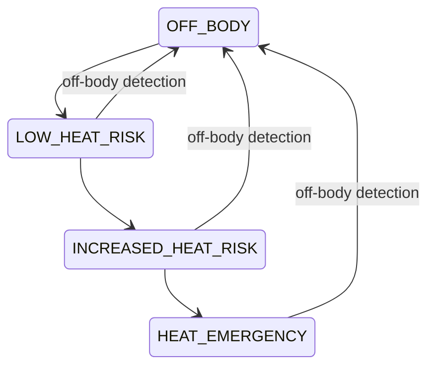
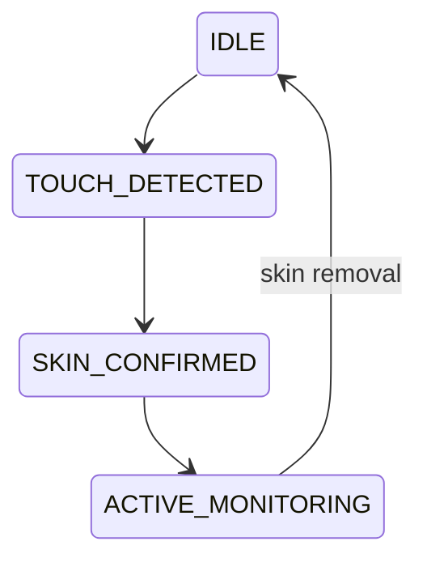

# Alpha Firmware Analysis

## Overview

Alpha is a dual-MCU heat stress wearable device. It monitors vital signs (heart rate, SpO2, core temperature) and environmental conditions to detect heat stress emergencies. Built on Zephyr RTOS (NCS v2.3.0).

## Hardware Architecture

### Dual Processor System
- **nRF52840** (Application Processor): All sensors, BLE, vital signs processing
- **nRF9151/nRF9160** (Communications Coprocessor): LTE cellular, OTA updates
- **IPC**: LPUART at 460800 baud with 13 message types

### Key Sensors (from `boards/alpha_b0_nrf52840.overlay`)
| Sensor | Driver | Bus | Purpose |
|--------|--------|-----|---------|
| LSM6DSO | `ck_lsm6dso` | SPI | 6-axis IMU (accel 52Hz + gyro 26Hz), 512-sample FIFO |
| PAH8151 | `pixart_pah8151` | I2C1 | PPG sensor for heart rate/SpO2, 1Hz batches of 32 samples |
| MLX90614 | `melexis_mlx90614` | GPIO bit-bang I2C | IR thermometer for skin temperature |
| BME280 | Standard Zephyr | I2C | Environmental temp/humidity/pressure |
| LP5814 | Custom | I2C | LED controller |

### VSM (Vital Signs Monitor)
The VSM driver orchestrates all three primary sensors (LSM6DSO, PAH8151, MLX90614) and runs the proprietary PSP algorithm for vital signs computation.

## Project Structure

```
/home/mateo/work/firmware/alpha_fw/
├── src/
│   └── app/
│       ├── alpha_state_machine.c  # Heat risk state machine
│       ├── sensor_handler.c       # Centralized sensor management
│       ├── vsm_handler.c          # Vital signs coordinator
│       └── ...
├── boards/
│   └── alpha_b0_nrf52840.overlay  # Main device tree overlay
├── build_all.sh                   # Multi-MCU build orchestration
├── flash_all.sh                   # Auto-detect JLink, flash both MCUs
├── CMakeLists.txt                 # 15 ZEPHYR_EXTRA_MODULES
├── prj.conf                       # 103 Kconfig options
└── .gitmodules                    # 13 submodules
```

## Submodules (13 total)

All from `git@bitbucket.org:corekinect/`:
- **lsm6dso_drv** - 6-axis IMU driver
- **pah8151_drv** - PPG/heart rate driver
- **mlx90614_drv** - IR temperature driver
- **vsm_drv** - Vital signs orchestrator (with PSP binary)
- **bme280_drv** - Environmental sensor
- **bq25798_drv** / **bq25622_drv** - Battery charger
- **maxim_bms_drv** - Battery management (17063)
- **lp5814_drv** - LED controller
- **ublox_m10_drv** - GPS/GNSS
- **nfc_drv** - NFC tag
- **sd_card_drv** - SD card storage
- **ck_boards** - Shared board definitions
- **ck_ipc** - Inter-processor communication

## State Machines

### Alpha Heat Stress State Machine


### VSM Touch Detection State Machine


## IPC Message Types (13)
- Biometric: HR, SpO2, core temperature
- System: time sync, OTA, SOS
- Config: thresholds, intervals

## Memory Layout (nRF52840)
- 48KB: MCUBoot bootloader
- 212KB: Application firmware
- 80KB: PSP algorithm (precompiled binary)
- 36KB: Settings/NVS
- External: 64Mbit SPI flash for secondary image + logs

## Build System
- `build_all.sh` orchestrates dual-MCU builds
- `flash_all.sh` auto-detects JLink debuggers
- CMake with 15 `ZEPHYR_EXTRA_MODULES`
- Multi-image sysbuild (MCUBoot + app + coprocessor)
- FIPS hash calculation for WolfSSL crypto

## Validation-Relevant Observations

1. **Three target sensor drivers**: LSM6DSO, PAH8151, MLX90614 are the primary validation targets
2. **VSM orchestration**: The VSM driver coordinates all 3 sensors - a key integration test point
3. **PSP proprietary algorithm**: Precompiled binary (80KB) - cannot be unit tested, only black-box tested
4. **GPIO bit-bang I2C**: MLX90614 uses GPIO-based I2C, not hardware I2C - needs special test considerations
5. **Manufacturing tests built-in**: SNR, cross-talk, reflectivity tests exist in VSM/PAH8151 for factory use
6. **Dual-MCU**: Same IPC challenge as sigma5 - tests need to handle both processors
7. **No CI/CD**: Manual builds via scripts
8. **13 submodules**: Each driver change needs regression testing
