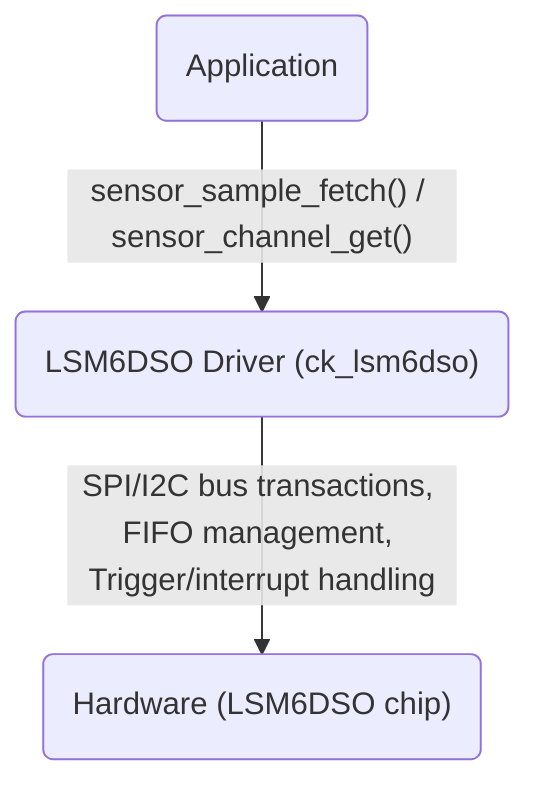

# Sensor Drivers Analysis

## Overview

Three primary sensor drivers plus the VSM (Vital Signs Monitor) orchestrator are the initial targets for the validation system. All follow Zephyr sensor driver architecture patterns with custom CoreKinect extensions.

All drivers exist as git submodules on Bitbucket (`git@bitbucket.org:corekinect/`) and are shared across multiple firmware products.

## Driver Locations

Each driver exists in multiple locations due to git submodule structure:
- **Alpha firmware**: `/home/mateo/work/firmware/alpha_fw/{driver}_drv/`
- **Concord libs**: `/home/mateo/work/concord/concord/libs/zephyr/{driver}_drv/`

---

## 1. LSM6DSO Driver (6-Axis IMU)

### Identity
- **DT_DRV_COMPAT**: `ck_lsm6dso`
- **Bus**: SPI or I2C (configurable)
- **Kconfig**: `CONFIG_CK_LSM6DSO=y`
- **Init Priority**: 90
- **Thread Stack**: 1024 bytes

### Capabilities
- **Accelerometer**: Up to 6.6kHz ODR, configurable full-scale (2/4/8/16g)
- **Gyroscope**: Up to 6.6kHz ODR, configurable full-scale (125-2000 dps)
- **FIFO**: 512 samples, watermark trigger
- **Motion Triggers**: Configurable threshold/duration for motion detection

### Custom Channels
| Channel | Description |
|---------|-------------|
| `SAMPLE_COUNT` | Number of samples in FIFO batch |
| `TIMESTAMP` | Hardware timestamp of sample |

### Custom Attributes
- ODR (Output Data Rate) configuration
- Full-scale range selection
- FIFO watermark level
- Motion detection thresholds

### Architecture


### Test Considerations
- SPI and I2C bus variants need separate test configs
- FIFO batching behavior (watermark triggers, overflow)
- Motion detection threshold calibration
- Interrupt-driven vs polled operation
- Multi-channel fetch ordering

---

## 2. PAH8151 Driver (PPG Sensor)

### Identity
- **DT_DRV_COMPAT**: `pixart_pah8151`
- **Bus**: I2C only
- **Thread Stack**: 16KB (largest of the three - heavy processing)
- **Vendor Library**: PixArt `pah_815x` (precompiled)

### Capabilities
- **PPG (Photoplethysmography)**: Heart rate, SpO2 measurement
- **Touch Detection**: Capacitive proximity sensing
- **Multi-LED**: Red, Green, IR channels with configurable intensity

### Custom Channels (14)
| Channel | Description |
|---------|-------------|
| Red intensity | Red LED channel data |
| Green intensity | Green LED channel data |
| IR intensity | IR LED channel data |
| Exposure time | Current exposure setting |
| DAC values | Digital-to-analog converter settings |
| LED current | Per-LED current control |
| Touch state | Touch/proximity detection |
| SNR | Signal-to-noise ratio (manufacturing test) |
| Cross-talk | LED cross-talk measurement |
| Reflectivity | Surface reflectivity measurement |
| ... | Additional diagnostic channels |

### Custom Triggers
| Trigger | Description |
|---------|-------------|
| `PPG_READY` | New PPG batch available (32 samples) |
| `TOUCH` | Touch state changed (on/off body) |

### Manufacturing Test Functions
Built into the driver for factory validation:
- **SNR Test**: Signal-to-noise ratio measurement
- **Cross-talk Test**: LED-to-LED interference measurement
- **Reflectivity Test**: Surface optical quality assessment

### Architecture
```
Application / VSM Driver
    ↓ sensor_sample_fetch() / sensor_channel_get()
PAH8151 Driver (pixart_pah8151)
    ↓ I2C bus transactions
    ↓ PixArt vendor library (pah_815x) - precompiled
    ↓ Batch collection (32 samples per trigger)
Hardware (PAH8151 chip)
```

### Test Considerations
- **Vendor binary**: PixArt library is precompiled - cannot emulate internal behavior
- **Large thread stack**: 16KB means resource-constrained test environments may need tuning
- **Touch detection**: State transitions (touch → no-touch) are timing-sensitive
- **Multi-LED channels**: 14 custom channels means extensive channel-get coverage needed
- **PPG batch timing**: 1Hz batch rate with 32 samples per batch
- **Manufacturing test functions**: Already exist - can be leveraged for validation

---

## 3. MLX90614 Driver (IR Temperature)

### Identity
- **DT_DRV_COMPAT**: `melexis_mlx90614`
- **Bus**: GPIO bit-banged I2C (NOT hardware I2C)
- **Communication**: SMBus-like protocol over GPIO pins

### Capabilities
- **Ambient Temperature**: Environmental temperature reading
- **Object Temperature**: Non-contact IR skin temperature
- **Sleep/Wake**: Power management for battery life

### Channels
| Channel | Description |
|---------|-------------|
| `AMBIENT_TEMP` | Environmental temperature |
| `OBJECT_TEMP` | IR surface (skin) temperature |

### Architecture
```
Application / VSM Driver
    ↓ sensor_sample_fetch() / sensor_channel_get()
MLX90614 Driver (melexis_mlx90614)
    ↓ GPIO bit-bang I2C (custom implementation)
    ↓ SMBus read/write with CRC-8
Hardware (MLX90614 chip)
```

### Test Considerations
- **GPIO bit-bang I2C**: Standard I2C emulator won't work - needs GPIO-level emulation or real hardware
- **Sleep/wake transitions**: Power management state machine
- **Thermal accuracy**: Temperature readings need validation against reference
- **CRC-8 protocol**: Error detection needs edge-case testing
- **Timing-sensitive**: Bit-bang I2C has strict timing requirements

---

## 4. VSM Driver (Vital Signs Monitor)

### Identity
- **Multi-threaded orchestrator** coordinating LSM6DSO, PAH8151, and MLX90614
- **Proprietary PSP Algorithm**: Precompiled binary for vital signs computation
- **State Machine**: Complex multi-phase operation

### State Machine
```
IDLE
  ↓ (PAH8151 touch trigger)
TOUCH_DETECTED
  ↓ (sustained contact confirmed)
SKIN_CONFIRMED
  ↓ (all sensors initialized + PSP ready)
ACTIVE_MONITORING
  ↓ (skin removal or timeout)
IDLE
```

### Sensor Orchestration
1. **Idle**: Only PAH8151 touch detection active (low power)
2. **Touch Detected**: Start LSM6DSO (motion context), confirm skin contact
3. **Skin Confirmed**: Start MLX90614 (temperature), initialize PSP algorithm
4. **Active Monitoring**: All 3 sensors feeding data to PSP → HR, SpO2, core temp

### PSP Algorithm
- **Proprietary**: Precompiled binary blob (~80KB on nRF52840)
- **Input**: Raw PPG data (PAH8151), accelerometer data (LSM6DSO), skin temperature (MLX90614)
- **Output**: Heart rate, SpO2, estimated core temperature, confidence scores
- **Cannot be unit tested**: Black-box only - validate inputs/outputs

### Manufacturing Tests
Built into VSM for factory validation:
- **SNR Test**: Delegates to PAH8151 SNR test
- **Cross-talk Test**: Delegates to PAH8151 cross-talk test
- **Reflectivity Test**: Surface optical quality
- **Integration Test**: All 3 sensors coordinated

### Test Considerations
- **Integration complexity**: Orchestrates 3 drivers simultaneously
- **PSP black-box**: Can only test inputs fed to PSP and outputs received
- **State machine transitions**: Need to test all valid and invalid transitions
- **Threading**: Multi-threaded design means concurrency testing is important
- **Power states**: Transitions between sensor power states
- **Error handling**: What happens when one sensor fails during active monitoring?

---

## Cross-Driver Observations

### Shared Patterns
1. All drivers use `DEVICE_DT_INST_DEFINE` macro
2. All implement `sensor_driver_api` (sample_fetch, channel_get, attr_set/get, trigger_set)
3. All use devicetree for configuration (pin assignments, bus addresses, etc.)
4. All are independent git submodules shared across products

### Emulation Feasibility
| Driver | Emulation Approach | Feasibility |
|--------|-------------------|-------------|
| LSM6DSO | I2C/SPI bus emulator + register map | **High** - standard bus, well-documented registers |
| PAH8151 | I2C bus emulator + register map | **Medium** - vendor library complicates emulation |
| MLX90614 | GPIO-level emulation | **Low** - bit-bang I2C doesn't use standard bus drivers |
| VSM | Mock sub-drivers | **Medium** - depends on PSP binary behavior |

### Multi-Product Usage
| Driver | Sigma5 | Alpha | Other Products? |
|--------|--------|-------|-----------------|
| LSM6DSO | Yes | Yes | Likely |
| PAH8151 | No | Yes | Possible |
| MLX90614 | No | Yes | Possible |
| VSM | No | Yes | Possible |
| ck_boards | Yes | Yes | Yes (all products) |
| ck_ipc | Yes | Yes | Yes (all dual-MCU) |

### Submodule Change Cascade
When a driver submodule is updated:
1. **Driver-level tests** run for the driver itself
2. **Per-product integration tests** run for every product that uses the driver
3. **Board-variant tests** may need to run per ck_boards variant

Example: LSM6DSO change → test on sigma5 hardware AND alpha hardware (different SPI/I2C configs)
