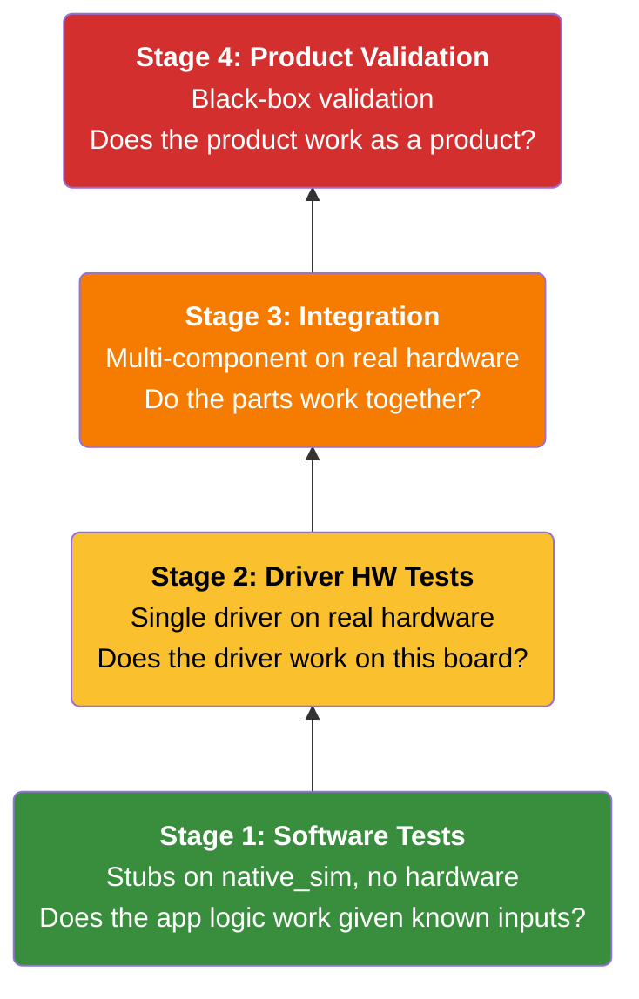
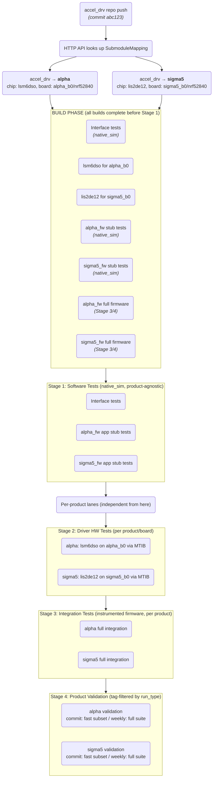
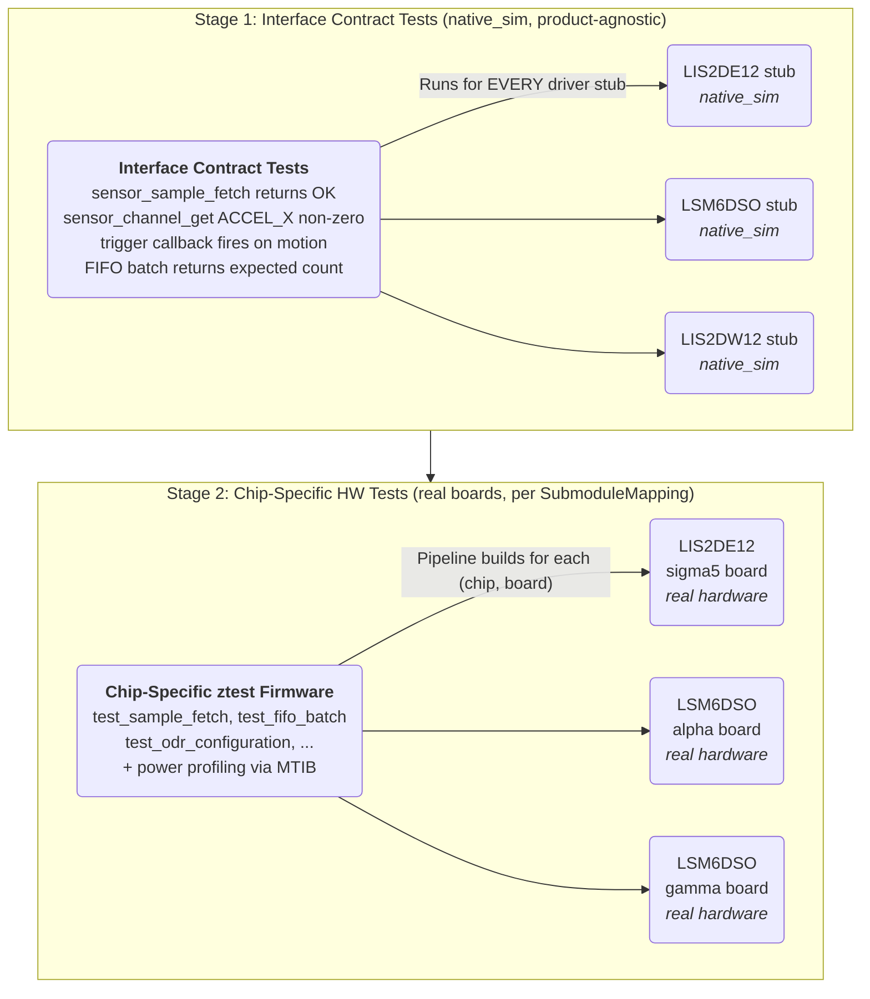

# Embedded Firmware Validation: Philosophy, Strategy & Engineering Rationale

> A foundational document for CoreKinect's device quality engineering practice.
> Covers the _why_ behind every architectural decision, the theory of multi-stage validation,
> the full device lifecycle (manufacturing, field deployment, FUOTA),
> and a practical roadmap from where we are today to where we need to be.

---

## 1. The Problem We're Solving

CoreKinect builds safety-critical wearable devices. When firmware fails silently — a missed sensor reading, a dropped state transition, a corrupted message between processors — the consequence isn't a degraded user experience. It's a missed emergency.

We currently have:

- **Multiple firmware products** sharing drivers, libraries, and submodule dependencies across different hardware configurations.
- **Zero automated validation**. Builds are manual. Testing is manual. A change to a shared component has no automated way to verify it hasn't broken the products that depend on it.

The cost of this status quo compounds with every new product, every new driver, every new engineer. The question isn't whether we need automated validation — it's how to build one that actually fits the constraints of embedded firmware development.

But the problem is broader than testing firmware changes. A device's quality lifecycle doesn't end when the firmware passes a test suite. It extends through three critical domains:

1. **Firmware validation** (the focus of this document's testing pyramid): Does this firmware version work correctly on the hardware it will ship on? Triggered by code changes, executed through Stages 1-4.

2. **Manufacturing validation**: Does this specific physical device — this individual unit with this serial number — meet hardware and firmware quality standards? Triggered by device assembly, executed through POST, personalization, radio calibration, and sensor characterization.

3. **FUOTA (Firmware Update Over The Air) validation**: Can we safely update devices that are already deployed in the field? Triggered by firmware approval, executed through staged OTA rollout with backend health monitoring.

These three domains overlap in test coverage (power, communications, sensors) but differ in what they test, when they run, and what a failure means. A firmware validation failure blocks a release. A manufacturing failure scraps or reworks a unit. A FUOTA failure bricks or degrades a device that a customer is already using — the highest-stakes failure mode.

The testing pyramid (Section 3) addresses the first domain in depth. Section 3.5 connects all three domains into a unified device quality lifecycle — because a validation system that only covers firmware development, ignoring the factory floor and the field, leaves critical gaps in the quality chain.

---

## 2. Why Embedded Validation Is Fundamentally Different

### 2.1 You Can't Mock Physics

In web services, a unit test can mock a database and still exercise meaningful application logic. In embedded firmware, the interesting behavior often lives at the boundary between software and hardware. An accelerometer driver's correctness depends on SPI timing, interrupt latency, FIFO watermark behavior, and DMA transfer ordering — none of which exist in a mock.

This doesn't mean unit tests are useless in embedded. It means we have to be precise about what each test type can and cannot prove.

### 2.2 The Combinatorial Problem

Alpha uses the LSM6DSO (6-axis IMU over SPI), Sigma5 uses the LIS2DE12 (3-axis accel over I2C) — different sensors, different buses, different devicetree overlays. But both products pull from shared libraries and submodules. A change to a shared dependency needs verification on every product and board configuration it touches. A board overlay change needs every driver that uses it re-tested. A Zephyr RTOS update needs everything re-verified.

This combinatorial explosion is the core reason we need automation. A human cannot reliably enumerate and execute every affected test combination when a shared submodule changes. A machine can.

### 2.3 The Binary Blob Problem

The VSM orchestrator runs the proprietary PSP algorithm — a ~80KB precompiled ARM binary (`psp.hex`, 4,866 lines of Intel HEX) copyrighted by Philips. We cannot instrument it, step through it, or emulate its internal behavior. We can only observe its inputs and outputs. It cannot execute on x86, which means any test that touches the PSP path cannot run on `native_sim`.

Other vendor-supplied code (like the PixArt PAH815x library in the PAH8151 PPG driver) is distributed as C source, which means it _can_ be compiled for `native_sim` and tested in emulation. This is a significant architectural advantage — it means only the PSP algorithm is a true opaque binary blob.

Our testing strategy must include a layer that treats the PSP as a genuine black box. We verify the contract (given these inputs, we expect these outputs within these tolerances) without pretending we can see inside. For components with available source (even third-party source like PixArt), stub testing works — and that's the approach we take (see Section 3.1).

### 2.4 Hardware Is a Scarce Resource

We have a finite number of MTIB test benches, each physically wired to a specific product's hardware. Unlike cloud testing where you spin up 1,000 containers, we are bounded by physical hardware. Every test that _can_ run without hardware _should_ run without hardware, to keep the hardware test queues short and focused on what only hardware can prove.

---

## 3. The Testing Pyramid for Embedded Firmware

The classical testing pyramid (unit → integration → end-to-end) applies to embedded, but the boundaries shift.



_Bottom = fast, cheap, no HW, high volume (runs on every commit). Top = slow, expensive, needs HW, low volume (runs on gate)._

**Why software tests come before driver hardware tests**: Drivers are the lower abstraction layer, so bottom-up thinking says "verify the hardware first." But the stages are ordered by cost, not by dependency. The stub tests and hardware tests answer independent questions — "is the app logic correct given known inputs?" vs "does the driver work on real silicon?" Neither answer depends on the other. By running the cheap question first (native_sim, 1-2 min, no hardware), a broken state machine threshold or a wrong alert condition gets caught before occupying an MTIB node for 5-15 minutes per board. The interface contract tests (`tests/interface/`) ensure stubs stay in sync with the real driver API, so stubs don't silently diverge. Within the hardware stages (2 → 3 → 4), bottom-up ordering does apply: verify the driver before the system that uses it.

### 3.1 Stage 1 — Software Tests (native_sim, No Hardware)

Stage 1 is the cheapest, fastest layer. It runs on `native_sim` (Zephyr's POSIX simulation platform) inside a container on any amd64 machine. No physical hardware involved. But what exactly can it test? There are two fundamentally different approaches, and they serve different purposes.

#### 3.1a — Driver Register Emulation (Acknowledged but NOT pursued)

> **Decision: We are not implementing driver register emulation.** This section documents what it is and why it's not the right investment for a company like CoreKinect. The approach is preserved here for reference — if circumstances change (team grows significantly, a critical driver has chronic regression issues), it could be revisited.

**What it is**: You write an I2C/SPI emulator backend using Zephyr's `EMUL_DT_DEFINE()` framework that mimics the sensor chip's register map. The real driver code runs unmodified — it issues bus transactions, and the emulator responds with simulated register values. It tests the driver's internal logic: register configuration sequences, FIFO management, data parsing, error handling paths.

**Why we're not doing it**:

1. **Emulating hardware is incredibly difficult and error-prone.** A register map emulator is only as good as its accuracy. The LSM6DSO has hundreds of registers, many with interdependent behavior (write FIFO config → affects watermark → affects interrupt → affects FIFO read behavior). Modeling this correctly means you are essentially reimplementing the sensor chip in software. If your emulator is wrong, your tests pass on a lie. If the chip has errata (and they all do), your emulator won't model the errata unless you explicitly add them — which means you need to know about the errata to test for the errata, which defeats the purpose.

2. **The cost-to-value ratio is terrible for a small team.** Writing a register map emulator for one sensor chip is weeks of work. Maintaining it as the real driver evolves (new features, new register configs) is ongoing cost. For a small embedded team, that engineering time is better spent writing more hardware tests or improving the application logic. Companies that do this well (Zephyr upstream, large silicon vendors) have dedicated teams for it.

3. **It doesn't prove what actually matters.** Even a perfect register emulator doesn't test bus timing, interrupt latency, DMA ordering, power sequencing, or electrical noise. The things that actually break in production are hardware interaction bugs, not register-parsing bugs. If a register mask is wrong, you'll catch it in Stage 2 (hardware test) within minutes. The register emulator would have caught it too, but at 10x the development cost.

4. **Stub drivers (3.1b) cover the high-value testing gap.** The main reason to want native_sim tests is to catch application-level logic bugs quickly — and stub drivers do that without any hardware emulation at all. The driver's internal register handling is better validated on real hardware where the test is authoritative.

**When register emulation WOULD make sense** (not our situation):

- Very large teams with dedicated test infrastructure engineers
- Drivers with extremely complex internal state machines where hardware test turnaround is too slow for iteration
- Upstream open-source projects (like Zephyr itself) that need to test driver code without access to hardware
- Safety-critical certifications that require formal evidence of code-path coverage in the driver layer

**What we do instead**: Test driver correctness on real hardware (Stage 2). Test application logic with stub drivers on native_sim (Stage 1, Section 3.1b). This gives us fast feedback on business logic (stubs) and authoritative feedback on hardware interaction (real hardware), without the fragile middle ground of pretending to be a sensor chip.

#### 3.1b — Stub Drivers for App-Level Testing (Tests the application, not the driver)

**What it is**: Each driver repo includes a **stub implementation** of the `sensor_driver_api` that can be pre-configured with test data. The stub doesn't emulate registers — it doesn't talk to any bus at all. It simply returns whatever values the test told it to return.

**What it proves**: The application's logic is correct given known sensor inputs. State machine transitions, threshold decisions, sensor fusion, data processing, alert conditions — all tested without any hardware or driver complexity.

**What it can't prove**: That the driver works. That the sensor works. That the bus transactions succeed. It explicitly doesn't try to.

**Why this is the right native_sim strategy**: Consider the Alpha firmware's heat stress detection:

```c
// In alpha_state_machine.c (simplified)
void process_vitals(vitals_t *v) {
    if (v->heart_rate > 160 && v->core_temp > 39.0) {
        transition_to(HEAT_EMERGENCY);
    } else if (v->core_temp > 38.0) {
        transition_to(INCREASED_HEAT_RISK);
    } else if (v->on_body) {
        transition_to(LOW_HEAT_RISK);
    }
}
```

To test this logic, you don't need to emulate any sensor hardware. You don't need to know how PAH8151 computes heart rate or how the LSM6DSO FIFO works. You need a stub that, when the app calls `sensor_channel_get(VSM_CHAN_HEART_RATE)`, returns `165`. Then you verify the state machine went to HEAT_EMERGENCY.

**How it works architecturally**:

```
Production build:                     Test build (native_sim):

  App code                              App code (IDENTICAL)
    │                                     │
    ▼                                     ▼
  sensor_driver_api                     sensor_driver_api (SAME INTERFACE)
    │                                     │
    ▼                                     ▼
  Real LSM6DSO driver                   Stub driver (CONFIG_LSM6DSO_STUB=y)
    │                                     │
    ▼                                     ▼
  Real I2C bus + hardware               Returns pre-configured test data
```

**How the stub is implemented**:

```c
// In accel_drv/stubs/lsm6dso_stub.c

static struct sensor_value stub_channels[SENSOR_CHAN_MAX];
static bool stub_configured = false;

/* Test API: pre-load values before calling the app */
void lsm6dso_stub_set_channel(enum sensor_channel chan, struct sensor_value *val) {
    stub_channels[chan] = *val;
    stub_configured = true;
}

/* Standard sensor API: returns whatever the test pre-loaded */
static int stub_sample_fetch(const struct device *dev, enum sensor_channel chan) {
    return stub_configured ? 0 : -ENODATA;
}

static int stub_channel_get(const struct device *dev, enum sensor_channel chan,
                            struct sensor_value *val) {
    *val = stub_channels[chan];
    return 0;
}

static const struct sensor_driver_api stub_api = {
    .sample_fetch = stub_sample_fetch,
    .channel_get = stub_channel_get,
    .trigger_set = stub_trigger_set,  /* fire trigger callbacks on demand */
};

DEVICE_DT_INST_DEFINE(0, stub_init, NULL, &stub_data, &stub_config,
                      POST_KERNEL, CONFIG_SENSOR_INIT_PRIORITY, &stub_api);
```

**How the Kconfig/DT switching works** (this is the mechanism that makes stubs compile):

```
# accel_drv/stubs/Kconfig

config CK_LSM6DSO_STUB
    bool "Use LSM6DSO stub driver (for testing)"
    depends on !CK_LSM6DSO    # mutually exclusive with real driver
    help
      Stub implementation of LSM6DSO sensor_driver_api.
      Returns pre-configured values set via test API.
      Only for native_sim app-level testing.

config CK_LIS2DE12_STUB
    bool "Use LIS2DE12 stub driver (for testing)"
    depends on !CK_LIS2DE12
```

```cmake
# accel_drv/stubs/CMakeLists.txt

zephyr_library_sources_ifdef(CONFIG_CK_LSM6DSO_STUB lsm6dso_stub.c)
zephyr_library_sources_ifdef(CONFIG_CK_LIS2DE12_STUB lis2de12_stub.c)
```

```
# The stub uses a separate DT compatible string.
# accel_drv/dts/bindings/ck,lsm6dso-stub.yaml

description: LSM6DSO stub sensor for testing
compatible: "ck,lsm6dso-stub"
include: sensor-device.yaml
```

```
# alpha_fw/tests/app/boards/native_sim.overlay
# This overlay replaces the real sensor node with the stub node.

/ {
    lsm6dso0: lsm6dso-stub {
        compatible = "ck,lsm6dso-stub";
        status = "okay";
    };
};
```

```
# alpha_fw/tests/app/prj.conf
# Enable stubs, disable real drivers

CONFIG_CK_LSM6DSO=n
CONFIG_CK_LSM6DSO_STUB=y
CONFIG_CK_PAH8151=n
CONFIG_PAH8151_STUB=y
CONFIG_VSM=n
CONFIG_VSM_STUB=y
```

The flow: when building for `native_sim` with this overlay + prj.conf, Zephyr instantiates the stub device node (compatible `ck,lsm6dso-stub`) and links the stub source (`lsm6dso_stub.c`) instead of the real driver. The app code calls `DEVICE_DT_GET(DT_NODELABEL(lsm6dso0))` and gets the stub — same device label, different implementation.

**Then the app test looks like**:

```c
// tests/app/test_alpha_state_machine.c (runs on native_sim)

void test_heat_emergency_triggered_on_high_hr_and_temp(void) {
    /* Pre-configure stub drivers with dangerous vital signs */
    struct sensor_value hr = { .val1 = 165, .val2 = 0 };
    struct sensor_value temp = { .val1 = 39, .val2 = 500000 };  /* 39.5°C */
    struct sensor_value spo2 = { .val1 = 94, .val2 = 0 };

    vsm_stub_set_channel(VSM_CHAN_HEART_RATE, &hr);
    vsm_stub_set_channel(VSM_CHAN_CORE_TEMP, &temp);
    vsm_stub_set_channel(VSM_CHAN_SPO2, &spo2);
    vsm_stub_fire_trigger(SENSOR_TRIG_DATA_READY);

    /* Let the app process the data */
    k_sleep(K_MSEC(100));

    /* Verify state machine transition */
    zassert_equal(alpha_get_state(), HEAT_EMERGENCY,
                  "Expected HEAT_EMERGENCY, got %d", alpha_get_state());
}
```

**Which components benefit from stub testing**:

| What's Tested                   | Stub Needed        | What It Catches                                        |
| ------------------------------- | ------------------ | ------------------------------------------------------ |
| Alpha heat stress state machine | VSM stub           | Threshold logic, state transitions, off-body detection |
| Sigma5 fall detection algorithm | Accelerometer stub | Fall detection parameters, false positive filtering    |
| Sensor data processing / fusion | All sensor stubs   | Averaging, filtering, calibration math                 |
| IPC message generation          | Sensor stubs       | Correct message formatting given known sensor data     |
| Power state management          | Sensor stubs       | Sleep/wake decisions based on sensor activity          |
| Alert/notification logic        | Sensor stubs       | When alerts fire, what data they include               |

**Critical insight**: Stub testing works even for VSM/PSP. You don't stub the sub-drivers (LSM6DSO, PAH8151, MLX90614) — you stub the VSM output itself. The app doesn't call the sub-drivers directly; it calls the VSM driver. Stub the VSM, and you can test all app logic that depends on vital signs, without any hardware, without any vendor binary.

#### 3.1c — Where Does Each Type Live?

```
Driver repos (accel_drv, ppg, temperature):
├── drivers/lsm6dso/
│   └── src/                    # Fresh custom driver (NOT a fork of upstream Zephyr driver)
├── dts/bindings/               # Sensor DT bindings OWNED by this repo
│   ├── ck,lsm6dso.yaml         # Binding: accel/gyro config, IRQ, power modes
│   └── ck,lis2de12.yaml        # Each chip gets its own binding
├── stubs/                      # Stub implementations for ALL drivers in this group
│   ├── lsm6dso_stub.c          # sensor_driver_api stub
│   ├── lis2de12_stub.c
│   ├── Kconfig                  # CONFIG_CK_LSM6DSO_STUB, CONFIG_CK_LIS2DE12_STUB
│   └── CMakeLists.txt
├── tests/                      # Zephyr-native test code (C, ztest, Twister metadata)
│   ├── interface/              # Interface contract tests (native_sim via stubs)
│   │   ├── testcase.yaml       # platform_allow: native_sim
│   │   └── src/main.c
│   ├── lsm6dso/                # Chip-specific HW tests (product-agnostic)
│   │   ├── src/main.c          # ztest firmware exercising the driver
│   │   ├── testcase.yaml       # NO product boards — pipeline decides
│   │   └── test_spec.yaml      # power budgets from DATASHEET
│   └── lis2de12/
│       └── ...                 # same pattern
├── .concord/                   # Pipeline infrastructure (Concord-specific config)
│   ├── pipeline.yaml           # targets, triggers, stages, notifications
│   └── build.yaml              # build recipe (how to compile tests for each board)
├── zephyr/module.yml           # Registers repo as Zephyr module (makes dts/bindings/ discoverable)

Firmware app repos (alpha_fw, sigma5_fw):
├── tests/                      # Zephyr-native test code (C, ztest, Twister metadata)
│   └── app/                    # App-level tests using stubs (3.1b)
│       ├── testcase.yaml       # platform_allow: native_sim
│       ├── prj.conf            # CONFIG_CK_LSM6DSO_STUB=y, CONFIG_VSM_STUB=y
│       ├── boards/
│       │   └── native_sim.overlay  # stub device nodes
│       └── src/
│           ├── test_state_machine.c
│           ├── test_sensor_processing.c
│           └── test_alert_logic.c
├── .concord/                   # Pipeline infrastructure (Concord-specific config)
│   ├── pipeline.yaml           # triggers, stages, notifications
│   ├── build.yaml              # build recipe
│   ├── integration_spec.yaml   # power budgets + thresholds for integrated system
│   └── tests/integration/      # Stage 3 Python tests (Concord TestContext API)
│       └── test_vsm.py
├── src/
│   ├── main.c
│   ├── ...
│   └── concord_harness.c       # Harness declarations (compiled out when CONFIG_CONCORD_HARNESS=n)
```

**Boundary: `tests/` vs `.concord/`** — `tests/` contains Zephyr-native code: C ztest firmware, `testcase.yaml`, `prj.conf`, DTS overlays. These build with vanilla Twister and don't depend on Concord. `.concord/` contains pipeline infrastructure: how to build, where to test, what targets to fan out to, and (in firmware repos) Python integration tests that use Concord's `TestContext` API. The `test_spec.yaml` lives alongside the ztest firmware in `tests/` because it references test function names and is authored by the driver engineer who writes the tests — even though it's evaluated by Concord at runtime.

**Key principle: no product knowledge in driver repos.** The driver repo tests the driver in isolation. It doesn't know which products use it, which boards they run on, or what the product-specific pin assignments are. That information lives in two places:

- **`ck_boards`** (board definitions, HWMv2 format): define the hardware wiring — e.g., LSM6DSO on SPI0, IRQ on P0.14, CS on P0.8. Each board has a `board.yml` (name, vendor, SoCs, revisions) and per-SoC DTS files. ck*boards defines \_where* a sensor is wired (bus, pins); the driver repo defines _what_ the sensor is (DT binding, config properties).
- **`SubmoduleMapping`** (PostgreSQL): maps driver repos → products → chips → boards

When a new product uses an existing driver, you add a SubmoduleMapping entry and ensure the board definition in `ck_boards` has the sensor node. Zero changes in the driver repo.

#### 3.1d — Summary: The Honest Assessment

| Approach                      | Value             | Cost                                      | Our Decision                                                                                               |
| ----------------------------- | ----------------- | ----------------------------------------- | ---------------------------------------------------------------------------------------------------------- |
| Register emulation (3.1a)     | Medium            | High (write + maintain emulator per chip) | **Not pursuing** — fragile, expensive to maintain, doesn't prove hardware interaction (see 3.1a rationale) |
| Stub driver app tests (3.1b)  | **High**          | Low (simple stub per driver type)         | **Our approach** — tests business logic, works for ALL drivers, fast on native_sim                         |
| Hardware-only (no native_sim) | Valid for drivers | Zero upfront, high ongoing                | Used for driver validation (Stage 2) — authoritative, no emulation fragility                               |

**Our approach**: Stub drivers (3.1b) for app-level testing on native_sim, real hardware (Stage 2) for driver-level testing. This gives us fast feedback on the logic that matters most (application behavior) and authoritative feedback on the layer that can't be faked (hardware interaction). No time wasted writing and maintaining register map emulators that are less trustworthy than the hardware tests we're already going to run.

**What we explicitly don't do**: We don't pretend that native_sim tests replace hardware tests. They test different things. A passing native_sim test means "the logic is correct given these inputs." A passing hardware test means "the hardware actually produces these inputs." You need both.

### 3.2 Stage 2 — Driver Hardware Tests (Single Driver, Real Board)

Stage 2 tests run on two fundamentally different fixture types, because the question you can answer about a driver depends on what hardware it's wired to:

- **Dev-kit fixtures** — a bare MCU (e.g., nRF52840) wired directly to a single sensor over SPI or I2C, with relay-based power isolation via MTIB GPIO. This is the only fixture where individual sensor power measurement is physically meaningful, because nothing else is drawing current. Dev-kit runs execute in `test_mode: full` — both functional tests and `power_budget` assertions from `test_spec.yaml` are evaluated.

- **Product-board fixtures** — a full product board (Alpha, Sigma5) with its complete BOM: MCU, BLE radio, battery charger, 5+ other sensors, LEDs. You can't isolate a single sensor's current draw when 15 other devices are on the same power rail. Product-board runs execute in `test_mode: functional` — the same functional tests verify that the product's specific DTS/wiring config doesn't break the driver, but power data is captured for diagnostics and trend analysis only, never judged against budgets.

**What they prove**: On dev-kits → the driver works correctly on isolated hardware and its power consumption meets datasheet budgets. On product boards → the driver works correctly with that specific product's DTS overlay, bus assignments, and pin configuration. Bus transactions succeed, interrupts fire, FIFO fills and drains, power states transition. These are the authoritative driver tests — no emulation, no stubs, real silicon.

**Where they run**: On real hardware accessed via MTIB test bench. Dev-kit MTIB fixtures provide a bare MCU + single sensor with relay-isolated power measurement. Product-board MTIB fixtures provide full product hardware. Both fixture types are MTIB nodes in the same cluster — the pipeline controller matches jobs to nodes via capability labels (see Section 3.2, "Per-Board Testing"). The test pod runs on an agent node and connects to MTIB via gRPC. MTIB handles flashing, UART, power measurement, and GPIO.

#### Two Pieces of Code, Strict Separation

A Stage 2 test has two parts that live in different repos and know nothing about each other:

| | Test Firmware (C/ztest) | Test Orchestrator (Python) |
|---|---|---|
| **Lives in** | Driver repo (`tests/lsm6dso/`) | Concord monorepo (`apps/validation/test-runner/`) |
| **Runs on** | The nRF52840 itself | An agent node (K8s pod) |
| **Written by** | Driver engineer | Infrastructure team |
| **Knows about** | Driver registers, sensor behavior, DTS | MTIB gRPC, power measurement, artifact storage |
| **Doesn't know about** | MTIB, power profiling, MinIO | LSM6DSO registers, FIFO logic, sensor physics |

They connect through two interfaces: **ztest UART markers** (standard structured output the orchestrator parses with regex) and **test_spec.yaml** (acceptance criteria the driver engineer defines alongside the test code).

#### Test Firmware — DTS-Driven Conditional Coverage

The LSM6DSO driver supports SPI and I2C, optional interrupts, and configurable FIFO. Alpha wires it on SPI with an interrupt pin. A future product might use I2C with no interrupt. The driver engineer writes ALL the tests in one file — the board's DTS determines which ones compile into the binary.

```c
// tests/lsm6dso/src/main.c (runs ON the nRF52840)

#define LSM6DSO_NODE DT_NODELABEL(lsm6dso0)

/* ── Always run: every board has basic sensor access ── */

ZTEST(lsm6dso_hw, test_device_ready)
{
    zassert_true(device_is_ready(DEVICE_DT_GET(LSM6DSO_NODE)));
}

ZTEST(lsm6dso_hw, test_sample_fetch)
{
    const struct device *dev = DEVICE_DT_GET(LSM6DSO_NODE);
    zassert_ok(sensor_sample_fetch(dev));
    struct sensor_value accel_x;
    zassert_ok(sensor_channel_get(dev, SENSOR_CHAN_ACCEL_X, &accel_x));
    zassert_true(accel_x.val1 != 0 || accel_x.val2 != 0,
                 "accel_x is zero — sensor not responding");
}

/* ── Bus-specific: compiled in only for the wired bus type ── */

#if DT_ON_BUS(LSM6DSO_NODE, spi)
ZTEST(lsm6dso_hw, test_spi_whoami)
{
    uint8_t whoami = read_register(DEVICE_DT_GET(LSM6DSO_NODE), LSM6DSO_WHO_AM_I);
    zassert_equal(whoami, 0x6C, "WHO_AM_I mismatch: 0x%02X", whoami);
}
#endif

#if DT_ON_BUS(LSM6DSO_NODE, i2c)
ZTEST(lsm6dso_hw, test_i2c_whoami)
{
    uint8_t whoami = read_register(DEVICE_DT_GET(LSM6DSO_NODE), LSM6DSO_WHO_AM_I);
    zassert_equal(whoami, 0x6C, "WHO_AM_I mismatch: 0x%02X", whoami);
}
#endif

/* ── Interrupt tests: only if the board wires irq_gpios ── */

#if DT_NODE_HAS_PROP(LSM6DSO_NODE, irq_gpios)

ZTEST(lsm6dso_hw, test_drdy_interrupt)
{
    const struct device *dev = DEVICE_DT_GET(LSM6DSO_NODE);
    volatile bool drdy_fired = false;
    struct sensor_trigger trig = {
        .type = SENSOR_TRIG_DATA_READY,
        .chan = SENSOR_CHAN_ACCEL_XYZ,
    };
    sensor_trigger_set(dev, &trig, drdy_callback);
    k_sleep(K_MSEC(500));
    zassert_true(drdy_fired, "DRDY interrupt never fired");
}

ZTEST(lsm6dso_hw, test_fifo_watermark_interrupt)
{
    const struct device *dev = DEVICE_DT_GET(LSM6DSO_NODE);
    configure_fifo_watermark(dev, 26);
    configure_odr(dev, 52);
    k_sleep(K_MSEC(1000));
    zassert_true(wm_fired, "FIFO watermark interrupt never fired");
}

#else /* no irq_gpios — polled mode */

ZTEST(lsm6dso_hw, test_polled_fifo_read)
{
    const struct device *dev = DEVICE_DT_GET(LSM6DSO_NODE);
    configure_odr(dev, 52);
    k_sleep(K_MSEC(1000));
    int count = poll_fifo_status(dev);
    zassert_true(count > 0, "FIFO empty after 1s at 52Hz");
}

#endif /* irq_gpios */

/* ── Runtime skip: for tests that need external fixture ── */

ZTEST(lsm6dso_hw, test_motion_detection)
{
    const struct device *dev = DEVICE_DT_GET(LSM6DSO_NODE);
    struct sensor_value accel;
    sensor_sample_fetch(dev);
    sensor_channel_get(dev, SENSOR_CHAN_ACCEL_X, &accel);
    /* Skip if no motion actuator is providing stimulus */
    zassume_true(abs(sensor_value_to_milli(&accel)) > 500,
                 "No motion detected — skipping (needs actuator)");
    /* ... actual motion threshold test ... */
}

ZTEST_SUITE(lsm6dso_hw, NULL, NULL, NULL, NULL, NULL);
```

Three mechanisms at work:

1. **`#if DT_ON_BUS(...)` / `#if DT_NODE_HAS_PROP(...)`** — Compile-time guards. The preprocessor includes or excludes entire test functions based on the board's DTS. Same macros the driver itself uses (e.g., the LSM6DSO driver uses `COND_CODE_1(DT_INST_ON_BUS(inst, spi), ...)` to select SPI vs I2C config).

2. **`#ifdef CONFIG_*`** — Kconfig guards. Some features like trigger support are gated by Kconfig symbols (`CONFIG_CK_LSM6DSO_TRIGGER`) that auto-disable when the DTS lacks the required properties. The test's `prj.conf` enables everything — the board's DTS determines what's actually available.

3. **`zassume_true()`** — Runtime skip. For conditions that depend on the physical test fixture (is a motion actuator attached? is a charger connected?), the test checks at runtime and marks itself SKIP if the precondition isn't met.

The result: one source file produces different binaries per board.

```
Built for alpha_b0 (SPI + IRQ):        Built for gamma_b0 (I2C, no IRQ):
  ✓ test_device_ready                    ✓ test_device_ready
  ✓ test_sample_fetch                    ✓ test_sample_fetch
  ✓ test_spi_whoami                      ✓ test_i2c_whoami
  ✓ test_drdy_interrupt                  ✓ test_polled_fifo_read
  ✓ test_fifo_watermark_interrupt        ○ test_motion_detection (SKIP)
  ○ test_motion_detection (SKIP)
```

#### Test Orchestrator — Power-Correlated Execution

The orchestrator is generic Python that works for any driver. It flashes firmware via MTIB, streams UART and power concurrently, and uses ztest markers (`START - name` / `PASS - name`) as timestamps to slice the power trace into per-test segments:

```
UART timeline:                Power trace:

  START - test_idle_power      ──────────── t=0.0s
      (device idles)           │  12 µA  │
  PASS - test_idle_power       ──────────── t=1.0s  → slice → idle_power.csv
  START - test_sample_fetch    ──────────── t=1.0s
      (SPI burst, read regs)   │ 450 µA  │
  PASS - test_sample_fetch     ──────────── t=1.1s  → slice → sample_fetch.csv
  START - test_fifo_batch      ──────────── t=1.1s
      (continuous 52Hz)        │ 380 µA  │
  PASS - test_fifo_batch       ──────────── t=2.3s  → slice → fifo_batch.csv
```

Each test gets its own power trace segment, stored as a separate artifact. Per-test statistics (average, peak, energy in µJ) are computed and evaluated against the acceptance criteria in `test_spec.yaml`.

**Important: this power-correlated flow runs on ALL Stage 2 tests — both dev-kit and product-board fixtures.** Power is always captured and stored as artifacts for trend analysis (e.g., detecting regressions where current creeps up over time). However, `power_budget` assertions from `test_spec.yaml` are **only evaluated on dev-kit runs** (`test_mode: full`), where the sensor's current draw is physically isolated behind a relay. On product-board runs (`test_mode: functional`), the power data is stored but never causes a pass/fail judgment — you can't meaningfully attribute current to a single sensor on a board with 15 other active devices sharing the same power rail.

#### test_spec.yaml — What It Covers and How It Links

**Division of responsibility**: The ztest firmware and the test_spec.yaml check different things. Understanding the split is key to understanding what test_spec is for.

| What's being checked | Who checks it | How |
|---|---|---|
| **Functional correctness** — sensor returns valid data, FIFO fills, interrupts fire, registers read correctly | **ztest firmware** (C, runs on device) | `zassert_*` assertions → PASS/FAIL over UART |
| **Power consumption** — current draw during each test phase is within the datasheet budget | **Orchestrator** (Python, runs on agent) | MTIB power measurement, sliced by UART timestamps, evaluated against `power_budget` |
| **Timing** — test completes within expected duration, no hangs | **Orchestrator** | UART timestamps + `timeout_s` per test |
| **Coverage** — the right tests ran for this board's hardware features | **Orchestrator** | `required` / `required_when` conditions evaluated against build-time board features |

The firmware handles "does the driver work?" The test_spec handles "is the driver operating within its datasheet parameters, and did we test everything we should have?"

**The full spec**:

```yaml
# tests/lsm6dso/test_spec.yaml
version: 1

metadata:
  chip: LSM6DSO
  datasheet_ref: "LSM6DSO datasheet Rev 9, Table 4 (current consumption)"
  author: driver-team
  last_reviewed: "2026-02-01"

defaults:
  timeout_s: 60                          # per-test timeout — orchestrator aborts if exceeded
  # no default power_budget — power is always captured but only judged when declared

tests:
  # ── Core tests (every board) ──
  test_device_ready:
    required: always
    timeout_s: 5
  test_sample_fetch:
    required: always
    timeout_s: 5
    power_budget:
      peak_ua: 800                       # SPI/I2C burst can spike during register read

  # ── Bus-specific tests ──
  test_spi_whoami:
    required_when: { bus: spi }
    timeout_s: 5
  test_i2c_whoami:
    required_when: { bus: i2c }
    timeout_s: 5

  # ── Interrupt tests ──
  test_drdy_interrupt:
    required_when: { has_prop: irq_gpios }
    timeout_s: 10
  test_fifo_watermark_interrupt:
    required_when: { has_prop: irq_gpios }
    timeout_s: 10
    power_budget:
      avg_ua: 500                        # continuous 52Hz sampling for 1s

  # ── Polled-mode tests ──
  test_polled_fifo_read:
    required_when: { not_has_prop: irq_gpios }
    timeout_s: 10
    power_budget:
      avg_ua: 500

  # ── Fixture-dependent tests ──
  test_motion_detection:
    required: false                      # best-effort — needs physical actuator
    power_budget:
      avg_ua: 600
```

**Key fields**:

- **`required: always`** — This test must appear in ztest output for every board. If it doesn't, the run is flagged as a coverage gap.
- **`required_when: { bus: spi }`** — This test must appear if the board wires this sensor on SPI. If the board uses I2C, the test is expected to be absent (compiled out). Not a gap.
- **`required_when: { has_prop: irq_gpios }`** — This test must appear if the board's DTS has the `irq_gpios` property for this sensor node. `not_has_prop` is the inverse.
- **`required: false`** — This test may or may not run. If it appears as SKIP, that's fine. If it's absent entirely, that's fine. No coverage judgment.
- **`power_budget`** — External measurement criteria. All fields optional (`avg_ua`, `peak_ua`, `min_ua`, `energy_uj`). If not declared, power is still captured for trend analysis but no pass/fail judgment is made.
- **`timeout_s`** — The orchestrator kills the test if it exceeds this. Catches firmware hangs (sensor init deadlock, interrupt storm, bus arbitration failure). Falls back to `defaults.timeout_s` if not set per-test.

**How `required_when` links to the build** — the `board_features.json` bridge:

The `required_when` conditions reference DTS properties (`bus`, `has_prop`). But the orchestrator is Python running on an agent node — it doesn't have access to the Zephyr devicetree. The link is a `board_features.json` file produced at **build time**:

```
Build step (Twister + post-build extraction):
  1. Twister builds test firmware for alpha_b0/nrf52840
  2. Post-build script reads the generated DTS output (build/zephyr/zephyr.dts)
  3. Extracts feature flags for the sensor node into board_features.json
  4. Both hex + board_features.json are uploaded to MinIO as build artifacts
```

```json
// board_features.json (generated per build, stored alongside the hex)
{
  "board": "alpha_b0/nrf52840",
  "chip": "lsm6dso",
  "node_label": "lsm6dso0",
  "features": {
    "bus": "spi",
    "has_prop": ["irq_gpios", "int_pin", "accel_odr", "gyro_odr"],
    "kconfig": ["CK_LSM6DSO", "CK_LSM6DSO_TRIGGER"]
  }
}
```

At test time, the orchestrator loads both files:

```
Orchestrator evaluation flow:
  1. Load test_spec.yaml (from driver repo, copied into MinIO with build artifacts)
  2. Load board_features.json (from build output)
  3. Parse ztest UART output → list of tests that ran (PASS/FAIL/SKIP)
  4. For each test in test_spec.yaml:
     - If required: always → must be in ztest output
     - If required_when: { bus: spi } → check board_features.features.bus == "spi"
       - If yes → must be in ztest output
       - If no → expected absent, not a gap
     - If required_when: { has_prop: irq_gpios } → check "irq_gpios" in board_features.features.has_prop
     - If required: false → no coverage judgment
  5. Produce coverage report: covered / not_applicable / gap / unexpected
```

This keeps the orchestrator generic — it evaluates conditions against a JSON file, not against Zephyr internals. Any build system that produces a `board_features.json` in this format works. The extraction script is ~30 lines of Python parsing `zephyr.dts`.

**Coverage categories** (what the report shows per test):

| Category | Meaning | Example |
|---|---|---|
| **PASS** | Test ran, ztest assertion passed, power within budget (if declared and `test_mode: full`) | `test_sample_fetch` on devkit_nrf52840_lsm6dso_spi |
| **FAIL** | Test ran, ztest assertion failed OR power exceeded budget (dev-kit only, `test_mode: full`) | `test_drdy_interrupt` if interrupt never fires |
| **SKIP** | Test ran but `zassume_true()` skipped it at runtime | `test_motion_detection` with no actuator attached |
| **NOT_APPLICABLE** | Test compiled out because board lacks the feature — expected, not a gap | `test_spi_whoami` on an I2C board |
| **COVERAGE_GAP** | `required_when` says this test should exist for this board, but it didn't appear | `test_drdy_interrupt` on a board with `irq_gpios` but the test wasn't compiled in — something is wrong |
| **UNEXPECTED** | Test appeared in ztest output but isn't in test_spec.yaml — not an error, just noted | A new test added to the firmware but not yet in the spec |

#### Per-Board Testing — How the Mapping Gets Built

The driver's source code, test firmware, and test_spec.yaml are all product-agnostic — they don't know which boards use this driver. But the pipeline needs to know "when accel_drv changes, build and test lsm6dso on the dev-kit AND on every product board that uses it." Where does this mapping come from?

**It's declared in the driver repo's `.concord/pipeline.yaml`**, in the `targets:` block:

```yaml
# accel_drv/.concord/pipeline.yaml (driver repo)
targets:
  # Dev-kit targets — isolated power + functional (test_mode: full)
  - board: devkit_nrf52840_lsm6dso_spi
    chip: lsm6dso
    test_mode: full
  - board: devkit_nrf52840_lsm6dso_i2c
    chip: lsm6dso
    test_mode: full
  - board: devkit_nrf52840_lis2de12_i2c
    chip: lis2de12
    test_mode: full
  # Product targets — functional DTS verification only (test_mode: functional)
  - board: alpha_b0/nrf52840
    chip: lsm6dso
    product: alpha
    test_mode: functional
  - board: sigma5_b0/nrf52840
    chip: lis2de12
    product: sigma5
    test_mode: functional
```

- `test_mode: full` = evaluate `power_budget` assertions from `test_spec.yaml` + functional tests. Used on dev-kit boards where the sensor's current draw is physically isolated.
- `test_mode: functional` = functional tests only; power is captured for diagnostics/trend analysis but violations never fail the pipeline. Used on product boards where you can't isolate individual sensor current.

Dev-kit boards (e.g., `devkit_nrf52840_lsm6dso_spi`) are proper Zephyr board definitions in `ck_boards`. They define just the MCU + one sensor with correct bus/pin assignments. They live alongside product board definitions.

This is the driver repo's only point of product/fixture awareness — and it's pipeline configuration, not driver code. The driver's CMakeLists.txt, Kconfig, DTS bindings, and test firmware never reference alpha, sigma5, or dev-kits. Only the pipeline config declares "test this chip on these boards in these modes."

**How it flows into the system**:

1. **Declaration**: The driver engineer adds a `targets:` entry to `.concord/pipeline.yaml` in the driver repo. This is a versioned, reviewable change — it goes through the same PR process as code.

2. **Sync to DB**: When Concord first onboards the repo (via the "Connect Repository" UI flow), or on each pipeline trigger, Concord reads the `targets:` block and syncs it to `SubmoduleMapping` entries in PostgreSQL. The DB copy enables fast API lookups without cloning repos at trigger time.

3. **Pipeline fan-out**: When a push to the accel_drv repo triggers a pipeline, the HTTP API reads SubmoduleMapping and issues separate `BuildRequest` calls for each (chip, board) pair:
   - `BuildRequest(repo=accel_drv, board="devkit_nrf52840_lsm6dso_spi", chip="lsm6dso")`
   - `BuildRequest(repo=accel_drv, board="devkit_nrf52840_lsm6dso_i2c", chip="lsm6dso")`
   - `BuildRequest(repo=accel_drv, board="alpha_b0/nrf52840", chip="lsm6dso")`
   - `BuildRequest(repo=accel_drv, board="sigma5_b0/nrf52840", chip="lis2de12")`

4. **Board resolution**: The build service builds the test firmware for each board. The board definition in `ck_boards` provides the DTS with correct bus/pin assignments — this is where the physical wiring (SPI vs I2C, which GPIO for interrupt, which CS pin) gets resolved. The driver repo doesn't carry board overlays.

5. **Capability-based node matching**: Each MTIB node has capability labels (stored in Concord's `Node.capabilities` and mirrored as K8s node labels). The pipeline controller derives `requires` labels from each target's board name using a board→capabilities registry in Concord. A dev-kit target requires `{ fixture_type: devkit, chip: lsm6dso, bus: spi }`. A product target requires `{ fixture_type: product, product: alpha }`. The work queue matches jobs to the first free node whose capabilities satisfy all `requires` labels — like GitHub Actions runner labels.

**When a new product adopts the driver**:

1. Add a board definition in `ck_boards` with the sensor node wired correctly (bus, pins, interrupt)
2. Add a `targets:` entry (with `test_mode: functional`) in the driver repo's `.concord/pipeline.yaml`
3. Register the MTIB node in Concord with `fixture_type: product` capabilities
4. Done — the driver code, test firmware, and test_spec.yaml are untouched

**When adding a dev-kit fixture for a chip**:

1. Add a dev-kit board definition in `ck_boards` (e.g., `devkit_nrf52840_lsm6dso_spi`) — bare MCU + single sensor
2. Add a `targets:` entry (with `test_mode: full`) in the driver repo's `.concord/pipeline.yaml`
3. Register the MTIB node in Concord with `fixture_type: devkit` capabilities (chip, bus, power_isolation, mcu)
4. Done — power budgets from the datasheet are now enforced on isolated hardware

**Why not derive it automatically from `.gitmodules`?** You could imagine Concord scanning all firmware repos' `.gitmodules` to discover which products use which driver repos. We don't do this because: (a) it requires cloning and parsing every firmware repo on every driver push, (b) `.gitmodules` tells you the repo but not the chip or board (alpha uses lsm6dso from the accel_drv repo, but `.gitmodules` doesn't say which chip), and (c) explicit declaration in the driver repo is simpler, faster, and reviewable.

#### Why Not Twister for Execution

We use Twister to **build** test firmware (`--prep-artifacts-for-testing`) and for `testcase.yaml` metadata. We don't use it as the runtime executor because: (1) it expects local serial ports, not remote gRPC streams, (2) it can't measure power or correlate it with test cases, and (3) we need richer between-test orchestration (GPIO toggling, voltage changes, bus traces). The ztest UART markers are trivial to parse — we don't need Twister's harness when the test pod already handles UART.

#### Artifacts

```
MinIO: validation/pipelines/{pipeline_id}/stages/driver_hw/{job_id}/
├── junit.xml               # ztest results (pass/fail/skip per test)
├── uart_log.txt            # full UART output
├── power/
│   ├── full_trace.csv      # continuous power measurement
│   ├── per_test/           # sliced per-test power traces
│   └── summary.json        # per-test: avg_ua, peak_ua, energy_uj, budget pass/fail
├── metadata.json           # firmware version, board, MTIB node, timestamps
└── test_spec.yaml          # copy of spec used for evaluation
```

Power data is also pushed to InfluxDB for trend analysis — detecting regressions where current draw creeps up over time even if it stays within budget.

#### Where the Code Lives

```
Driver repo (accel_drv/):
├── tests/lsm6dso/                 # Zephyr-native test code
│   ├── src/main.c                 # ztest firmware with DTS-guarded test cases
│   ├── test_spec.yaml             # power budgets + coverage conditions (from datasheet)
│   ├── prj.conf                   # Kconfig — enables all driver features
│   ├── testcase.yaml              # Twister metadata (no product-specific platform_allow)
│   └── CMakeLists.txt
├── .concord/                      # Pipeline infrastructure
│   ├── pipeline.yaml              # targets (dev-kit + product boards), triggers, stages
│   └── build.yaml                 # build recipe (test_native, test_device)

Concord monorepo:
├── apps/validation/test-runner/
│   ├── ztest_parser.py            # Parses ztest UART markers
│   ├── power_profiler.py          # Concurrent power measurement + per-test slicing
│   ├── coverage_evaluator.py      # Cross-references results vs test_spec required_when
│   ├── artifact_manager.py        # MinIO upload, artifact correlation
│   └── report_generator.py        # Unified report: pass/fail + power + coverage
```


### 3.3 Stage 3 — Integration Tests (Instrumented Firmware, Real Hardware)

**What they prove**: Components work together as a system. Unlike Stage 2 (isolated driver correctness on dev-kit fixtures), Stage 3 verifies inter-component behavior on real product hardware: state machine transitions driven by real sensor data, IPC between MCUs, sensor orchestration timing, power state coordination. Unlike Stage 4 (black-box product spec), Stage 3 can observe and control internal firmware state — it tests the _architecture_, not the _product specification_.

**Where they run**: On real product hardware (full Alpha or Sigma5 assembly), accessed via MTIB.

#### The Instrumentation Problem

You can't test integration from outside. External interfaces (BLE, LED, button) only show final outcomes. To verify that a state machine transitioned through the right intermediate states, or that an IPC message was correctly parsed before being forwarded, or that a sensor orchestration sequence happened in the right order, you need to see _inside_ the running firmware.

Adding `printk` debugging changes timing and behavior. Parsing ad-hoc UART strings is fragile and couples tests to log messages that change without notice. The solution: a structured instrumentation harness that provides a stable observation and control interface, and compiles out completely for production builds.

#### The `concord_harness` Module

`concord_harness` is a Zephyr module (own repo, pulled into firmware repos as a west module) that provides four macro types for declaring instrumentation points:

- **`CONCORD_GETTER(name, handler)`** — Read-only observation. Returns a string value from the running firmware: state machine state, sensor reading, counter, flag. The handler is a function the firmware engineer writes that reads whatever internal variable is relevant.

- **`CONCORD_SETTER(name, handler)`** — Writable configuration. Lets a test change a runtime parameter without reflashing: sampling interval, threshold, feature flag. The handler validates the input and applies it.

- **`CONCORD_INJECT(name, handler)`** — Force events that normally come from hardware. Simulate a skin-touch detection, inject a fake IMU motion event, feed a synthetic IPC message. The handler converts the string argument into whatever the firmware subsystem expects and delivers it through the normal internal API (e.g., posting to a message queue).

- **`CONCORD_EVENT(name)`** — Async notification from firmware to test. When the firmware hits a point of interest (state changed, IPC message sent, alert triggered), it emits an event that the test can await. Events are fire-and-forget from the firmware's perspective.

All four macros expand to nothing when `CONFIG_CONCORD_HARNESS=n` (production builds). The harness thread runs at the lowest priority in the system (below all application threads) to minimize timing impact on real firmware behavior. The module lives in its own repo (`concord_harness`), is product-agnostic, and contains no product-specific code — only the macro framework, shell command registration, and log backend.

#### Transport — Zephyr Shell on UART0

The harness registers shell commands under a `concord` root, using the standard Zephyr Shell subsystem on UART0:

- `concord get <name>` → firmware responds with `[CONCORD:RSP] <name>=<value>`
- `concord set <name> <value>` → `[CONCORD:RSP] <name>=OK` or `[CONCORD:RSP] <name>=ERR:<reason>`
- `concord inject <name> <value>` → `[CONCORD:RSP] <name>=OK`
- `concord list` → dumps all registered instrumentation points with their type (getter/setter/inject/event)

Events are emitted asynchronously by the firmware: `[CONCORD:EVT] <name>=<value>`

Device logs use standard Zephyr log format (`[timestamp] <level> module: message`) on the same UART. The Python-side test runner runs a demuxer that splits the incoming UART stream by prefix: `[CONCORD:RSP]` lines go to the harness response queue, `[CONCORD:EVT]` lines go to the event queue, and everything else goes to the device log buffer. No special framing protocol — just string prefix matching on well-known tags.

#### Firmware-Side Declaration

Each firmware repo has a `src/concord_harness.c` that uses the macros to declare its instrumentation points. This file is the only coupling point between the generic harness framework and the product-specific firmware — it references firmware internals (state variables, config structs, handler functions) and is authored by the firmware engineer who knows the code. It compiles to nothing in production builds.

The naming convention for instrumentation points is `<module>.<thing>` (e.g., `app.state`, `sensor.touch`, `config.hr_interval_ms`). There are no predefined enums — the names are strings, documented by convention in the firmware repo. The `concord list` command at runtime provides discovery, and the test runner validates expected harness points at the start of each test session.

#### Why This Can't Be Emulated

The harness lets you test real component interactions on real hardware with real timing, while still being able to observe and control internal state. The state machine transitions are driven by real sensor interrupts with real latency. The IPC between MCUs uses real UART with real electrical characteristics. The PPG algorithm processes real photodiode waveforms. No mock or simulator can replicate the timing relationships between an IMU interrupt, a state machine transition, and an IPC message — and those timing relationships are exactly what integration tests need to verify.

#### How They Differ from Stage 4

Stage 3 uses **instrumented firmware** (`CONFIG_CONCORD_HARNESS=y`) and tests the **architecture** — do components integrate correctly? Stage 4 uses **production firmware** (`CONFIG_CONCORD_HARNESS=n`) and tests the **product specification** — does it meet the spec sheet? Stage 3's `concord_harness` gives tests a window into firmware internals: read state, change config, inject events, observe transitions. Stage 4 is deliberately blind to internals — it interacts through the same interfaces a user would (buttons, LEDs, BLE, backend API). Stage 3 might pass while Stage 4 fails if, for example, the BLE advertising interval doesn't match the product specification, or a biometric message is missing a required field that the backend expects.

### 3.4 Stage 4 — Product Validation (Black-Box, Production-Like)

**What they prove**: The product, as shipped, meets its specifications. This is the final gate before a firmware version is approved for manufacturing.

**Where they run**: On real product hardware, connected to a physical test fixture (charger relay, button actuator, motion stage, on-skin electrode, temperature-controlled enclosure), with the device talking to the CoreKinect cloud backend over LTE.

#### Why Black-Box Testing Matters

Stages 1-3 test _how the firmware works_: is the driver correct? Do the MCUs talk to each other? Do sensors initialize? Stage 4 ignores all of that. It tests _what the product does_ — the behaviors a customer or a regulatory body would observe. The firmware is a black box. The tests interact through the same interfaces a user would: buttons, LEDs, haptic feedback, the companion app (via the backend API), and environmental exposure.

This means Stage 4 catches a category of bugs invisible to earlier stages: correct components wired together incorrectly. A sensor driver that passes all Stage 2 unit tests and integrates cleanly in Stage 3 might still produce biometric readings that fail the product specification because the algorithm configuration was wrong, or the heartbeat message format doesn't match what the backend expects.

#### Backend-in-the-Loop

Many Stage 4 tests verify data that the device sends to the CoreKinect cloud API. A position test doesn't just check that the GNSS module acquired a fix — it verifies that a correctly-formatted position message arrived at the backend within the specified time window. A configuration test pushes parameters via the backend's REST API (which delivers them to the device over LTE) and then reads back the device's acknowledgment from the backend.

This is deliberate: you're testing the **device-cloud system**, not just the device. The backend API is a real dependency in production, and mismatches between firmware message format and backend expectations are a frequent source of field issues. By including the backend in the test loop, Stage 4 catches protocol drift, serialization bugs, and timing mismatches that would never surface in a device-only test.

The test runner uses a `backend_client.py` module that wraps the CoreKinect REST API. Test devices are pre-provisioned in the backend with known device IDs. Credentials come from Vault.

#### Fixture-Driven Testing

Stage 4 tests physically manipulate the device through an MTIB-controlled test fixture. The fixture provides:

- **Charger relay**: Connect/disconnect the charging cable to test charge detection, charge cycle, temperature-limited charging, and charging LED patterns.
- **Button actuator**: Momentary switch presses (short/long) to test UI interactions, power modes, and haptic feedback.
- **Linear actuator (motion)**: Shake, single-axis, or sustained motion to test motion detection thresholds, duration, and no-motion timeout.
- **On-skin electrode**: Simulates skin contact to trigger biometric monitoring (PPG, SpO2, skin temperature).
- **Peltier temperature controller**: Sets the ambient temperature around the DUT to test environmental sensors, charging temperature limits, and extreme-temperature operation.
- **Photodiode array**: Reads LED color and blink pattern to verify visual indicators for each device state.

Each fixture element is wired to specific MTIB GPIO, motor, or ADC pins. The `fixture_controller.py` module maps abstract actions (e.g., `charger.connect()`, `temperature.set(45)`) to the physical pin assignments defined in each MTIB node's fixture profile. This decouples test logic from wiring — the same test code works on any fixture that implements the required actions, even if the physical pins differ.

#### Test Domain Taxonomy

The full Alpha validation suite spans 89 individual tests (PRDTST project) organized into 12 domains:

| Domain             | What It Proves                                             | Commit?     | Weekly?  |
| ------------------ | ---------------------------------------------------------- | ----------- | -------- |
| **Power/Current**  | Sleep, active, normal, lockout current within budget       | Yes         | Yes      |
| **Charging**       | Charge cycle, temperature limits, charger detection, LEDs  | Detect only | Full     |
| **BMS**            | SoC reporting, temp accuracy, parameter retention          | Yes         | Yes      |
| **Configuration**  | Heartbeat/motion/timeout parameters via backend            | Yes         | Yes      |
| **Environmental**  | Temperature, humidity, pressure accuracy; extreme temps    | Accuracy    | Extremes |
| **Motion**         | Threshold, duration, no-motion window, axis detection      | Yes         | Yes      |
| **GNSS**           | Cold/warm start, A-GNSS aiding, speed/heading              | Cold start  | Full     |
| **Biometric**      | On-skin detection/removal, biometric message content       | Yes         | Yes      |
| **UI**             | Button short/long press, LED patterns, haptic feedback     | Yes         | Yes      |
| **Communications** | NFC tag, LTE registration, BLE advertising, message format | Yes         | Yes      |
| **Endurance**      | 3-day uptime, operating temperature range cycling          | No          | Yes      |
| **FUOTA**          | Firmware update, interrupted update, rollback              | No          | Yes      |

Each test defines its fixture requirements (what physical actions it needs), backend requirements (what API calls it makes), tags for filtering, and acceptance criteria (measured values vs spec limits).

#### Commit vs Weekly Split

Not all 80+ tests run on every commit. The split is driven by two factors:

1. **Regression likelihood**: Power budgets, basic sensor function, communication links, and UI interactions can regress on any commit. These run per-push and complete in 30-60 minutes. Multi-day endurance, full charge cycles, FUOTA, and environmental extremes are unlikely to regress on a single commit — they depend on deep firmware stability, not individual changes.

2. **Cost**: A 3-day endurance test occupies an MTIB node for 72 hours. Running this per-commit would require dedicated hardware per product and would gate merges for days. Running it weekly catches the same regressions at a fraction of the hardware cost. FUOTA tests require backend coordination and multiple firmware images. Environmental extremes require physical temperature cycling.

The per-commit subset is designed as a **regression smoke test**: if core function is intact, the firmware is safe to merge. The weekly suite is a **comprehensive compliance check**: if the product passes, it's ready for release.

**How they differ from Stage 3**: Stage 3 tests the _architecture_ (do components integrate correctly?). Stage 4 tests the _product_ (does it meet the spec sheet?). Stage 3 might pass while Stage 4 fails if, for example, the BLE advertising interval doesn't match the product specification, or a biometric message is missing a required field that the backend expects.

### 3.5 The Full Device Quality Lifecycle: Manufacturing, Validation, and FUOTA

The testing pyramid (Stages 1-4) validates a firmware _version_. But a firmware version alone doesn't ship to customers — a _device_ does. And a device doesn't stay static after leaving the factory — it receives _firmware updates_ in the field. The pyramid is one critical piece of a larger quality lifecycle that spans manufacturing, field deployment, and FUOTA.

#### 3.5.1 The Three Validation Domains

Each domain answers a fundamentally different question, has a different trigger, and produces different data:

| Domain | Question | Trigger | Unit Under Test | Failure Means |
|--------|----------|---------|-----------------|---------------|
| **Firmware Validation** (Stages 1-4) | Does this firmware work correctly? | Code change (commit, PR, merge) | Firmware version (build artifact) | Block the release. Fix the code. |
| **Manufacturing Validation** | Does this physical device work? | Device assembled on factory floor | Individual device (serial number) | Scrap or rework the unit. |
| **FUOTA Validation** | Can we safely update deployed devices? | Firmware version approved for release | Update path (old version → new version) | Halt rollout. Fix the firmware or the update mechanism. |

They overlap in _what_ they test (power draw, communications, sensor function) but differ in _why_ they test it and _what a failure means_. This distinction matters for tooling, data models, and ownership.

#### 3.5.2 Manufacturing Validation

Manufacturing validation ensures every device leaving the factory meets hardware and firmware quality standards. It runs on the factory floor, triggered by physical device assembly, and produces per-unit pass/fail records tied to a device serial number.

**The manufacturing flow**:

```
Device Assembled
    │
    ├── 1. Flash manufacturing firmware (approved by Stage 4)
    │       └── J-Link flash via MTIB → mfg_fw.hex
    │
    ├── 2. Power-On Self-Test (POST)
    │       ├── Sensor probing (accelerometer, PPG, temperature, pressure, humidity)
    │       ├── Radio verification (LTE registration, BLE advertising, NFC tag read)
    │       ├── Power rail validation (battery sim, charger, system rail current)
    │       ├── Inter-MCU communication (nRF52840 ↔ nRF9151 IPC)
    │       └── GNSS acquisition (cold start within time limit)
    │
    ├── 3. Device Personalization
    │       ├── Assign device ID, IMEI
    │       ├── Provision certificates and encryption keys
    │       ├── Write calibration data (sensor offsets, radio trim)
    │       └── Register device in CoreCloud backend
    │
    ├── 4. Final Verification
    │       ├── Heartbeat message received by CoreCloud (proves end-to-end)
    │       ├── Device ID matches backend record
    │       └── All POST criteria passed
    │
    └── PASS → Device approved for packaging and shipment
        FAIL → Device flagged for rework or scrap
```

**How manufacturing relates to firmware validation**:

- Manufacturing uses the **firmware version that passed Stage 4 validation**. It never flashes unapproved firmware. The validation pipeline is the gate.
- Manufacturing POST overlaps with Stage 4 test domains (power, sensors, communications) but tests them from a _device-specific_ perspective. Stage 4 asks "does this firmware's power management work?" Manufacturing POST asks "does this unit's power rail deliver the right voltage?" Same measurement, different root cause analysis on failure.
- Manufacturing produces **per-device records** (serial number, test results, calibration data). Stage 4 produces **per-firmware-version records** (test results, power traces, backend message verification). Both feed into the same quality database but serve different queries: "Is this firmware version safe to ship?" vs "Is this specific device safe to ship?"

**Shared infrastructure**: Manufacturing and validation share MTIB test benches, CoreCloud backend access, J-Link programming, and UART interfaces. The manufacturing scripts (`apps/manufacturing/alpha/`) use the same `corekinect` Python library and MTIB gRPC client that the validation pipeline uses. The test bench hardware is identical — only the test profiles differ.

#### 3.5.3 FUOTA Validation

FUOTA validation ensures that a firmware version that passed Stage 4 can be safely delivered to devices already deployed in the field. This is the highest-stakes validation domain: a bad OTA update can brick devices that customers are actively using, with no physical access for recovery.

**Why FUOTA is a separate validation domain**:

A firmware version that passes all 80+ Stage 4 tests on a freshly-flashed device might still fail when delivered via OTA:
- The OTA boot path is different from the fresh-flash boot path (bootloader → verify → swap → boot vs direct flash → boot)
- Flash partition state from a previous firmware version persists through the update — stale config, incompatible NVS schema, leftover debug state
- Dual-MCU synchronization (nRF52840 app processor + nRF9151 comms processor) must survive an update where one MCU updates before the other
- The 5-minute cooldown between FUOTA plan completions in the backend is a real constraint that affects multi-stage rollouts

**The FUOTA validation flow** (12 steps, see `stage4-fuota-validation-flow.md` for full detail):

```
Step 1:  Flash manufacturing firmware (baseline)
Step 2:  FUOTA → debug build (tests OTA from mfg firmware)
Step 3:  Run core validation tests (verify debug build works)
Step 4:  FUOTA → release build (tests OTA from debug to release)
Step 5:  Run core validation tests (verify release build works)
Step 6:  FUOTA → previous release (tests downgrade/alternate path)
Step 7:  Run core validation tests (verify older release still works)
Step 8:  FUOTA → current release (tests upgrade from older version)
Step 9:  Run core validation tests (verify upgrade path works)
Step 10: Interrupt FUOTA mid-transfer (test recovery)
Step 11: Re-attempt FUOTA (test retry/resume)
Step 12: Final validation pass (confirm device fully functional)
```

Each validation check (Steps 3, 5, 7, 9, 12) queries the CoreCloud backend for device messages:
- `BootMsgV2` — confirms the expected firmware version booted
- `PositionMsgV6` — confirms GNSS function survived the update
- `BiometricDataMsg` — confirms sensor pipeline is intact
- `NetworkStatusMsgV4` — confirms LTE connectivity

**How FUOTA validation relates to the pipeline**:

- FUOTA validation is a _weekly_ Stage 4 test domain. It doesn't run per-commit (too slow, too expensive, unlikely to regress on a single change).
- When a firmware version passes the full Stage 4 suite (including FUOTA), it's approved for field deployment.
- The CoreCloud backend manages FUOTA plans (targets, stages, rollout percentage). The validation pipeline creates these plans programmatically via the CoreCloud SDK.
- Post-deployment monitoring (checking that updated devices in the field continue reporting healthy messages) is the final quality signal — but it happens outside the pipeline, as an operational concern.

#### 3.5.4 The Device Timeline

The three validation domains form a chronological chain across the device lifecycle:

```
Code Change
    │
    ▼
┌─────────────────────────────────────────────┐
│  FIRMWARE VALIDATION (Testing Pyramid)      │
│  Stage 1 → Stage 2 → Stage 3 → Stage 4     │
│  "Does this firmware version work?"         │
└──────────────────┬──────────────────────────┘
                   │ Firmware Approved
                   │
       ┌───────────┴───────────┐
       │                       │
       ▼                       ▼
┌──────────────┐     ┌─────────────────┐
│ MANUFACTURING │     │ FUOTA VALIDATION │
│ (new devices) │     │ (deployed devices)│
│               │     │                   │
│ Flash → POST  │     │ 12-step flow      │
│ → Personalize │     │ → OTA delivery    │
│ → Ship        │     │ → Health check    │
└──────┬───────┘     └────────┬──────────┘
       │                      │
       ▼                      ▼
┌─────────────────────────────────────────────┐
│  DEVICE IN FIELD                            │
│  Reports to CoreCloud (heartbeats, position,│
│  biometrics, network status)                │
│  Health monitoring / anomaly detection      │
└─────────────────────────────────────────────┘
```

**Key connections between domains**:

1. **Firmware validation gates manufacturing**: No device is flashed with a firmware version that hasn't passed Stage 4. The approved firmware version is a build artifact stored in MinIO with full traceability (commit SHA, test results, approval timestamp).

2. **Firmware validation gates FUOTA**: No firmware version is pushed to field devices unless it has passed both the standard Stage 4 suite and the FUOTA-specific 12-step validation flow.

3. **Manufacturing and FUOTA share a backend**: CoreCloud is the common backend for both. Manufacturing registers devices and writes initial records. FUOTA manages update plans and monitors completions. Validation reads device messages to verify behavior. The CoreCloud SDK (`libs/python/corekinect/core_cloud/`) is the shared client library.

4. **Field data informs all three domains**: If devices in the field exhibit anomalies after a FUOTA update (drop in heartbeat frequency, degraded GNSS accuracy, unexpected boot loops), that data feeds back into the validation pipeline — indicating that Stage 4 tests need to cover additional scenarios, or that the FUOTA validation flow needs additional health checks.

#### 3.5.5 What This Means for Concord

Concord's scope extends beyond the testing pyramid:

- **The validation pipeline** (Stages 1-4) is the core, and the majority of this document focuses on it. This is where the most engineering investment goes, because it's the most complex and the most automated.
- **Manufacturing integration** means the pipeline produces approved firmware artifacts that manufacturing consumes, and manufacturing results feed back into the quality database. Concord stores both validation and manufacturing results, enabling cross-queries: "Show me all devices manufactured with firmware v2.3.1 and their POST results."
- **FUOTA integration** means the pipeline includes FUOTA validation as a Stage 4 test domain, the CoreCloud SDK enables programmatic FUOTA plan creation and monitoring, and post-deployment health data is accessible for retrospective analysis.
- **The quality database** (PostgreSQL via Prisma) is the single source of truth that ties it all together: firmware versions, validation results, manufacturing records, device serial numbers, FUOTA deployment history, and field health metrics.

This is the system Jared envisions: not just a firmware CI/CD pipeline, but a **device quality platform** — one that tracks a device from the moment its firmware is written, through factory assembly, into the customer's hands, and through every firmware update it receives in the field.

---

## 4. Why the Pipeline Is Structured This Way

### 4.1 Fail Fast, Fail Cheap

The stages are ordered by cost:

| Stage                  | Cost           | Duration       | Hardware                      | Runs On                     |
| ---------------------- | -------------- | -------------- | ----------------------------- | --------------------------- |
| 1: Software            | Cheapest       | 1-5 min        | None                          | Agent node (container only) |
| 2: Driver HW           | Moderate       | 5-15 min/board | MTIB node                     | Agent node → MTIB via gRPC  |
| 3: Integration         | Expensive      | 15-30 min      | MTIB node                     | Agent node → MTIB via gRPC  |
| 4: Validation (commit) | Most expensive | 30-60 min      | MTIB node + fixture + backend | Agent node → MTIB via gRPC  |
| 4: Validation (weekly) | Most expensive | Hours to days  | MTIB node + fixture + backend | Agent node → MTIB via gRPC  |

Stage 4 has two cost profiles. The per-commit run executes a fast subset (~30-60 min) covering core regression checks. The weekly/release run executes the full suite including multi-day endurance, full charge cycles, FUOTA, and environmental extremes — this can take hours to days but runs only on a scheduled cadence, not per-push.

If a Stage 1 software test catches a bug, we've saved 30-60 minutes of hardware test time (or days, for weekly suites) and freed an MTIB node for another pipeline. This is why the stage gate exists: don't run Stage N+1 until Stage N passes.

### 4.2 Fan-Out at the Right Level

A single submodule change can affect multiple products. The fan-out starts at Stage 1 and continues through all stages:



**Stage 4 run cadence**: Per-commit pipelines (triggered by `on.push` in `.concord/pipeline.yaml`) run a fast Stage 4 subset — tests tagged `"commit"` covering core regression checks (~30-60 min). Scheduled runs (defined via `on.schedule` in the same file, reconciled to K8s CronJobs by the platform) trigger the full suite including endurance, FUOTA, and environmental extremes (hours to days). Release validation is triggered manually via the Concord UI/API with `run_type: "release"` and runs everything. The `run_type` flows through to the Stage 4 Job as an env var that the validation runner uses to filter test groups by tag.

**Key architectural detail — cross-repo builds**: Stage 1 app stub tests live in the _firmware_ repo (`alpha_fw/tests/app/`) but are triggered by a _driver_ repo change. The build service handles this by cloning the firmware repo and overriding the driver submodule to point to the triggered commit. This is specified as `submodule_overrides` in the `BuildRequest` — see the architecture doc for the full mechanism.

**Key architectural detail — no product knowledge in driver repos**: The fan-out above is orchestrated entirely by the pipeline. The accel_drv repo doesn't know that alpha exists, doesn't contain alpha_b0 board overlays, and doesn't list alpha_b0 in any `platform_allow`. The SubmoduleMapping in PostgreSQL is the **single source of truth** for which products use which driver chips on which boards. This is critical for scalability:

- Adding a new product: create a SubmoduleMapping entry + board definition in `ck_boards`. Zero changes in the driver repo.
- Removing a product: delete the SubmoduleMapping entry. Zero changes in the driver repo.
- The driver repo manages only one direction of the dependency: it depends on Zephyr/NCS (via `west.yml`). It does NOT track who depends on it. That reverse mapping is the pipeline's job.

**Per-product lanes**: After Stage 1 (which is product-agnostic), the pipeline fans out into independent per-product lanes. A failure in the alpha lane does not cancel the sigma5 lane. This means a driver change that regresses on one board doesn't block validation of unaffected products. The overall pipeline status is PASSED (all lanes passed) or PARTIAL_FAILURE (some lanes failed).

The system tracks submodule-to-product mappings in PostgreSQL so it knows exactly which products need testing and which firmware repos need cross-repo builds.

**Concurrent pipelines and supersede policy**: When a second commit is pushed to the same branch while a pipeline is still running, the behavior is controlled by the `concurrency:` block in `.concord/pipeline.yaml`. The default (`supersede: "none"`) lets both pipelines run concurrently — the MTIB work queue handles this naturally with FIFO ordering. For repos with high commit frequency, `supersede: true` cancels pending (not yet running) Jobs from the older pipeline while letting running Jobs finish. We never auto-kill running hardware tests. See the architecture doc for the full concurrency specification.

**Trigger filtering**: Not every push needs a pipeline. The `on:` block in `.concord/pipeline.yaml` controls when pipelines trigger — branch filters (`on.push.branches`), path filters (`on.push.paths`), and ignore rules (`on.push.ignore_paths`). A docs-only commit to a matching branch is silently skipped if the changed files don't intersect with `paths`. Feature branches can be included in `branches` but configured to run only Stages 1-2 via the stage definitions. This is the same model as GitHub Actions' `on.push.paths` — developers define what changes matter for their repo.

### 4.3 K8s-Native Because State Belongs to the Orchestrator

We chose Kubernetes as the state store for live pipeline orchestration because:

1. **K8s Jobs already model our workload perfectly**: A test is a batch job that runs to completion, succeeds or fails, and produces output. K8s has a native primitive for this.

2. **The HTTP API must be stateless**: We deploy, upgrade, and restart the API frequently. If pipeline state lived in the API's memory or required the API to be running for progression, we'd couple API availability to test execution.

3. **Crash recovery is free**: If the pipeline controller dies and restarts, it lists all Jobs from K8s and reconstructs the exact state. No database consistency checks, no orphaned records.

4. **kubectl is a debugging tool**: When something goes wrong, `kubectl get jobs -l corekinect.com/pipeline-id=pl-abc123` shows you every job in the pipeline, its status, its labels, its logs. No need for a custom debugging interface.

### 4.4 Builds Are Separate From Tests

The build service is a long-running deployment, not a step inside the test pod. This separation exists because:

1. **Build cache locality**: ccache works best when the cache is warm and local. A persistent pod with a PVC-backed ccache has 70-90% cache hit rates. A fresh pod starts cold every time.

2. **Build artifacts serve multiple consumers**: A single firmware build may be used by Stage 2, 3, and 4 tests. Building once and storing in MinIO avoids redundant compilation.

3. **Build and test have different resource profiles**: Building needs CPU and disk I/O. Testing needs network (gRPC to MTIB) and sometimes memory (for trace analysis). Separating them allows different resource limits and scheduling.

4. **Build failures are not test failures**: If the code doesn't compile, that's a build failure — don't create test jobs at all. The pipeline controller handles this distinction.

---

## 5. How Each Test Type Must Be Written

### 5.1 Stage 1 Software Tests on native_sim

There are two sub-types, as discussed in Section 3.1. Each has different structure, rules, and value.

#### 5.1a — Driver Register Emulation Tests (Not Implemented — See Section 3.1a)

> We do not write register emulation tests. Driver correctness is validated on real hardware in Stage 2. See Section 3.1a for the full rationale on why register emulation is not the right investment for our team.

#### 5.1b — App-Level Tests with Stub Drivers

**Where they live**: In the firmware app repo (alpha_fw, sigma5_fw), not the driver repo. The stubs themselves live in the driver repos.

**Structure**:

```
alpha_fw/
├── src/app/                          # Production app code
│   ├── alpha_state_machine.c
│   ├── sensor_handler.c
│   └── vsm_handler.c
├── tests/
│   └── app/                          # App-level stub tests
│       ├── testcase.yaml
│       ├── CMakeLists.txt
│       ├── prj.conf                  # CONFIG_CK_LSM6DSO_STUB=y
│       │                             # CONFIG_PAH8151_STUB=y
│       │                             # CONFIG_VSM_STUB=y
│       ├── boards/
│       │   └── native_sim.overlay    # Stub device nodes
│       └── src/
│           ├── test_heat_stress_state_machine.c
│           ├── test_sensor_data_processing.c
│           ├── test_off_body_detection.c
│           └── test_alert_conditions.c
```

**testcase.yaml**:

```yaml
tests:
  app.alpha.state_machine:
    platform_allow: native_sim
    tags: unit app
    harness: ztest
  app.alpha.sensor_processing:
    platform_allow: native_sim
    tags: unit app
    harness: ztest
```

**Rules**:

- Stubs must implement the EXACT same `sensor_driver_api` as the real driver. If the real driver returns `SENSOR_CHAN_ACCEL_XYZ` as three values, the stub must too.
- Stub configuration is done via a test-only API (e.g., `lsm6dso_stub_set_channel()`). This API must NOT be available in production builds.
- Use Kconfig to switch between real and stub: `CONFIG_CK_LSM6DSO_STUB` replaces `CONFIG_CK_LSM6DSO`.
- Test the decisions, not the plumbing. "If HR > 160 and temp > 39, transition to HEAT_EMERGENCY" is a good test. "sensor_sample_fetch returns 0" is testing the stub, not the app.
- Stub triggers must be manually fireable: `lsm6dso_stub_fire_trigger(SENSOR_TRIG_DATA_READY)` so tests can simulate data-ready events.
- **These are our native_sim tests.** They are the only type of Stage 1 test we write (see Section 3.1a for why we skip register emulation).

### 5.2 Driver Hardware Tests (ztest firmware + Python test runner)

Driver hardware tests have two parts (see Section 3.2 for the full architecture):

**Part 1 — Test firmware (in driver repo)**:

```yaml
# accel_drv/tests/lsm6dso/testcase.yaml
# NOTE: No platform_allow. The pipeline decides which boards to build for
# based on SubmoduleMapping in PostgreSQL. The build service passes -p ${BOARD}
# explicitly, which overrides any platform_allow. This keeps the driver repo
# completely product-agnostic.
tests:
  drivers.sensor.lsm6dso.hw:
    tags: hardware driver
    harness: console # used by Twister for build only, not runtime
    timeout: 120
```

```yaml
# accel_drv/tests/lsm6dso/test_spec.yaml
version: 1
metadata:
  chip: LSM6DSO
  datasheet_ref: "LSM6DSO datasheet Rev 9, Table 4"
defaults:
  timeout_s: 60
tests:
  test_device_ready:
    required: always
    timeout_s: 5
  test_sample_fetch:
    required: always
    power_budget: { peak_ua: 800 }
    timeout_s: 5
  test_spi_whoami:
    required_when: { bus: spi }
  test_i2c_whoami:
    required_when: { bus: i2c }
  test_drdy_interrupt:
    required_when: { has_prop: irq_gpios }
  test_fifo_watermark_interrupt:
    required_when: { has_prop: irq_gpios }
    power_budget: { avg_ua: 500 }
  test_polled_fifo_read:
    required_when: { not_has_prop: irq_gpios }
    power_budget: { avg_ua: 500 }
  test_motion_detection:
    required: false
    power_budget: { avg_ua: 600 }
```

See Section 3.2 for the full test_spec.yaml explanation, including `required_when` conditions, `board_features.json` linkage, and coverage categories.

**Part 2 — Test runner (in concord monorepo)**: The generic orchestrator framework described in Section 3.2. Driver engineers don't write Python — the framework handles flashing, UART parsing, power measurement, and artifact storage for all drivers.

**Rules**:

- **Test firmware is pure ztest.** Use `ZTEST()` macros, `zassert_*` assertions. Don't put MTIB calls in the C code — the firmware doesn't know about MTIB.
- **One test binary per chip per board.** The test firmware exercises one driver on one board. The build service compiles it, the test runner runs it.
- **Always start with flash + power cycle.** The test runner flashes the test hex and power-cycles the DUT before every test run. Never assume clean state.
- **Session-level timeout.** If the test firmware crashes during boot (hard fault, watchdog reset, stuck in driver init), no ztest markers will appear on UART. The test runner has a **session timeout** (30 seconds from power-on): if no `TESTSUITE` or `START` marker appears, the test is aborted as FAIL with "firmware boot timeout." This prevents a single firmware bug from permanently occupying an MTIB node. The K8s Job also has `activeDeadlineSeconds` (600s / 10 min) as a hard backstop.
- **Use per-test timeouts in test_spec.yaml.** Hardware can hang mid-test. The test runner enforces the per-test timeout and kills the test if exceeded.
- **Always capture power.** Power measurement runs continuously for every Stage 2 test, even if no power budget is defined in test_spec.yaml. The data is stored as artifacts for trend analysis. Regressions where current creeps up over time are caught even without explicit assertions. **Power budgets are only enforced on dev-kit fixtures (`test_mode: full`), where the sensor's current draw is physically isolated.** On product boards (`test_mode: functional`), power is captured for trend analysis but violations don't fail the pipeline — you can't attribute current to a single sensor on a board with 15 other active devices.
- **The pipeline fans out per board from SubmoduleMapping, not from the driver repo.** One Job per (chip, board) pair. Same test firmware source, different board DTS, different MTIB node. The driver repo's `testcase.yaml` does NOT list product boards — the pipeline decides.
- **Name tests descriptively.** `test_fifo_batch_at_52hz` not `test_fifo`. The name appears in JUnit XML, power trace filenames, and MinIO artifact paths.
- **Define power budgets from datasheets.** The test_spec.yaml power budgets should come from the sensor datasheet plus reasonable margin. These are regression gates, not discovery. These budgets are validated on dev-kit fixtures where the sensor's current draw is physically isolated behind a relay — the only context where individual sensor power measurement is meaningful.
- **Suppress UART noise in test builds.** Test firmware `prj.conf` should include `CONFIG_LOG=n` and `CONFIG_BOOT_BANNER=n` to prevent Zephyr log output from interleaving with ztest markers. The parser uses anchored regexes and ignores non-ztest lines, but clean UART output reduces confusion during debugging.
- **Power trace windows include margin.** UART marker timestamps and power measurement timestamps come from the same MTIB clock, so alignment is within ~1ms. The test runner adds ±50ms margin to power slice windows to capture full transients. For tests lasting >100ms (all realistic hardware tests), this margin is negligible.

### 5.3 Integration Tests (Python + Instrumented Firmware + MTIB V2)

**Structure**:

```python
# firmware_repo/.concord/tests/integration/test_state_machine.py

async def test_state_transitions(ctx):
    """Verify state machine transitions through expected states."""
    await ctx.flash_firmware()
    await ctx.power_on()
    await ctx.wait_for_boot()

    # Observe initial state via harness
    state = await ctx.harness.get("app.state")
    assert state == "off_body_e"

    # Inject a sensor event that triggers a transition
    await ctx.harness.inject("sensor.touch", "detected")

    # Wait for the async event confirming the transition
    evt = await ctx.harness.wait_event("app.state_changed", timeout_s=10)
    assert evt.value == "low_heat_risk_e"

    # Verify via getter too
    state = await ctx.harness.get("app.state")
    assert state == "low_heat_risk_e"
```

**Rules**:

- Flash **instrumented firmware** (`CONFIG_CONCORD_HARNESS=y`). The build service produces both instrumented and production hex files from the same source.
- Use `ctx.harness.get()` to observe internal state, not UART string parsing. The harness is the structured interface — it decouples tests from log message formatting.
- Use `ctx.harness.inject()` for events that can't be physically triggered by the MTIB fixture. Prefer physical stimulus when available (e.g., use MTIB GPIO for button press, use inject for "BLE connection established" or simulated sensor readings).
- Use `ctx.harness.wait_event()` for async state changes rather than polling getters. Events are emitted by the firmware the moment they happen — no polling delay, no missed transitions.
- Call `ctx.harness.list()` at test start to validate that the firmware build includes expected harness points — catches version skew between tests and firmware early, before tests start failing with confusing "unknown harness point" errors.
- Test the **boundaries between components**, not components themselves. That's what Stage 2 driver tests are for. Integration tests verify that the state machine responds correctly to real sensor events, that IPC messages flow between MCUs, that sensor orchestration timing is correct.
- Integration tests are product-specific and live in the **firmware repo** (`.concord/tests/integration/`), not in the Concord monorepo. Each product's firmware repo owns its integration tests because integration behavior depends on product-specific hardware combinations, and the tests should version with the firmware they test. The Concord test runner discovers and executes these modules at runtime via a `TestContext` contract (see Section 9.5).
- **Naming convention** for harness points: `<module>.<thing>` (e.g., `app.state`, `sensor.touch`, `ipc.last_msg`). No predefined enums — the names are strings, documented by convention in the firmware repo's `src/concord_harness.c`.
- Define acceptance criteria in `.concord/integration_spec.yaml` (lives in the firmware repo). Same pattern as `test_spec.yaml` for driver tests — power budgets, timeouts, expected states.

### 5.4 Product Validation Tests

**Rules**:

- These test the product specification, not the implementation. Write tests from the product requirements document.
- Overlapping test _domains_ with manufacturing (power, communications, sensors) but validation and manufacturing are **separate systems** with independent data models, triggers, and lifecycles. Validation tests a firmware _change_; manufacturing tests a physical _device_. Validation covers additional domains (endurance, FUOTA, environmental extremes, backend-in-the-loop config/message verification) that manufacturing does not. See Section 3.5 for how these domains connect across the full device lifecycle.
- Results must be stored with full traceability: firmware version, hardware revision, commit SHA, timestamps, MTIB node used.
- These tests are the quality gate for approving a firmware version. If they fail, the firmware is not approved for manufacturing.
- Stage 4 is **fully Concord-owned**. The validation spec, execution logic, fixture profiles, and backend integration all live in the Concord monorepo and infrastructure — not in firmware repos. This is because Stage 4 tests are inseparable from the physical test infrastructure (fixture wiring, backend coordination, multi-day orchestration). See Section 9.4 for the rationale.
- Validation specs are organized into ~12 test groups (power, charging, BMS, config, environmental, motion, GNSS, biometric, UI, communications, endurance, FUOTA) with per-test fixture requirements, backend interactions, tag-based filtering, and measurable acceptance thresholds.
- Each product has a dedicated validation container image (`concord-validation-alpha`, `concord-validation-sigma5`) extending the base test-runner. The validation spec is baked into the image from the Concord monorepo.
- Tests are tagged for execution cadence: `"commit"` (per-push fast subset), `"weekly"` (scheduled full suite including endurance/FUOTA/environmental extremes), and `"release"` (everything, for release candidates). The `run_type` on the pipeline trigger determines which tags execute.
- Weekly/release runs are scheduled via `on.schedule` entries in `.concord/pipeline.yaml` (reconciled to K8s CronJobs by the platform) or triggered manually via the Concord UI/API. This replaces the earlier "staging variant" concept — the same production firmware runs with different test coverage based on `run_type`, not with different firmware build flags.

#### FUOTA Validation Rules

FUOTA (Firmware Update Over The Air) tests are a special subset of Stage 4 that deserve explicit guidance because they span the entire device-cloud system:

- **FUOTA tests validate the update path, not just the target firmware.** A firmware that passes all other Stage 4 tests on a fresh flash might still fail when delivered via OTA — different boot sequence, different flash layout, different partition state. The FUOTA test verifies the transition, not just the destination.
- **The 12-step validation flow** tests the full FUOTA matrix: manufacturing firmware → FUOTA to debug build → run validation → FUOTA to release build → run validation → FUOTA from a previous release → run validation. This proves forward updates, transition from manufacturing firmware, and upgrade paths from older versions.
- **Dual-MCU coordination matters.** Alpha has two processors: nRF52840 (app, App ID 109) and nRF9151 (comms, App ID 108). FUOTA updates each independently. The validation flow must verify that both processors update correctly and that the inter-processor communication survives the update sequence. A 5-minute cooldown between FUOTA completions avoids race conditions in the backend plan processing.
- **Backend verification is mandatory after every FUOTA step.** After each firmware update, the test runner queries CoreCloud for `BootMsgV2` (confirming the new firmware version booted), `PositionMsgV6` (confirming GNSS function), `BiometricDataMsg` (confirming sensor function), and `NetworkStatusMsgV4` (confirming LTE connectivity). A FUOTA that "succeeds" per the backend plan but produces no valid device messages afterward is a failure.
- **FUOTA tests run weekly, not per-commit.** The full 12-step flow takes 2-4 hours per product (including boot wait times, cooldown periods, and validation checks). It's triggered by `run_type: weekly` or `run_type: release`.

#### Manufacturing Relationship

- Manufacturing uses the **approved firmware version** produced by this pipeline. Stage 4 is the quality gate — manufacturing cannot use a firmware version that hasn't passed validation.
- Manufacturing POST (Power-On Self-Test) results for a device type provide a baseline for Stage 4 validation analysis. If a device consistently fails a specific test in both manufacturing POST and Stage 4 validation, the root cause is likely hardware (manufacturing concern), not firmware (validation concern).
- Manufacturing personalization (device ID, IMEI, certificates, keys) happens after firmware flashing. Stage 4 tests use pre-provisioned test devices — they don't exercise the personalization flow itself. Manufacturing validation of the personalization flow is a separate concern (see Section 3.5).

---

## 6. The Interface Contract: Why Grouped Driver Repos Work

By grouping drivers by sensor type (accelerometers, ppg, temperature), we enforce a powerful constraint: **all drivers of the same type must implement the same Zephyr sensor API interface**.

This means:

- The LIS2DE12 and LSM6DSO both implement `sensor_sample_fetch()` → `sensor_channel_get(SENSOR_CHAN_ACCEL_XYZ)`.
- Both expose the same custom channels (SAMPLE_COUNT, TIMESTAMP) if the interface contract requires it.
- Both handle triggers (DATA_READY, MOTION) through the same `sensor_trigger_set()` API.

**The `tests/interface/` directory tests this contract on native_sim via stubs**. These tests don't know which chip is behind the sensor API — they just call the standard interface and verify the behavior. When a new accelerometer chip is added to the repo, it must pass the interface tests (via its stub) before it can be merged. Interface tests are fast, product-agnostic, and catch API contract violations early.

**The `tests/{chip}/` directories test each chip on real hardware** (Stage 2). These chip-specific tests are also product-agnostic — they test the driver, not the product. The pipeline configuration (`SubmoduleMapping`) decides which boards to build and test each chip on.

This is the embedded equivalent of interface testing in object-oriented software. The interface is `sensor_driver_api`. The implementations are LIS2DE12, LSM6DSO, etc. The interface tests verify the contract. The chip tests verify the implementation.



_Driver repo has ZERO product knowledge. The SubmoduleMapping decides which (chip, board) pairs to build and test._

---

## 7. Where We Are Today

### What Exists

- **Firmware**: Two production firmware applications (Sigma5, Alpha) with working builds
- **Drivers**: 13-14 submodules per product, all following Zephyr sensor driver patterns
- **MTIB V2**: 71-RPC hardware access server, deployed on Verdin iMX8M Mini nodes
- **Concord platform**: HTTP API, PostgreSQL, MinIO, K8s cluster with 3 servers + 3 agents + 5 edge nodes
- **Validation pattern**: Sigma5 manufacturing validation works (K8s Jobs, standalone pods, MTIB V1)
- **Database models**: Test, TestExecution, TestResult already defined in Prisma schema
- **Manufacturing scripts**: Alpha manufacturing script exists (`apps/manufacturing/alpha/`). Sigma5 manufacturing is operational.
- **CoreCloud SDK**: Python library (`libs/python/corekinect/core_cloud/`) with DB ORM access, v1.0 message definitions, environment namespace pattern (`VAL_1_0`, `DEV_1_0`, `DEV_0_9`)
- **FUOTA infrastructure**: CoreCloud backend supports FUOTA plans (targets, stages, rollout). Firmware supports OTA on both MCUs (App ID 108 nRF9151, App ID 109 nRF52840).

### What Doesn't Exist

- **No automated test pipeline**: No tests run automatically on any code change
- **No firmware build automation**: All builds are manual (devcontainer, command line)
- **No stub drivers**: No native_sim test capability for application logic
- **No hardware test orchestration**: No test runner framework that combines MTIB RPCs with ztest output parsing
- **No submodule change detection**: No webhooks, no cross-repo triggering
- **No build caching**: Every build starts from scratch
- **No driver test suites**: No ztest tests, no hardware test scripts
- **No pipeline orchestration**: No K8s Job watcher, no stage gates
- **No automated FUOTA validation**: FUOTA testing is manual. No automated 12-step flow (flash mfg → FUOTA → validate → repeat for debug/release).
- **No manufacturing-to-validation traceability**: Manufacturing results and validation results live in separate systems with no cross-referencing by firmware version or device serial.
- **No field health monitoring**: No automated post-FUOTA device health verification (checking that updated devices report expected boot messages, position data, biometrics).

### What's Partially There

- **K8s RBAC**: Service account can already create Jobs
- **K8s node labels**: Edge nodes are labeled (purpose, role), just need product labels for validation
- **MinIO storage**: Firmware storage works, just need structured prefix hierarchy for validation artifacts
- **MTIB V2 RPCs**: FlashProgram, UartStream, PowerMeasure all defined — the building blocks for the test runner
- **Validation job template**: K8s Job YAML template exists, just needs extension for new test types
- **CoreCloud DB access**: ORM models exist for v1.0 message types (`BootMsgV2`, `PositionMsgV6`, `BiometricDataMsg`, `NetworkStatusMsgV4`). Reading device messages works. FUOTA plan creation via DB ORM is feasible but not yet built. REST send only available for `GPSConfMsg` — `GroundModeConfigV2` has DB reads but no REST delivery yet.
- **Manufacturing alpha script**: Basic personalization flow exists but POST (Power-On Self-Test) coverage is limited and not integrated with validation pipeline

---

## 8. Where We Start

### First Milestone: One Driver, One Product, One Pipeline

The proof of concept that validates the entire system end-to-end. We build the thinnest possible vertical slice:

**Driver**: LSM6DSO (in the accelerometers group)
**Product**: Alpha (alpha_b0 board)
**Pipeline**: Webhook → Build → Software Tests (stubs on native_sim) → Driver HW Test (MTIB)

Why LSM6DSO first:

- Pure portable C — no vendor binaries, compiles for native_sim without issues
- Used on Alpha — we have the hardware for Stage 2
- Moderate complexity — 512-sample FIFO, motion triggers, dual channel (accel + gyro)
- Stub driver enables immediate app-level testing of Alpha's heat stress logic

What we build for this milestone:

1. **LSM6DSO stub driver** — enables app-level testing on native_sim
2. **Alpha app stub tests** — test heat stress state machine with pre-configured sensor values
3. **LSM6DSO interface tests** — shared interface contract tests that validate the sensor API
4. **Build service pod** — long-running deployment with ccache, `.concord/build.yaml` manifest support
5. **Pipeline controller pod** — watches K8s Jobs, manages stage gates, MTIB work queue
6. **Pipeline trigger API endpoint** — receives webhooks, creates pipeline
7. **Validation admin API** — CRUD for submodule mappings, pipeline configs
8. **Driver HW test runner framework** — Python orchestrator: flash via MTIB, parse ztest UART, measure power, correlate artifacts
9. **LSM6DSO test_spec.yaml** — power budgets and acceptance criteria for hardware tests

When this works, we have proved:

- Stub driver testing works for app-level logic on native_sim
- Hardware testing works via MTIB V2 with the queueing mechanism
- The build → test → report pipeline works end-to-end
- K8s-native state management works
- Webhook triggering works
- New products/drivers can be onboarded via the admin API

### Second Milestone: Multi-Product Fan-Out

Extend the pipeline to handle the submodule change cascade:

- Accelerometers repo change → test on Alpha (LSM6DSO) AND Sigma5 (LIS2DE12)
- Add LIS2DE12 stub driver and hardware tests
- Add Sigma5 app stub tests (fall detection state machine)
- Prove the SubmoduleMapping → multi-product Job fan-out works

### Third Milestone: Full Alpha Pipeline

Add Stages 3 and 4 for Alpha:

- VSM integration tests (multi-sensor orchestration)
- Full product validation (power, charging, config, environmental, motion, GNSS, biometric, UI, comms — per-commit subset; endurance, FUOTA — weekly)
- End-to-end from driver change → product validation

### Fourth Milestone: Second Sensor Group

Add the PPG driver group (PAH8151):

- Stub driver for PPG output (HR, SpO2, touch detection) — enables app-level testing
- Hardware tests for PAH8151 on real hardware via MTIB
- Manufacturing test functions (SNR, cross-talk) repurposed for validation
- Prove the system scales to a second sensor group with its own interface contract

### Fifth Milestone: Platform Evolution (Developer Self-Service)

Transform Concord from an infra-managed system into a self-service CI/CD platform for embedded firmware:

**Phase A — Pipeline Config as Code**:

- `.concord/pipeline.yaml` in each repo replaces API-driven pipeline configuration
- "Connect Repository" self-service UI in Concord dashboard
- Repo-first config with DB admin overrides
- Existing API-configured pipelines migrated to repo manifests

**Phase B — Integration Tests in Firmware Repos**:

- Move `test_{product}.py` from Concord monorepo to firmware repos (`.concord/tests/integration/`)
- Define the `TestContext` contract (implicit SDK: `ctx.flash_firmware()`, `ctx.measure_power()`, etc.)
- Test runner discovers test modules from build artifacts at runtime
- Firmware engineers write integration tests in the same PR as firmware changes

**Phase C — Formal SDK (if needed)**:

- Evaluate developer friction after Phase B
- If needed: publish type-annotation-only stubs, then full SDK with local mock tooling
- Only pursue if the implicit contract approach proves insufficient

See Section 9 for the full ownership model, rationale, and examples.

### Sixth Milestone: Device Quality Lifecycle (Manufacturing + FUOTA Integration)

Close the loop between firmware validation, manufacturing, and FUOTA — making Concord a device quality platform, not just a firmware CI/CD pipeline:

**Phase A — FUOTA Validation Automation**:

- Build the 12-step FUOTA validation flow as an automated Stage 4 test domain
- Integrate CoreCloud SDK for programmatic FUOTA plan creation (`FuotaPlanBuilder`) and monitoring (`FuotaMonitor`)
- Backend message verification after each FUOTA step (`BootMsgV2`, `PositionMsgV6`, `BiometricDataMsg`, `NetworkStatusMsgV4`)
- Dual-MCU FUOTA sequencing with 5-minute cooldown enforcement
- **Value**: FUOTA testing moves from manual to automated. Weekly cadence catches update-path regressions. Release gate includes OTA validation.

**Phase B — Manufacturing Traceability**:

- Store manufacturing POST results and personalization records in Concord's PostgreSQL (or federate with manufacturing system)
- Cross-reference by firmware version: "Which devices were manufactured with firmware v2.3.1? What were their POST results?"
- Cross-reference by device serial: "What firmware versions has this device run? When was it manufactured? What was its POST result?"
- **Value**: Single pane of glass for device quality. Traceability from code commit → firmware version → manufactured device → field updates.

**Phase C — Post-Deployment Health Monitoring**:

- After FUOTA deployment to field devices, automatically query CoreCloud for health signals (heartbeat frequency, message completeness, boot loops, error rates)
- Alert on anomalies: "Devices updated to v2.4.0 in the last 24 hours are reporting 30% fewer heartbeats than expected"
- Feed field health data back into the validation database for retrospective analysis
- **Value**: Closes the feedback loop. Field problems inform future validation test coverage. The quality chain extends from commit to field.

---

## 9. Test Ownership & the Concord Platform Model

### 9.1 The Platform Vision

Concord is evolving from an internal test orchestration system into something closer to a **CI/CD platform** — analogous to how GitHub Actions relates to GitHub. The platform provides infrastructure (build service, MTIB orchestration, artifact storage, power profiling, backend integration, fixture control). Developers bring their code and test definitions. The `.concord/` folder in each repo is the interface between them.

This matters for two reasons:

1. **Scalability**. CoreKinect's firmware portfolio is growing. Every new product, driver, or sensor adds test permutations. If every test requires a validation engineer to modify the Concord monorepo, the validation team becomes a bottleneck. Developers need to own their tests.

2. **Proximity**. Tests are most useful when they live next to the code they test. A PR that changes sensor initialization should include the updated integration test in the same PR — not require a separate Concord monorepo PR that has to be coordinated manually. Tests that version with their code are easier to review, easier to maintain, and harder to forget.

But not all tests belong to developers. The physical test fixture, the backend client, multi-day endurance orchestration, and FUOTA coordination are infrastructure. A firmware engineer shouldn't need to understand MTIB pin assignments or fixture PID loops to get their firmware validated. The platform must draw a clear line between **what developers own** and **what infrastructure owns**.

### 9.2 The Ownership Principle

**Developers own test definitions and test logic. Concord owns test infrastructure and execution.**

The `.concord/` folder is the contract boundary. Developers define _what_ to test and _how_ to build. Concord defines _how_ to run it on hardware, _how_ to measure power, _how_ to manage artifacts, and _how_ to control fixtures.

### 9.3 The Ownership Matrix

| What                                | Where It Lives                                   | Who Owns It             | Why There                                                                                                                                                                                                                           |
| ----------------------------------- | ------------------------------------------------ | ----------------------- | ----------------------------------------------------------------------------------------------------------------------------------------------------------------------------------------------------------------------------------- |
| **Build recipe**                    | Repo (`.concord/build.yaml`)                     | Developer               | They know how to build their code. New repos are self-onboarding.                                                                                                                                                                   |
| **Pipeline config**                 | Repo (`.concord/pipeline.yaml`), DB override     | Developer + infra       | Developer defines default pipeline (stages, branches, products). Infra can override via DB for emergencies or special cases.                                                                                                        |
| **Triggers & path filters**         | Repo (`on.push.branches`, `on.push.paths`)       | Developer               | Developers know which branches and paths matter. Path filters are repo-only (not DB-overridable).                                                                                                                                   |
| **Scheduled runs**                  | Repo (`on.schedule`), DB override                | Developer + infra       | Schedules live with the code (code-reviewable). Infra can pause via DB override.                                                                                                                                                    |
| **Concurrency policy**              | Repo (`concurrency:`), DB override               | Developer + infra       | Developer sets default; infra can override during incidents.                                                                                                                                                                        |
| **Notifications**                   | Repo (`notifications:`), DB override             | Developer + infra       | Developer picks their Slack channel and email list. Infra can silence during maintenance.                                                                                                                                           |
| **Retry & timeout**                 | Repo (per-stage `retry:`, `timeout:`)            | Developer               | Developer sets per-stage retry policy and timeout. Infrastructure failures auto-retry; test failures never auto-retry.                                                                                                              |
| **Artifact retention**              | Repo (`artifacts:`), DB override                 | Developer + infra       | Developer sets default retention. Infra can override globally.                                                                                                                                                                      |
| **Stage 1: Stub tests**             | Repo (`tests/app/`, `tests/interface/`)          | Developer               | Their app logic, their stubs, their assertions. Pure software, no infrastructure dependency.                                                                                                                                        |
| **Stage 2: Driver test firmware**   | Repo (`tests/{chip}/src/`)                       | Driver engineer         | Their driver, their ztest C code. Product-agnostic.                                                                                                                                                                                 |
| **Stage 2: Acceptance criteria**    | Repo (`tests/{chip}/test_spec.yaml`)             | Driver engineer         | They read the datasheet. They set the power budgets.                                                                                                                                                                                |
| **Stage 2: Test orchestration**     | Concord monorepo                                 | Infra team              | Flash, parse ztest markers, measure power, upload artifacts. Generic, same for every driver.                                                                                                                                        |
| **Stage 3: Integration test logic** | Firmware repo (`.concord/tests/integration/`)    | Firmware engineer       | Product-specific tests that version with the firmware they test. Uses `ctx.harness.*` API backed by `concord_harness` Zephyr module.                                                                                               |
| **Stage 3: Integration spec**       | Firmware repo (`.concord/integration_spec.yaml`) | Firmware engineer       | Power budgets and thresholds for the integrated system.                                                                                                                                                                             |
| **Stage 3: Test orchestration**     | Concord monorepo                                 | Infra team              | MTIB orchestration, UART demux, harness transport, instrumented build orchestration, power profiling, artifact management.                                                                                                          |
| **Stage 3: Harness module**         | `concord_harness` repo (Zephyr module)           | Infra team              | Generic framework — macros, shell commands, log backend. Product-agnostic.                                                                                                                                                          |
| **Stage 3: Harness declarations**   | Firmware repo (`src/concord_harness.c`)          | Firmware engineer       | Product-specific getters, setters, injection points, events. Compiles out for production.                                                                                                                                           |
| **Stage 4: Everything**             | Concord monorepo                                 | Validation / infra team | Deeply infrastructure-coupled: fixture control, backend-in-the-loop, multi-day endurance, FUOTA. The validation spec, the execution logic, the fixture profiles — all owned by the team that owns the physical test infrastructure. |
| **Fixture profiles**                | Concord (Node model in PostgreSQL)               | Infra team              | Physical wiring of MTIB pins to fixture elements. Not developer-visible.                                                                                                                                                            |
| **Backend credentials**             | Vault                                            | Infra team              | Security boundary. Not in repos.                                                                                                                                                                                                    |
| **MTIB node management**            | Concord + K8s labels                             | Infra team              | Physical hardware administration.                                                                                                                                                                                                   |

### 9.4 Why Stage 4 Is Fully Concord-Owned

Stage 4 is the exception to the "developers own test definitions" principle. Three reasons:

1. **The tests ARE infrastructure.** A Stage 4 test that verifies charge cycle behavior requires a charger relay, a PID-controlled peltier element, photodiode ADC reads, and a 4-hour timeout. The "test definition" is inseparable from the "test infrastructure." Putting a validation_spec.yaml in a firmware repo and expecting a firmware engineer to define fixture actions for a peltier temperature controller is the wrong abstraction boundary.

2. **Cross-cutting product knowledge.** Validation tests span the entire product specification: hardware, firmware, backend, regulatory requirements, field reliability targets. This knowledge lives with the validation engineering team, not with individual firmware engineers who own specific subsystems.

3. **Operational control.** Weekly endurance runs tie up MTIB nodes for 72 hours. FUOTA tests require backend coordination. Temperature cycling tests have physical safety implications. The team that operates the test infrastructure needs to control what runs on it and when.

Firmware engineers influence Stage 4 indirectly: they define the product spec, they fix bugs that Stage 4 catches, and they can request new validation tests. But the validation team decides how to translate a product requirement into a physical test sequence.

### 9.5 Why Stage 3 Integration Tests Move to Firmware Repos

Stage 3 is the opposite of Stage 4. Integration tests are product-specific, tightly coupled to firmware architecture, and change whenever the firmware changes. Currently they live in the Concord monorepo (`test_{product}.py`), which creates friction:

- A firmware engineer adds a new sensor to Alpha → they need a Concord monorepo PR to add the integration test → two repos, two PRs, manual coordination.
- Integration test code versions independently from the firmware it tests → version skew, broken tests after firmware changes.
- Code reviewers can't see the test alongside the firmware change → the PR is incomplete.

Moving integration test logic to the firmware repo (`.concord/tests/integration/`) fixes all three problems. The firmware engineer writes the integration test in the same PR as the firmware change. The test versions with the firmware. Reviewers see both.

**How discovery works**: The Concord test runner doesn't hardcode test modules. For Stage 3, it looks for Python test modules in the firmware build artifacts (the build service includes `.concord/tests/` in the artifact bundle). At runtime, it imports these modules and calls functions matching the `test_*` convention, passing a context object that provides MTIB access, power measurement, harness transport, log access, and artifact upload.

**The context contract**: Test functions receive a context object provided by Concord at runtime. This context is the implicit SDK — it exposes methods like `ctx.flash_firmware()`, `ctx.power_on()`, `ctx.measure_power()`, and crucially `ctx.harness.*` for interacting with the `concord_harness` instrumentation layer and `ctx.logs.*` for accessing captured device logs. The `ctx.harness` wrapper handles the Zephyr Shell transport — the developer doesn't need to know about UART framing, prefix demux, or shell command syntax. The firmware engineer writes test logic using these methods. They don't need to know about gRPC, MinIO, or InfluxDB. The context handles all of that.

```python
# alpha_fw/.concord/tests/integration/test_vsm.py
# This file lives in the firmware repo, versioned with the firmware.

async def test_idle_power(ctx):
    """Verify idle power after boot with all sensors sleeping."""
    await ctx.flash_firmware()
    await ctx.power_on()
    await ctx.wait_for_boot()

    # Use harness to confirm state before measuring power
    state = await ctx.harness.get("app.state")
    assert state == "off_body_e"

    trace = await ctx.measure_power(duration_s=10)
    assert trace.avg_ua < 50, f"Idle power {trace.avg_ua}µA exceeds 50µA budget"

async def test_state_transitions(ctx):
    """Verify state machine transitions through expected states on skin contact."""
    await ctx.flash_firmware()
    await ctx.power_on()
    await ctx.wait_for_boot()

    # Observe initial state via harness
    state = await ctx.harness.get("app.state")
    assert state == "off_body_e"

    # Inject a sensor event that triggers a transition
    await ctx.harness.inject("sensor.touch", "detected")

    # Wait for the async event confirming the transition
    evt = await ctx.harness.wait_event("app.state_changed", timeout_s=10)
    assert evt.value == "low_heat_risk_e"

    # Verify via getter too
    state = await ctx.harness.get("app.state")
    assert state == "low_heat_risk_e"

    # Verify device logs show the transition
    log_line = await ctx.logs.wait_for("transitioning to low_heat_risk_e", timeout_s=5)
    assert log_line is not None
```

This is not a formal SDK package — there's no `pip install`. The context object is injected by the Concord test runner at execution time. `ctx.wait_for_uart()` still exists for backward compatibility, but `ctx.logs.wait_for()` is preferred — it only searches device logs, not harness traffic (the demuxer separates them). If a developer wants type hints and autocomplete, a future phase can publish a `concord-test-stubs` package with type annotations only (no runtime dependency).

### 9.6 Pipeline Config as Code: `.concord/pipeline.yaml`

Currently, pipeline configuration (which stages to run, which branches to trigger on, which products a repo affects) lives in PostgreSQL via the `ValidationPipelineConfig` model. This means onboarding a new repo requires API calls or UI interaction to create the config. It's not version-controlled, not code-reviewable, and not visible to the developer working in the repo.

The `.concord/pipeline.yaml` file moves this config into the repo — with the same expressiveness developers expect from GitHub Actions workflow files. The design principle: **if a developer would want to change it in the same PR as a code change, it belongs in the repo.** Triggers, schedules, concurrency, notifications, retry policies, artifact retention — all of it lives with the code.

```yaml
# accel_drv/.concord/pipeline.yaml
version: 1

# ─── Triggers ───────────────────────────────────────────────────────
# Defines WHEN this pipeline runs. Evaluated by Concord on every incoming event.
on:
  push:
    branches: ["main", "develop", "release/*"]
    paths: # Only trigger when these paths change
      - "drivers/**"
      - "tests/**"
      - ".concord/**"
    ignore_paths: # Never trigger for changes limited to these
      - "docs/**"
      - "**/*.md"

  schedule: # Scheduled runs (Concord reconciles these to K8s CronJobs)
    - cron: "0 2 * * 0" # Sunday 02:00 UTC
      run_type: weekly
    - cron: "0 1 * * 1-6" # Mon-Sat 01:00 UTC
      run_type: regression

  manual: # Manual trigger via Concord UI or API
    allowed_run_types: ["commit", "weekly", "release"]

# ─── Concurrency ────────────────────────────────────────────────────
# Controls what happens when multiple pipelines trigger for the same branch.
concurrency:
  group: "${{ repo }}/${{ branch }}"
  supersede: true # Cancel pending jobs from older pipeline

# ─── Stages ─────────────────────────────────────────────────────────
# Defines WHAT the pipeline does. Stages execute in order; each gates the next.
stages:
  - name: software
    order: 1
    type: native_sim
    testPaths: ["tests/app", "tests/interface"]
    timeout: 600
    retry: { max_attempts: 2, on: [infrastructure_failure] }
  - name: driver_hw
    order: 2
    type: hardware
    needsMtib: true
    timeout: 1800
  - name: integration
    order: 3
    type: hardware
    needsMtib: true
    timeout: 3600
  - name: validation
    order: 4
    type: hardware
    needsMtib: true
    testTags:
      commit: ["commit"]
      regression: ["commit", "weekly"]
      weekly: ["commit", "weekly"]
      release: ["commit", "weekly", "release"]
    timeouts: { commit: 3600, regression: 7200, weekly: 259200, release: 259200 }

# ─── Notifications ──────────────────────────────────────────────────
notifications:
  on_failure:
    { slack: "#accelerometer-ci", email: ["driver-team@corekinect.com"] }
  on_recovery: { slack: "#accelerometer-ci" }

# ─── Artifacts ──────────────────────────────────────────────────────
artifacts:
  retention_days: 90
  pin_releases: true # Auto-pin for release/* branches

# ─── Targets ───────────────────────────────────────────────────────
# test_mode: "full" → power budgets enforced (dev-kit only)
# test_mode: "functional" → power captured but not judged (product boards)
targets:
  # Dev-kit targets — isolated power + functional
  - board: devkit_nrf52840_lsm6dso_spi
    chip: lsm6dso
    test_mode: full
  - board: devkit_nrf52840_lsm6dso_i2c
    chip: lsm6dso
    test_mode: full
  - board: devkit_nrf52840_lis2de12_i2c
    chip: lis2de12
    test_mode: full
  # Product targets — functional DTS verification only
  - board: alpha_b0/nrf52840
    chip: lsm6dso
    product: alpha
    test_mode: functional
  - board: sigma5_b0/nrf52840
    chip: lis2de12
    product: sigma5
    test_mode: functional
```

**Precedence**: `.concord/pipeline.yaml` is the primary config. If a `ValidationPipelineConfig` record also exists in the database for this repo, the database record's fields **override** the repo config (field by field, not wholesale replacement). This lets infrastructure admins override branch filters, disable stages, pause schedules, or silence notifications without touching the repo. One exception: `on.push.paths` and `on.push.ignore_paths` are always repo-owned — developers know which paths matter for their code, and overriding this from the DB creates confusion.

**How it works**: When a webhook triggers, the HTTP API reads the repo's `.concord/pipeline.yaml` from the build artifacts (or fetches it directly from git). It evaluates the trigger rules (`on.push.branches` — does the branch match? `on.push.paths` — do the changed files intersect?). If both pass, it merges with any database overrides. The resulting config drives pipeline creation. If the repo has no `.concord/pipeline.yaml`, the system falls back entirely to the database config (preserving backward compatibility).

**Schedule reconciliation**: The pipeline controller periodically reads `on.schedule` entries from all connected repos and reconciles K8s CronJobs accordingly. Adding a schedule is a code-reviewed PR, not a Slack request to the infra team. Removing a product? Remove its schedule in the same PR. The DB override can pause all schedules by setting `on.schedule: []`.

### 9.7 Configuration Reference: Concord vs GitHub Actions

The `.concord/pipeline.yaml` is deliberately modeled after GitHub Actions workflow files. Developers familiar with `.github/workflows/*.yml` will find the patterns recognizable, adapted for Concord's embedded firmware context.

| Concept                | GitHub Actions                                      | Concord `.concord/pipeline.yaml`                            | Why Different                                                                                         |
| ---------------------- | --------------------------------------------------- | ----------------------------------------------------------- | ----------------------------------------------------------------------------------------------------- |
| **Trigger on push**    | `on: push: branches: [main]`                        | `on: push: branches: ["main"]`                              | Same concept                                                                                          |
| **Path filters**       | `on: push: paths: ["src/**"]`                       | `on: push: paths: ["drivers/**"]`                           | Same concept                                                                                          |
| **Scheduled runs**     | `on: schedule: - cron: "..."`                       | `on: schedule: - cron: "..." run_type: weekly`              | Concord adds `run_type` to control Stage 4 test tag filtering                                         |
| **Manual trigger**     | `on: workflow_dispatch: inputs:`                    | `on: manual: allowed_run_types: [...]`                      | Concord's input is `run_type`, not arbitrary inputs                                                   |
| **Concurrency**        | `concurrency: group: ..., cancel-in-progress: true` | `concurrency: group: ..., supersede: true`                  | Concord's `supersede` never kills running hardware tests — only cancels pending jobs                  |
| **Timeout**            | `timeout-minutes: 360` (per-job)                    | `timeout: 3600` (per-stage, seconds)                        | Stages ≈ jobs. Stage 4 has per-run-type timeouts for different cadences                               |
| **Retry**              | 3rd-party actions, no native                        | `retry: { max_attempts: 2, on: [infrastructure_failure] }`  | Native retry with failure-type filtering (never auto-retry test failures)                             |
| **Notifications**      | 3rd-party actions                                   | `notifications: on_failure: { slack: "...", email: [...] }` | Built-in — no marketplace dependency                                                                  |
| **Artifact retention** | `retention-days: 90`                                | `artifacts: retention_days: 90, pin_releases: true`         | Concord adds release pinning (for manufacturing audit trails)                                         |
| **Secrets**            | `secrets.GITHUB_TOKEN`                              | Vault-managed (not in repo config)                          | Hardware credentials are too sensitive for repo-level reference                                       |
| **Stages / Jobs**      | Jobs are parallel by default, needs: for deps       | Stages are sequential by definition (each gates the next)   | Embedded testing is inherently sequential: build → software test → HW test → integration → validation |
| **Runner selection**   | `runs-on: ubuntu-latest`                            | `needsMtib: true` + product affinity                        | Concord routes to MTIB nodes with the right DUT, not generic cloud VMs                                |
| **Admin override**     | N/A (repo-only)                                     | DB override (field-by-field merge)                          | Physical infrastructure needs an escape hatch outside the repo                                        |

**What's NOT in the repo** (and why):

- **Fixture profiles**: Physical MTIB pin wiring. Changes when you rewire the test bench, not when you change code.
- **Backend credentials**: Security boundary. Managed in Vault, injected at runtime.
- **MTIB node assignments**: Physical hardware administration. Not developer-facing.
- **Stage 4 validation specs**: Deeply coupled to test infrastructure (see Section 9.4).
- **Secrets/tokens**: Concord uses Vault injection, not repo-level secret references. Hardware test credentials are too sensitive and too shared across repos for per-repo config.

### 9.8 Self-Service Onboarding via Concord UI

The Concord dashboard provides a self-service "Connect Repository" flow that replaces the current multi-step onboarding guide:

```
Developer flow:
  1. Go to Concord dashboard → "Projects" → "Connect Repository"
  2. Paste Bitbucket repo URL (e.g., git@bitbucket.org:corekinect/accel_drv.git)
  3. Concord reads .concord/pipeline.yaml from the repo
     → Displays discovered config: stages, triggers, schedules, products
     → Shows validation: "Found 2 products (alpha, sigma5), 4 stages, weekly schedule,
        trigger on main/develop/release/*, path filter on drivers/** and tests/**"
  4. Developer confirms or adjusts
  5. Concord:
     a. Generates webhook secret
     b. Returns webhook URL for Bitbucket configuration
     c. Creates SubmoduleMapping entries from the products list
     d. Reconciles CronJobs from on.schedule entries
     e. Optionally creates a ValidationPipelineConfig DB record (for admin overrides later)
  6. Developer adds webhook URL to Bitbucket repo settings
  7. Done. Next push to a matching branch+path triggers the pipeline.

Admin override flow:
  1. Go to Concord dashboard → "Projects" → select project
  2. See current effective config (merged repo + DB), including active schedules
  3. Toggle DB overrides: disable a stage, change branch filter, pause schedules,
     silence notifications, add/remove products
  4. Changes take effect immediately (next pipeline trigger uses merged config)
  5. Repo .concord/pipeline.yaml is not modified — the override is DB-only
```

This is the "GitHub Actions" UX: the repo defines what it needs, the platform runs it, and admins have a control plane for overrides.

### 9.9 Evolution Phases

The ownership model is implemented incrementally, not all at once. Each phase delivers standalone value.

**Phase A — Pipeline Config as Code (`.concord/pipeline.yaml`)**

- Add `.concord/pipeline.yaml` parsing to the HTTP API trigger flow
- Implement trigger evaluation: branch matching, path filtering, ignore_paths
- Build the schedule reconciler: `on.schedule` → K8s CronJobs per repo
- Build the concurrency engine: evaluate `concurrency.group` and `supersede` policy
- Build the notification dispatcher: Slack webhook and email relay integration
- Build the "Connect Repository" UI in the Concord dashboard
- Repo-first config with DB override precedence
- Migrate existing `ValidationPipelineConfig` entries to `.concord/pipeline.yaml` files in each repo
- **Value**: Self-service onboarding. Pipeline config is version-controlled, code-reviewable, and expressive. Schedules, triggers, notifications, and concurrency all live with the code.

**Phase B — Integration Tests in Firmware Repos**

- Move `test_{product}.py` files from Concord monorepo to firmware repos (`.concord/tests/integration/`)
- Update the Stage 3 test runner to discover test modules from build artifacts instead of the container image
- Define the context contract (the implicit SDK): `ctx.flash_firmware()`, `ctx.power_on()`, `ctx.measure_power()`, etc.
- Write migration guide for existing integration tests
- **Value**: Integration tests version with firmware. Same-PR test updates. Reduced cross-repo coordination.

**Phase C — Formal SDK (if needed)**

- Publish `concord-test-sdk` or at minimum `concord-test-stubs` (type annotations only)
- Local development tooling: mock MTIB server, mock context for offline test development
- SDK versioning with backwards compatibility guarantees
- Documentation and examples
- **Only pursue if**: Phase B proves insufficient and multiple teams report friction with the raw contract approach. The implicit contract (export `test_*` functions, receive a context) may be all that's needed.

### 9.10 What Does NOT Move to Repos

Some things remain exclusively in the Concord monorepo and infrastructure:

| Component                                                                  | Why It Stays in Concord                                                                              |
| -------------------------------------------------------------------------- | ---------------------------------------------------------------------------------------------------- |
| **Stage 4 validation tests** (spec + execution)                            | Deeply infrastructure-coupled. Fixture, backend, multi-day runs. Owned by validation engineers.      |
| **Test runner framework** (ztest parser, power profiler, artifact manager) | Generic infrastructure. Same for all drivers/products. No developer customization needed.            |
| **Pipeline controller** (K8s watcher, stage gates, MTIB queue)             | Platform internals. Not developer-facing.                                                            |
| **Build service**                                                          | Platform internals. Repos define _what_ to build (`.concord/build.yaml`), the service handles _how_. |
| **Fixture profiles** (Node.fixtureProfile)                                 | Physical wiring. Changes when hardware changes, not when code changes.                               |
| **Backend credentials** (Vault)                                            | Security boundary.                                                                                   |
| **MTIB node administration**                                               | Physical infrastructure.                                                                             |

### 9.11 How This Changes the Developer Experience

**Today** (before platform model):

```
Firmware engineer wants to add a sensor to Alpha:
  1. Write driver code in driver repo
  2. Write ztest firmware in driver repo
  3. Write test_spec.yaml in driver repo
  4. Ask validation engineer to create SubmoduleMapping (API call or Jira ticket)
  5. Ask validation engineer to update pipeline config
  6. Ask validation engineer to write integration test in Concord monorepo
  7. Ask validation engineer to update validation tests in Concord monorepo
  8. Coordinate all of the above across repos and teams
```

**After** (with platform model):

```
Firmware engineer wants to add a sensor to Alpha:
  1. Write driver code in driver repo
  2. Write ztest firmware + test_spec.yaml in driver repo
  3. Update .concord/pipeline.yaml in driver repo:
     - Add product mapping
     - Set trigger paths (so docs-only changes don't waste MTIB time)
     - Set notification channel for the team
     - Define schedule if weekly validation is needed
  4. Write integration test in firmware repo (.concord/tests/integration/)
  5. Push. Pipeline runs automatically (trigger evaluates branch + path filters).
  6. Scheduled runs trigger automatically from the on.schedule entry.
  7. If Stage 4 validation needs updating → file a ticket for the validation team
     (they own Stage 4, but it rarely changes for a new sensor)
```

Steps 1-6 are all developer-owned, in repos they control, reviewable in PRs. Triggers, schedules, notifications, concurrency — the developer configures it all in `.concord/pipeline.yaml`, the same way they'd configure a GitHub Actions workflow. The validation team is only involved when product-level validation criteria change — which is infrequent compared to driver and firmware changes.

---

## 10. Quality Metrics and What Success Looks Like

### Leading Indicators (We Track These)

- **Pipeline pass rate**: % of pipelines that pass all stages. Target: >95% on main branch.
- **Time to feedback**: Minutes from commit push to Stage 1 results. Target: <5 minutes.
- **Hardware test queue depth**: How many tests are waiting for MTIB nodes. Target: <3 queued.
- **Cache hit rate**: ccache hit rate on incremental builds. Target: >70%.
- **Test coverage per driver**: Number of test cases per sensor driver API function.

### Lagging Indicators (We Measure These)

- **Defects caught per stage**: How many bugs does each stage catch? If Stage 4 catches bugs that Stage 2 should have caught, our driver tests are insufficient.
- **Regression rate**: How often does a change to one driver break another product? Should trend toward zero.
- **Time to production release**: Calendar days from "code complete" to "approved for manufacturing". The pipeline should compress this significantly.
- **Field failure rate**: Ultimate measure. Are shipping devices more reliable because our firmware is better tested?

### Anti-Patterns to Watch For

- **Flaky tests**: Tests that pass sometimes and fail sometimes, unrelated to code changes. These erode trust in the pipeline. Root-cause and fix immediately, or quarantine the test.
- **Slow Stage 1**: If software tests take more than 5 minutes, the build cache is cold or tests are doing too much. Stage 1 should be fast.
- **Empty Stage 2**: If a driver has no hardware tests, we're trusting stubs alone — and stubs explicitly don't test the driver. Every driver must have hardware tests. Stubs test app logic; hardware tests test driver correctness.
- **Tests that test the framework**: A test that only verifies Zephyr's sensor API works is testing Zephyr, not our code. Tests should verify our driver's behavior, not the underlying platform.

---

## 11. Security and Trade Secret Considerations

### Proprietary Components

- **PSP algorithm** (~80KB ARM binary, `psp.hex`): Philips copyright. Never included in public images. Pulled from private MinIO at build time. The only true binary blob in our stack — cannot execute on x86/native_sim.
- **PixArt PAH815x library**: Vendor-supplied C source code (not a binary blob). May still be subject to NDA or redistribution restrictions — treat source files as confidential and keep in private repos only. Unlike the PSP binary, this code _can_ compile for native_sim, which means stub-based app testing works for any code path that depends on PAH8151 output.
- **Custom algorithms** (fall detection, heat stress): Competitive IP. Stays in private Bitbucket repos.

### Infrastructure Security

- All container images stored in private registry (`containers.ad.corekinect.com`)
- Vault manages secrets with per-namespace roles (cloud, manufacturing, validation)
- MTIB nodes run privileged containers by necessity (hardware access) — compensate with network isolation
- Bitbucket webhook signatures verified with HMAC-SHA256
- Test result artifacts in MinIO are not public — require Concord API authentication

### Build Environment Isolation

- Build service pods have access to source code and toolchains — treat as sensitive
- ccache PVCs may contain compiled object files — these reveal implementation details
- Firmware artifacts in MinIO contain flashable binaries — access-controlled
- Test firmware (Twister builds) may expose internal APIs — don't publish externally

---

## 12. Closing Perspective

This validation system is not a testing framework. It's a quality engineering practice. The framework (Twister, ztest, pytest) is just the tool. The practice is the discipline of:

1. **Defining what each test proves** and not pretending it proves more.
2. **Ordering tests by cost** so cheap tests run first and expensive tests only run on code that's already passed cheaper checks.
3. **Automating the cascade** so a human never has to remember which products use which drivers.
4. **Making the pipeline trustworthy** so that when it says "passed," engineers trust it, and when it says "failed," they investigate.
5. **Measuring what matters** so we know the pipeline is actually improving product quality, not just producing green checkmarks.
6. **Giving developers ownership** of the tests that belong to them, while keeping infrastructure-heavy validation under platform control. The `.concord/` folder is the interface. The platform runs the tests. Developers define what to test.
7. **Covering the full device lifecycle** — not just firmware development, but manufacturing, field deployment, and firmware updates. A firmware version isn't truly validated until devices running it are working correctly in the field.

The goal is not 100% test coverage. The goal is confidence — justified confidence — that when we approve a firmware version for manufacturing, it works correctly on the hardware it will ship on, that every device leaving the factory is individually verified, and that firmware updates reach deployed devices safely. The testing pyramid validates firmware. Manufacturing validates devices. FUOTA validates the update path. Together, they form a continuous quality chain from code commit to device in the field.

The path to that confidence scales with the team: self-service onboarding, repo-owned test definitions, and a platform that handles the hard parts (MTIB orchestration, power measurement, fixture control, artifact management, backend integration, FUOTA coordination) so developers can focus on writing good tests and engineers can focus on shipping reliable products.
