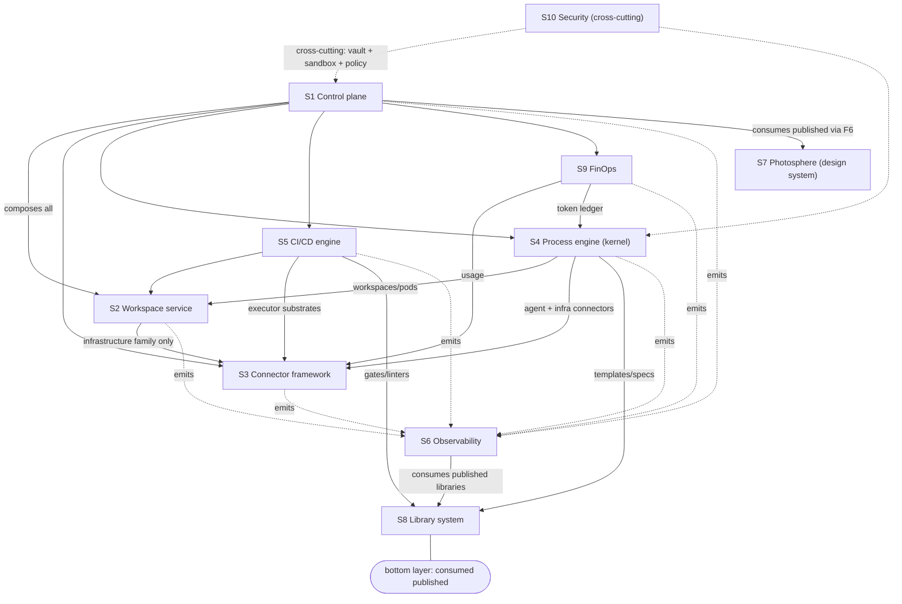

# 03 — System Decomposition

> Status: Draft · 2026-06-12 · Canonical home for subsystems S1–S10, dependency rules, repo and
> deployment mapping. Responsibilities reference Bender failure modes (corpus doc 01) they exist
> to mitigate — a subsystem that mitigates nothing is suspect.

## 1. Subsystem inventory

| ID | Subsystem | Responsibility (one line) | Bender modes addressed |
|---|---|---|---|
| S1 | **Control plane** | Tenancy, identity/RBAC, project lifecycle, creation wizard, the in-app assistant surface (AssistantSession, 02 §1), policy, audit log, the Connect API gateway; the only subsystem that knows all others. | 10 (internal APIs hardened), 13 |
| S2 | **Workspace service** | Eden-hosted git (built-in versioning), monorepo lifecycle, remote dev environments (browser editor, open-in-VS-Code), agent pods; the orchestrator reconcile loop over `workspaceprovider`. | 6 (VCS scaling), 8 (edit isolation) |
| S3 | **Connector framework** | The port/adapter machinery for everything external: contracts, capability manifests, conformance suites, credential binding, usage polling, drift detection. Families F1–F6 (05). | 11 (cost visibility), 12 |
| S4 | **Process engine (build-system kernel)** | Walks the 10-phase spine per cell; validates phase artifacts against schemas; binds phase→model via `agentconfiguration`; holds mutable run-state; fans out swarms; enforces budgets and gates. | 1, 3, 4 (review as gates), 7 |
| S5 | **CI/CD engine** | Pipeline definitions generated from archetypes; pluggable executors (docker → kubernetes); content-aware caching; runs schema validation, conformance, and breaking-change gates server-side. | 2 (build capacity), 5 (test-compute strategy) |
| S6 | **Observability platform** | One OTel stack, three planes: (a) Eden's own, (b) agent runs/transcripts/tokens, (c) generated-system telemetry; technical and non-technical renderings; SLOs; incident surface. | 9 (release vs detection), 11, 15 |
| S7 | **Design system (photosphere)** | Standalone asset: DTCG themes-as-data, runtime CSS-variable engine, Svelte component layer (ADR-0005); user-supplied design systems enter through the F6 connector contract. | 3 (agents fenced by token law) |
| S8 | **Library system** | The pattern catalogue rendered per ecosystem; HNS-1 naming; dev→release→adopt lifecycle with override enforcement; knowledge libraries + compiled checkers. Canonical: 10. | 1 (convention drift), 14 |
| S9 | **FinOps** | Unified metering (provider spend via F3 connectors + token spend from S4), budgets, alerts, pre-run cost estimates from accumulated archetype run data. | 11 (Jevons, cost visibility) |
| S10 | **Security** (cross-cutting) | Credential vault, agent sandboxing, clean-room verification, supply chain, tenant isolation, audit. Canonical: 07. | 10, supply chain |

**Bender** (see the README §1 source registry) catalogued how engineering practice fails at 10×
agentic velocity; this list is the canonical in-repo home of the fifteen modes, compactly: 1 code-liability/convention
drift · 2 build capacity · 3 easy-to-write-hard-to-maintain design · 4 review bottleneck ·
5 quadratic test-compute · 6 VCS scaling · 7 validation strategy ("Conjunction of Booleans") ·
8 multi-agent edit wars · 9 release outruns detection · 10 soft internal APIs · 11 token
economics/cost visibility · 12 rollback posture · 13 democratized building without a common
substrate · 14 knowledge/mentorship gap · 15 human attention.

## 2. Dependency rules

```
S1 control plane ───────▶ may depend on all (it is the composition surface)
S4 process engine ──────▶ S2 (workspaces/pods), S3 (agent + infra connectors), S8 (templates/specs)
S5 ci/cd ───────────────▶ S2, S3 (executor substrates), S8 (gates/linters)
S2 workspace ───────────▶ S3 (infrastructure family only)
S6 observability ◀────── everything emits to it; it depends on nothing above the libraries
S7 photosphere ─────────▶ nothing in Eden (separate asset; Eden consumes it published)
S8 libraries ───────────▶ nothing (the bottom layer; everything consumes them published)
S9 finops ──────────────▶ S3 (usage), S4 (token ledger)
S10 security ─────────── cross-cutting: vault and sandbox are services; policies are library-enforced
```



Hard rules: ① no subsystem imports a vendor SDK except inside an S3 adapter (P1/E1). ② nothing
below S1 knows about tenancy. ③ S4 never talks to a provider directly — agent pods and infra are
reached through S2/S3 ports. ④ libraries are consumed **published**, never by source path, except
under a declared dev override that cannot reach `main` (10 §8).

## 3. Repository mapping

| Repo | Contents |
|---|---|
| `gophersys/eden` (this monorepo, renamed) | `apps/backend` (Go modular monolith: S1–S6, S9 as domain slices) · `apps/frontend` (Svelte) · `apps/desktop` (Tauri shell) · `apps/agent` (Go dial-out agent for workspaces/pods) · `docs/` · phase-artifact schemas · archetype definitions |
| `gophersys/libs` (submodule) | `protocols/` (buf) · `go/` · `typescript/` · `rust/` · `python/` · `zephyr/` — pattern libraries per HNS-1 |
| `gophersys/photosphere` | The design system (S7), independently versioned |
| `gophersys/infrastructure` | kustomize base + overlays per stage |
| `gophersys/.devcontainer` | pinned dev images |

## 4. Deployment shape

🧩 **Modular monolith first.** `apps/backend` is one Go binary with domain slices
(`internal/{projects,workspaces,connectors,engine,identity,policy,audit,finops}`), one image, run
identically by `eden up` (docker-compose substrate) and by kubernetes overlays — the same
composition-root pattern as 10 §7.1 (stage and substrate detected once; the only
stage switch in the tree). Split into services only when scale forces it; the Connect API is the
seam that makes the split mechanical later. Agent pods and CI executors are separate processes
from day 1 (isolation, Bender mode 8) reached via the dial-out `management` pattern — workloads
connect out; nothing listens.

## 5. Subsystem notes (where the inventory needs more than one line)

- **S2 built-in git.** Eden hosts the authoritative repo (audit trail, gate enforcement at the
  server). External SCM (GitHub/GitLab) are F2 connector *mirrors* with declared ownership: pushes
  arriving at the mirror are drift (05 §5) — flagged with adopt/revert/fork options, satisfying
  "detect changes made external to the platform". byo-authority projects (ADR-0013) invert this:
  the user's host is authoritative, Eden holds organizational metadata only, and gate teeth come
  via host-app enforcement or are explicitly advisory.
- **S4 swarms.** Parallel safety comes from worktree isolation plus FileLeases (02 §2) assigned
  at planning time; operational semantics in 04 §7, build-time discipline in 09 §3.
- **S5 executors.** The CI contract is an executor port (docker, kubernetes); a future adapter may
  delegate to GitHub Actions et al. CI is also where every client-side enforcement re-runs
  server-side — client hooks are bypassable; the server gate is not (10 §8).
- **S6 transcripts.** Agent conversations are stored complete (plane b), linked to Run, Spec, and
  Evidence — the provenance chain from any deployed line of code back to the conversation that
  authored it.
- **S7 user design systems.** "Create/upload your own design system" = supply a DTCG ThemeDoc +
  component manifest through F6; UI-generating agents receive it as context and are *validated*
  against it (no off-system colors/components) — generation fenced by token law, i.e. generated
  UI may reference only the design system's semantic tokens and components (photosphere ADR-0003
  thesis, retained through the Svelte re-founding).
