# 05 — Connector Model

> Status: Draft · 2026-06-12 · Canonical home for: connector anatomy, families F1–F6, capability
> manifests, conformance, credentials, drift detection & remediation.
> The connector model is principle P1/E1 made mechanical: Eden defines requirement contracts;
> adapters satisfy them; nothing else touches the outside world.

## 1. Anatomy

Every connector family ships seven parts. An adapter is not "done" until all seven exist.

| Part | Obligation |
|---|---|
| **Contract** | The Eden-defined port: interfaces + protobuf messages in `libs/protocols`. Versioned; `buf breaking` gated. |
| **Adapter** | The per-provider implementation, isolated in its own package; the only place a vendor SDK may be imported. |
| **CapabilityManifest** | Declares which optional capabilities the adapter implements; the platform degrades gracefully ("this adapter doesn't support X, so feature Y is disabled, not broken"). |
| **Conformance suite** | The contract's executable semantics; every adapter must pass it against a real or faked provider (08 §2). This is how adapters are added safely at scale. |
| **Credential profile** | What scopes/permissions the user must grant, declared machine-readably; the wizard renders it as setup instructions; the vault enforces it (07 §2). |
| **Usage meter** | How consumption/billing data is polled or computed for this provider, normalized into UsageRecords (S9). |
| **Drift detector** | The family's ownership domain + reconcile loop emitting DriftEvents (§5). |

```mermaid
%% D3: Connector anatomy (seven parts) and families F1–F6 — v0 hand-authored projection of this document (12 §3); to be generated from model data.
flowchart LR
  subgraph ANATOMY ["Connector anatomy — seven parts (all required)"]
    direction TB
    C1["Contract (port: interfaces + protobuf, buf-breaking gated)"]
    C2["Adapter (per-provider; only place a vendor SDK is imported)"]
    C3["CapabilityManifest (declares optional capabilities; graceful degrade)"]
    C4["Conformance suite (executable semantics; every adapter passes)"]
    C5["Credential profile (scopes; wizard renders; vault enforces)"]
    C6["Usage meter (consumption -> UsageRecords, S9)"]
    C7["Drift detector (ownership domain + reconcile loop -> DriftEvents)"]
    C1 --> C2 --> C3 --> C4 --> C5 --> C6 --> C7
  end

  C1 -.realized per family.-> FAM

  subgraph FAM ["Families"]
    direction TB
    F1["F1 Infrastructure (substrate): docker-compose, kubernetes(kind)"]
    F2["F2 SCM: eden-authority + github mirror (authority_mode, enforcement_level)"]
    F3["F3 Billing & usage: cloud-billing polling"]
    F4["F4 Agents: claude-code (ADR-0008)"]
    F5["F5 Observability export: none in v1 (self-contained)"]
    F6["F6 Design systems: photosphere reference impl"]
  end
```



## 2. Families

| ID | Family | Contract summary | v1 adapters | Later |
|---|---|---|---|---|
| F1 | **Infrastructure (substrate)** | provision/teardown environments, run workloads, expose endpoints, secrets backend, registry, DNS, object storage, Postgres-class DB, metrics ingestion | `docker-compose`, `kubernetes` (kind) | managed kubernetes: EKS · GKE · AKS · DO; `bare-host`; `vm` (Firecracker/KubeVirt); `mac` (Orka); GPU; Test Bed (hardware) |
| F2 | **SCM** | mirror push/pull, PR/MR surface, webhooks, commit status, branch protection, identity mapping; per-project `authority_mode` (eden-authority \| byo-authority) and `enforcement_level` (enforced \| advisory) per ADR-0013 | eden-authority + `github` mirror | `gitlab`; byo-authority host-app enforcement |
| F3 | **Billing & usage** | poll provider spend, normalize cost lines, alerts; (hosted tier later: charge customers) | cloud-billing polling via F1 providers' APIs | `stripe` (when hosted tier exists) |
| F4 | **Agents** | `execute(spec, context, tools, schema) → artifact + transcript + token ledger`; tool grants; session persistence; interactive AssistantSessions (02 §1) use the same connector with read-scoped grants | `claude-code` (ADR-0008) | `pi`/`oh-my-pi` (+DeepSeek), `codex`, own-loop on `agentconfiguration.Client` |
| F5 | **Observability export** | OTel-native internally; export/forward to external backends; dashboard embedding | none needed in v1 (self-contained stack) | Datadog, Grafana Cloud, Honeycomb |
| F6 | **Design systems** | DTCG ThemeDoc + component manifest + usage rules in, validated UI generation out | `photosphere` (the reference implementation) | user-uploaded design systems (same contract — upload IS the adapter data) |

Notes. F2: eden-authority keeps gates server-enforceable and makes external mirrors a clean
drift surface. byo-authority (ADR-0013) inverts this for advanced users — their host is
authoritative, Eden stores organizational metadata only, and gate enforcement comes from host-app
enforcement (required status checks + branch protection) or are explicitly advisory with a
permanently visible guarantee badge. F4: the agent contract layers over the upstream
`AgentTransport`/factory design (docs/research/02 ✅ prototyped in `poc/agents`);
`agentconfiguration` compiles per-harness configuration (agents.yaml → native files) and routes
models. Boundary (per 02 §1 Workspace): S2 owns pod provisioning and lifecycle over
`workspaceprovider`; the F4 connector owns what runs inside the pod — harness invocation, tool
grants, transcript capture.

## 3. Capability manifests

A manifest is data, not code: `{capability_id, status: full | partial | absent, notes}` per
optional contract capability. The engine and UI consult manifests before offering features;
conformance suites verify manifests are truthful (a declared capability that fails its suite
blocks adapter release). This is what lets Eden "define its requirements and add adapters as we
go" without per-provider feature matrices rotting in documentation.

## 4. Credentials

Users supply provider credentials with the scopes the credential profile declares. Rules
(canonical detail in 07): vaulted at rest, KMS-backed; never serialized into agent context;
agents and workloads receive short-lived scoped tokens via the `secrets` port; every use is
audit-logged; revocation is immediate (vault is the single path).

## 5. Drift detection & remediation (E4/P10)

Each family declares an **ownership domain**: the set of external state Eden considers itself the
author of (the mirror repo's branches; the kubernetes namespace's resources; DNS records it
created).
A reconcile loop compares observed vs desired:

```
observe ──▶ diff vs desired ──▶ DriftEvent{domain, object, observed, desired, provenance}
                                      │
                  ┌───────────────────┼────────────────────┐
                  ▼                   ▼                    ▼
               adopt              revert                 fork
   (import external change   (restore desired       (branch the divergence,
    as an authored artifact   state; requires         queue for human ruling)
    re-entering the pipeline  policy permission)
    at the right phase)
```

- Detection is event-driven where the provider offers webhooks/watches, polled otherwise; every
  family must implement at least polled reconciliation.
- DriftEvents pause affected pipelines at their next gate (04 §8) and surface in the dashboard
  with the three remediation options; per-project policy may auto-rule classes of drift (e.g.
  auto-adopt doc-only commits to the mirror; never auto-revert production infrastructure).
- The remediation path itself is deterministic machinery (P8); agents may *propose* a ruling but
  never execute one outside a gate.
- IaC-style substrates make reconcile the *primary* topology (corpus doc 04 reconciliation-loop);
  for v1 cells drift detection is the Observe-phase obligation of cell invariant I6 (corpus doc
  04), generalized to every connector family. 🧩

## 6. Conformance (how adapters scale)

Per family, the conformance suite runs an adapter against recorded/faked provider behavior plus
(in release pipelines) a live sandbox account. Suites live with the contract, not the adapter —
adapters cannot weaken them. An adapter PR = adapter + manifest + passing conformance + credential
profile + meter + drift detector; the checklist is enforced by the engine, making third-party
adapters reviewable by machine first (the future marketplace depends on exactly this, 00 §6).
