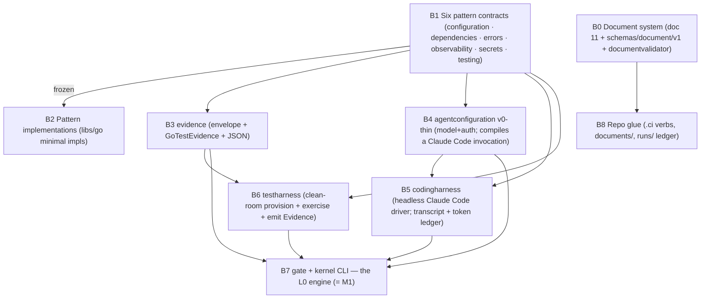

# 09 — Build Execution Plan

> Status: Draft · 2026-06-12 · Canonical home for: workstreams, parallelism discipline, the
> interface-negotiation protocol, milestones.
> **Supersession note (2026-07-06):** the M0–M3 / B-numbered sequencing below is the ORIGINAL
> plan; the executed order was re-ruled by ADR-0015 (product-first build order) + ADR-0022
> (Milestone B), and Milestone B has since shipped. The negotiation protocol (§4) and the
> parallelism discipline remain the live rules; read the milestone tables as history, not the
> current plan.
> Constraint set: built with Claude (Claude Code sessions + swarms); Mateo is never idle waiting
> on a single agent (divide and conquer); the build itself must *exercise* the practices the
> platform will later enforce — worktrees, interface negotiation, TDD, evidence gates — so that
> L0 is built the way L1+ will build (06 §1).

## 1. Posture

Everything that can be Go is Go (floor 1.26, ADR-0003). Development follows the ladder (06):
this plan details **L0**, the seeding of L1's task inventory, and the path into L2. Hand-built
work is bounded by 06's B2 exemption: humans + Claude hand-build the kernel, the universal
pattern libraries, and seam *contracts*; production implementations beyond that enter the L1/L2
task inventory and are built by the kernel. The practices below are not ceremony — each is a
rehearsal of machinery the kernel must later automate, performed manually first so its contract
is understood before it is coded.

## 2. Workstreams (parallel by construction)

Workstreams are sliced so their seams are Contracts, negotiable up front; after negotiation they
proceed independently in separate worktrees/sessions.

| WS | Scope | Depends on | First deliverables |
|---|---|---|---|
| WS1 | **Protocols + pattern libraries** | — | `libs/protocols` buf module skeleton; `libs/go/`: configuration · dependencies · errors · observability · secrets · testing (each: contract, fakes, conformance) |
| WS2 | **Kernel** | WS1 contracts only | `agentconfiguration` (resurrect agentd U1 as donor material through gates — ADR-0009/D) · `evidence` + GoTestEvidence · `testharness` · `codingharness`(Claude Code) · `specification`/`template` · linear `engine` |
| WS3 | **Control-plane spine** | WS1 contracts only | contract drafts (`workspaceprovider`, broker, gateway) + thin de-risking spikes; production implementations of `workspaceprovider(docker-compose)`, orchestrator, gateway, and `apps/agent` (salvaging `poc/agents` dial-out patterns) enter the **L1 kernel task inventory** (06 B2) — WS3 seeds kernel work, it does not bypass it |
| WS4 | **Photosphere re-founding** | independent (own repo) | ADR chain update in photosphere; theming engine retained; Svelte behavior-layer selection spike (OD-1) |
| WS5 | **Process & docs** | — | this set's review loop; phase-artifact schema drafts; knowledge-rule promotion from `poc/knowledge` |

Parallelism rule: WS2/WS3 start the moment their WS1 seam contracts freeze — not when WS1
finishes. Mateo's attention rotates across `approve` gates and open-decision rulings, not across
agent supervision (P13).

## 3. Worktree & merge discipline

**The git process is NOT defined here.** Its single home is
`.claude/rules/git-process.md` (ADR-0032) — branch naming, merge conditions,
commit format and attribution all live there and are cited, never restated. The
`ws<N>/<package-slug>` grammar this section used to name is deleted with
ADR-0019; the vocabulary is `<type>/<slug>`.

- One worktree per work package, cut from fresh `origin/main`; short-lived (days).
  Naming per git-process §2.
- File-lease sets declared in each package's plan; overlapping leases across concurrent packages
  are a planning error — fix the plan, not the merge.
- Merge under the four merge conditions of git-process §5. **This section states no
  competing set** — it previously carried a third one, which is the two-homes defect
  ADR-0032 exists to kill. The package-specific addition, and the only one, is the
  ADOPTED-only library invariant (10 §8).
- Conventional Commits; attribution per git-process §13.

## 4. Interface negotiation protocol

The manual rehearsal of the ServiceContract freeze gate (04 §4):

1. Producer and consumer of a seam each draft the contract from their side (interface + proto +
   usage examples) — cheaply, in parallel.
2. Reconcile into one **contract PR**: the interface, its fakes, and black-box contract tests —
   no implementation.
3. Freeze at review (photosphere's G1 interface-freeze gate: the contract is frozen before any
   implementation exists ✅). Post-freeze changes are new negotiations; `buf breaking` enforces
   the wire layer mechanically.
4. Both sides implement against the frozen contract + fakes, independently, TDD-style: tests
   first against the contract, typed holes (`panic("unimplemented")`), decompress to green.

## 5. TDD as practiced here

Contract-first, tests-pin-the-contract (not implementation accidents — the photosphere
divergence, resolved in its favor for human work; strict test-first remains the *template*
discipline for kernel-driven work where tests are phase artifacts). Every package lands with its
fakes and its conformance suite; "tests actually test" is checked by mutation where cheap (08 §3).

## 6. Milestones

| M | Gate (demonstrable, not aspirational) | Maps to |
|---|---|---|
| M0 | Seam contracts frozen: protocols skeleton + the six universal pattern contracts; worktree/CI discipline running on this repo | L0 entry |
| M1 | **Kernel closes the loop**: one task spec → Claude-Code-driven implementation → clean-room evidence → gate pass; tokens/variance/mutation metered (L0 exit) | 06 L0 |
| M2 | 50-task run through the go-backend cell (inventory: WS1/WS3 packages); instruments dashboarded; libraries adopted via dev→release→adopt (L1 exit) | 06 L1 |
| M3 | `eden up` walking skeleton: gateway + workspaceprovider(docker-compose) + agent + Svelte shell — kernel-built per L2; eden repo registered as project #1; first drift event detected on its own mirror (L2 exit criteria) | 06 L2 |

Estimates are deliberately absent: M1's run data is what makes estimation honest (T6); the first
cost model is calibrated on the kernel's own construction. 🔶

## 7. Immediate next actions (post doc-review)

1. Mateo reviews this set; rulings recorded as ADRs; open-decisions register updated.
2. Rename mechanics (ADR-0002, Consequences): repo rename, module paths, scope — one LSC-style
   change, gated.
3. WS1 contract drafts for the six universal patterns (the first interface negotiations).
4. WS2 spike: `codingharness` driving one headless Claude Code session end-to-end with transcript
   + token capture (de-risks the kernel's biggest item first).

## 8. L0 bill of materials (the dogfooding cut)

Everything the hand-operated dogfood loop — *specification in → agent implements in a worktree →
clean-room verification → deterministic gate → merge + ledger* — needs, in dependency order.
Implementations never start before their contract freezes (§4); once B7 exists, the remaining B2
backlog becomes the kernel's own first task inventory (06 L0→L1).

| # | Item | Contents | Depends on |
|---|---|---|---|
| B0 | Document system | doc 11 + `schemas/document/v1` + `tools/documentvalidator` (+ `project` verb, `--against` transition check, golden projection fixtures) | — (✅ shipped; additions in flight) |
| B1 | Six pattern contracts | configuration · dependencies · errors · observability · secrets · testing — contracts + fakes + conformance (WS1 negotiation → freeze) | — |
| B2 | Pattern implementations | minimal impls in `libs/go/` (one module each; root gitignored `go.work`) | B1 frozen |
| B3 | `evidence` | envelope interface + `GoTestEvidence` + JSON serialization | B1 |
| B4 | `agentconfiguration` (v0-thin) | model+auth binding; compiles a Claude Code invocation | B1 |
| B5 | `codingharness` | headless Claude Code driver on a worktree per specification; transcript + token ledger (WS2 spike de-risks) | B1, B4 |
| B6 | `testharness` | clean-room provision + exercise + emit Evidence (07 §4) | B1, B3 |
| B7 | `gate` + kernel CLI | linear runner: spec → worktree → B5 → B6 → gate verdict → run record. **This is the L0 engine** (= M1) | B3–B6 |
| B8 | Repo glue | `.ci` document/kernel verbs, `documents/` for project eden, `runs/` ledger convention | B0 |

## 9. The build waves (ADR-0016)

Each wave: **negotiate** new contracts it needs (the §4 protocol) → **implement** frozen
contracts TDD-first (tests authored from the contract before implementation; conformance suites
mandatory; substrate adapters tested against real docker daemons and kind clusters, never mocks)
→ **verify** adversarially → **Mateo reviews** between waves. Test infrastructure is a
deliverable of the wave that needs it, not an afterthought. Wave ledger: 3A = leaf+dependent
pattern implementations and the workspaceprovider/gitrepository/orchestrator negotiations; 3B =
substrate adapters, git operations, orchestrator v0, the agent-session service, the chat
surface, the Playwright forced-CRUD harness.
