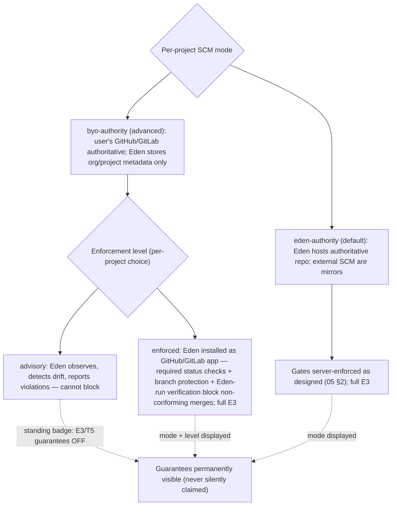

# ADR-0013: Two SCM integration modes; per-project gate enforcement with visible guarantees

- **Status:** Accepted (resolves OD-5)
- **Date:** 2026-06-12
- **Deciders:** Mateo (intake C8, C18)

## Context

05 §2 made Eden-hosted git the authority with external SCM as mirrors, and OD-5 parked
BYO-GitHub-as-authority. The intake overturned the parking: advanced users keep repos on their
own platforms, use the Eden backend only for organizational data about their projects, and
expect Eden to be "extremely well git integrated" — knowing exactly what drifted between their
repo and known state (C8). The tension: gates lose their enforcement power when Eden is not the authority.

## Decision

1. **Two integration modes per project:**
   - **eden-authority** (default): Eden hosts the authoritative repo; external SCM are mirrors;
     gates are server-enforced as designed (05 §2).
   - **byo-authority** (advanced): the user's GitHub/GitLab is authoritative. Eden stores
     **organizational and project metadata only** (data minimization is a product commitment);
     deep git integration tracks state and emits DriftEvents.
2. **Gate enforcement in byo-authority is a per-project choice** (C18):
   - **enforced** — Eden is installed as a GitHub/GitLab app: required status checks, branch
     protection, and Eden-run verification (in a cluster Eden can schedule on) block
     non-conforming merges. Full E3 guarantees.
   - **advisory** — Eden observes, detects drift, and reports violations but cannot block.
3. **Guarantees are permanently visible.** Every project surface displays its integration mode
   and enforcement level; an advisory project carries a standing badge stating exactly which
   guarantees (E3 promotion gating, T5 transition enforcement) are off. Eden never silently
   claims guarantees it cannot enforce.

## Consequences

- OD-5 resolved; the F2 contract gains `authority_mode` and `enforcement_level`, and its
  conformance suite gains host-app scenarios (status checks, branch-protection management).
- Clean-room verification (07 §4) is unchanged in enforced mode — Eden still runs the verifier
  in a cluster it schedules on and posts the result as a required check.
- Advisory mode weakens E3/T3 by explicit, displayed user choice — the invariant text stands;
  the guarantee scope is per-project and visible.
- The drift surface (05 §5) becomes the primary product experience in byo-authority mode.
