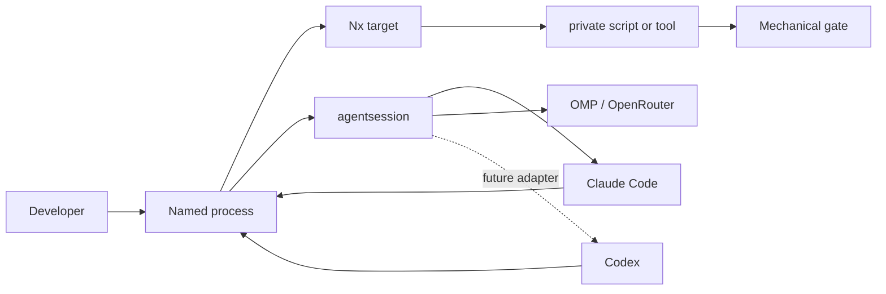

# Engineering system

This directory is the short operational map for humans and coding agents. The
machine-readable source is [`system.json`](system.json). Product truth remains
in [`documents/`](../../documents/); architecture truth remains in
[`docs/architecture/`](../architecture/).

## Four layers

| Layer           | One home                | Purpose                                            |
| --------------- | ----------------------- | -------------------------------------------------- |
| Product         | `documents/`            | What Eden must do                                  |
| Architecture    | `docs/architecture/`    | Why the system has its shape                       |
| Engineering     | `docs/engineering/`     | How work moves through the repository              |
| Agent execution | `libs/go/agentsession/` | Provider-neutral sessions, events and capabilities |

`AGENTS.md` and `CLAUDE.md` are adapters. They identify the harness and route
work here; they do not restate these layers. Repeated workflows become short
process documents and skills. Invariants become tests, linters, hooks, or
`ctl.sh` verbs. A warning written only in prose is not enforcement.

## Process vocabulary

The process identifiers are stable even while their documents are being built:

- `feature` — take one user-visible slice from intent to merge.
- `ci` — choose and run the smallest proof that covers a change.
- `parallel` — divide independent work across isolated worktrees.
- `review` — inspect a change and return evidence, not authorship.
- `release` — promote a verified commit without rebuilding it differently.

Their paths and readiness live in [`system.json`](system.json). We will activate
them one at a time. Until a process is active, existing repository commands and
gates remain authoritative.

## Rules for agent instrumentation

1. Put shared behavior here or in a named process, once.
2. Put reusable execution in a skill; keep reference material out of startup context.
3. Put deterministic enforcement in code, never in a prompt alone.
4. Keep harness-specific adapters only for genuine capability differences.
5. Enter through `devcontainer cloud`; inside the pinned container, expose every
   development and CI action as an Nx target. Scripts and tools stay behind Nx.
6. Preserve user work before cleanup; never infer permission to destroy history.
7. Prefer the smallest change and the narrowest useful proof.

## Current harness boundary

`libs/go/agentsession` already normalizes session specifications, events,
capabilities, credentials, and lifecycle. It currently implements Claude and
OMP adapters. Codex configuration is supported at the repository surface, but a
Codex `agentsession` adapter is future library work—not something documentation
should imitate.
