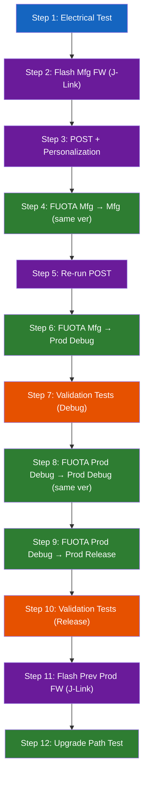
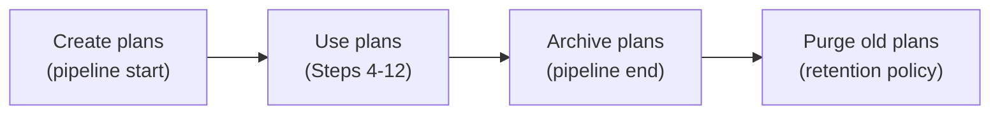
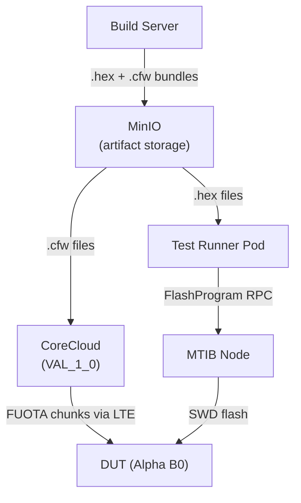
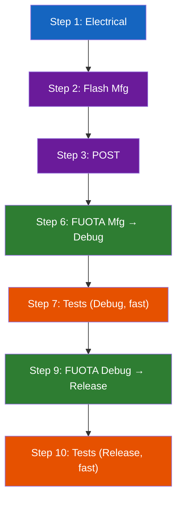
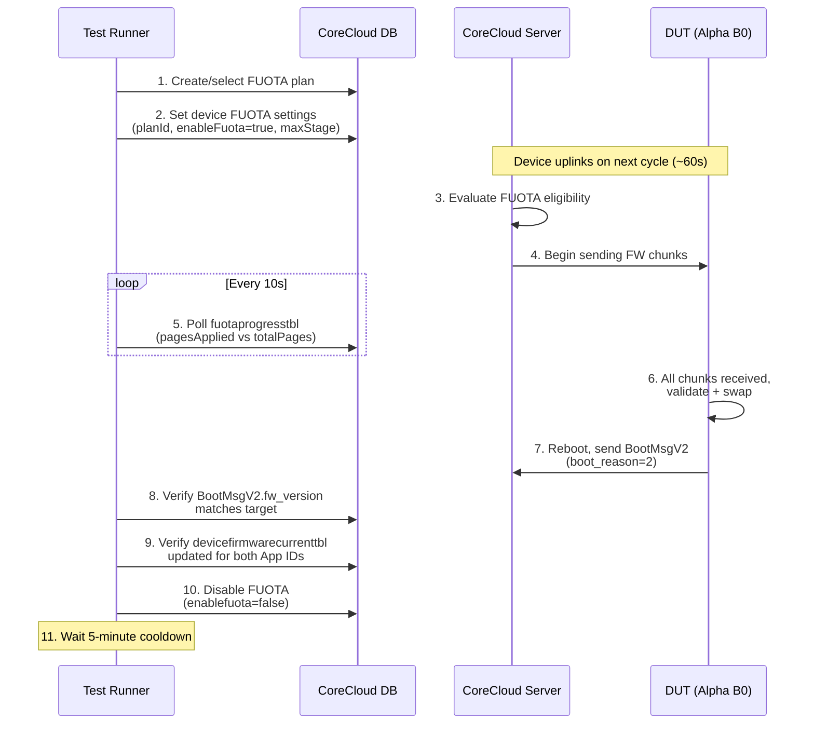
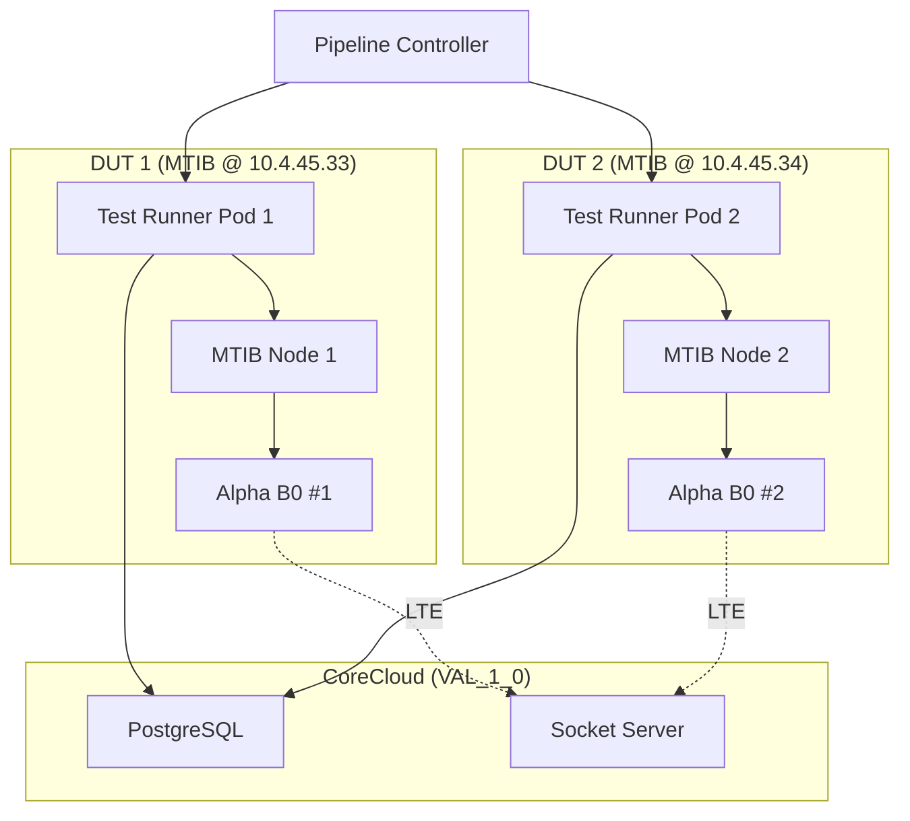
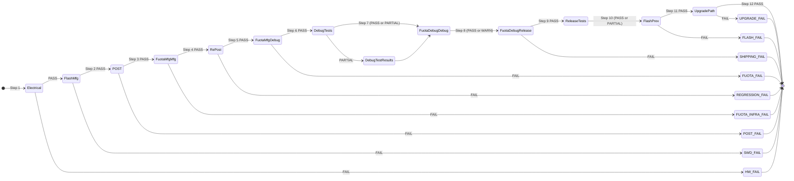

# Stage 4 FUOTA Validation Flow

> The complete firmware lifecycle validation sequence for Stage 4. Defines the
> 12-step FUOTA validation flow that every firmware release must pass before
> production approval. This document covers orchestration logic, FUOTA plan
> strategy, timing, artifact management, failure handling, and CoreCloud
> integration.
>
> **Companion to [stage4-product-tests.md](./stage4-product-tests.md)**, which
> defines the black-box test cases themselves. This document defines _how those
> tests are sequenced around firmware transitions_ -- the choreography of flash,
> FUOTA, verify, test, repeat that proves the firmware update mechanism and the
> shipping binary are both correct.

---

## 1. Purpose

Stage 4 product tests (defined in `stage4-product-tests.md`) answer: "does the
shipping binary meet its specifications?" This document answers the next
question: **does the firmware update lifecycle work end-to-end?**

A firmware release is not just a binary. It is a transition path:
manufacturing firmware in the factory, FUOTA to production debug for
validation, FUOTA to production release for shipping, and FUOTA from the
previous release for devices already in the field. Every one of those
transitions must work. A bug in any transition means bricked devices or failed
field updates.

The FUOTA Validation Flow is a 12-step sequence that exercises every transition
path on real hardware, using real CoreCloud FUOTA infrastructure, before any
firmware version is approved for production deployment. It is the core
orchestration logic of Stage 4.

### What This Flow Proves

1. **The FUOTA mechanism itself works** -- a device can receive firmware chunks
   over LTE, validate them, swap application images, and reboot cleanly.
2. **Every firmware transition path is viable** -- manufacturing to production,
   debug to release, same-version re-application, and real upgrade from
   previous release.
3. **Hardware survives FUOTA cycles** -- POST tests before and after FUOTA
   confirm no hardware regression.
4. **Both build variants pass product tests** -- the debug build (with UART
   diagnostics) and release build (the shipping binary) are each validated
   after FUOTA delivery.
5. **The field upgrade path works** -- flashing the previous production release
   and upgrading via FUOTA to the new release simulates a real-world device
   update.

---

## 2. The 12-Step FUOTA Validation Flow

For each new firmware build, the following sequence executes on each validation
DUT. Steps are numbered and must execute in order. Some steps may be skipped
for commit-level runs (see Section 6).



_Legend: Blue = hardware verification, Purple = J-Link flash + POST, Green = FUOTA transition, Orange = validation test suite._

---

### Step 1: Electrical Test

**Purpose**: Verify DUT hardware health before any firmware operations.

| Aspect | Detail |
|--------|--------|
| Action | Power DUT at 4.5V (Ch0), measure current draw at each rail |
| Interface | MTIB `PowerEnable`, `PowerMeasure` |
| Pass criteria | Current draw within spec at each voltage; no shorts, no open circuits |
| Failure action | Flag DUT as hardware failure, abort all remaining steps |

The electrical test catches dead boards, solder bridges, and power supply
faults before wasting time on firmware operations. This is a fast gate (under
30 seconds).

```python
async def step_1_electrical_test(ctx: ValidationContext):
    """Verify DUT hardware health via power rail measurements."""
    # Power on battery simulation rail
    await ctx.mtib.power_enable(channel=0, voltage_v=4.5)
    await asyncio.sleep(3)  # Boot settle time

    # Measure quiescent current
    result = await ctx.mtib.power_measure(channel=0, duration_s=5)
    assert result.avg_current_ma > 50, (
        f"DUT not drawing expected current: {result.avg_current_ma:.1f} mA "
        f"(expected >50 mA). Check solder joints and power rails."
    )
    assert result.avg_current_ma < 500, (
        f"DUT drawing excessive current: {result.avg_current_ma:.1f} mA "
        f"(expected <500 mA). Possible short circuit."
    )

    await ctx.mtib.power_disable(channel=0)
```

---

### Step 2: Flash Manufacturing Firmware (via J-Link)

**Purpose**: Load manufacturing firmware onto both processors via SWD.

| Aspect | Detail |
|--------|--------|
| Action | Flash `alpha_mfg_fw` to nRF52840 (App ID 109) and nRF9151 (App ID 108) |
| Interface | MTIB `FlashProgram` (wraps `nrfjprog --recover` + `nrfjprog --program`) |
| Speed | 4 MHz SWD (`--speed 4000`) |
| Pass criteria | Both processors boot, manufacturing shell accessible on UART |
| Failure action | Retry once, then flag J-Link/SWD issue |

Both processors must be flashed. The nRF52840 receives the app processor
manufacturing firmware; the nRF9151 receives the comms coprocessor
manufacturing firmware. Recovery (`--recover`) is always run first to clear
APPROTECT.

```
nrfjprog --recover --snr <PROBE_SERIAL> -f NRF52 --speed 4000
nrfjprog --program alpha_mfg_app_109.hex --chiperase --verify --reset --snr <PROBE_SERIAL> -f NRF52 --speed 4000

nrfjprog --recover --snr <PROBE_SERIAL> -f NRF53 --speed 4000 --coprocessor CP_NETWORK
nrfjprog --program alpha_mfg_comms_108.hex --chiperase --verify --reset --snr <PROBE_SERIAL> -f NRF53 --speed 4000 --coprocessor CP_NETWORK
```

---

### Step 3: POST (Hardware Verification + Personalization)

**Purpose**: Run the manufacturing POST sequence and personalize the device for
the validation CoreCloud environment.

| Aspect | Detail |
|--------|--------|
| Action | Execute POST via UART shell commands; assign device ID, generate keys, register with CoreCloud |
| Interface | MTIB `UartStream` (UART1 → nRF52840 shell) + CoreCloud REST API |
| Pass criteria | All POST steps pass, device registered in `VAL_1_0` environment |
| Failure action | Retry once, then flag hardware issue |

POST runs the following sub-steps via the manufacturing shell on the nRF52840:

1. **Chip ID verification** -- read nRF52840 and nRF9151 device IDs
2. **Accelerometer self-test** -- LSM6DSO SPI bus and sensor health
3. **Altimeter check** -- BME280 I2C bus and pressure reading
4. **BLE scan** -- nRF52840 radio health
5. **Modem registration** -- nRF9151 LTE-M attach to network
6. **Flash integrity** -- read/write external flash
7. **Personalization** -- assign Device ID (EUI-64), generate ECDSA P-256 key
   pair on-device, export public key, register with CoreCloud via
   `POST /System/Devices/Register`
8. **IPC rekey** -- establish encrypted inter-processor communication channel

Personalization creates a device identity in the `VAL_1_0` CoreCloud
environment. The Device ID, public key, device type (2), and device variant (3)
are registered. This identity persists for the remainder of the validation flow.

> **Note**: For persistent validation DUTs (pre-registered devices that are
> reused across pipeline runs), personalization is skipped. The DUT's existing
> identity in `VAL_1_0` is reused. Only the POST hardware checks are re-run.

---

### Step 4: FUOTA -- Manufacturing FW to Manufacturing FW (Same Version)

**Purpose**: Verify the FUOTA mechanism itself works before relying on it for
real firmware transitions.

| Aspect | Detail |
|--------|--------|
| Action | Create FUOTA plan targeting the same mfg FW version already running |
| Interface | CoreCloud DB ORM (plan creation + device settings) |
| FUOTA plan | Plan A (see Section 3) |
| Pass criteria | `BootMsgV2` with `boot_reason=2` (FUOTA complete), same mfg FW version reported |
| Timeout | 15 minutes |
| Failure action | Log FUOTA mechanism failure, retry once |

This step is a sanity check. The device already has manufacturing firmware
vX.Y.Z-PM. We send the exact same version via FUOTA. If this fails, the FUOTA
infrastructure itself is broken -- there is no point testing real transitions.

```python
async def step_4_fuota_mfg_to_mfg(ctx: ValidationContext):
    """FUOTA same-version re-application: verify FUOTA mechanism."""
    # Configure device FUOTA settings
    await ctx.fuota.configure_device(
        plan_id=ctx.plans.plan_a.id,
        enable=True,
        max_stage=1,
    )

    # Wait for FUOTA completion via BootMsgV2
    boot_msg = await ctx.fuota.wait_for_completion(
        expected_app_version=ctx.artifacts.mfg_fw.version_109,
        expected_comms_version=ctx.artifacts.mfg_fw.version_108,
        timeout_s=900,
    )
    assert boot_msg is not None, "FUOTA mfg→mfg did not complete within timeout"
    assert boot_msg.boot_reason == 2, (
        f"Expected FUOTA boot reason (2), got {boot_msg.boot_reason}"
    )

    # Disable FUOTA to prevent unintended further updates
    await ctx.fuota.configure_device(enable=False)

    # Wait for 5-minute cooldown
    await asyncio.sleep(300)
```

---

### Step 5: Re-run POST (Post-FUOTA Hardware Verification)

**Purpose**: Verify hardware is still healthy after a complete FUOTA cycle.

| Aspect | Detail |
|--------|--------|
| Action | Same POST hardware checks as Step 3, WITHOUT re-personalization |
| Interface | MTIB `UartStream` (UART1 shell) |
| Pass criteria | All hardware checks pass |
| Failure action | Flag post-FUOTA hardware regression |

This step catches corruption that could occur if the FUOTA process damaged
flash, disrupted sensor initialization, or broke the IPC channel. If Step 5
fails but Step 3 passed, the FUOTA operation itself caused the regression.

---

### Step 6: FUOTA -- Manufacturing FW to Production Debug FW

**Purpose**: First real firmware transition. Validates the critical
manufacturing-to-production upgrade path.

| Aspect | Detail |
|--------|--------|
| Action | FUOTA from mfg FW (vX.Y.Z-PM) to production debug FW (vX.Y.Z-PD) |
| Interface | CoreCloud DB ORM |
| FUOTA plan | Plan B (see Section 3) |
| Pass criteria | `BootMsgV2` confirms production debug FW version for both App IDs (108 + 109) |
| Timeout | 15 minutes per processor |
| Failure action | Retry FUOTA, check plan configuration |

This is the transition every device makes leaving the factory. The
manufacturing firmware (with POST routines and manufacturing shell) is replaced
by the production debug firmware (no shell, but with `CONFIG_LOG=y` for UART
diagnostics).

> **Dual-processor synchronization**: Both App ID 108 (nRF9151) and App ID 109
> (nRF52840) must complete their FUOTA transfers and report the correct target
> version before the device is considered updated. The `updateorder` field in
> `fuotaplanstagetargetstbl` controls which processor updates first.

---

### Step 7: Validation Tests (Debug Build)

**Purpose**: Execute the full validation test suite against the production
debug firmware.

| Aspect | Detail |
|--------|--------|
| Action | Run all Stage 4 test modules from `stage4-product-tests.md` |
| Firmware | Production Debug (`CONFIG_CONCORD_HARNESS=n`, `CONFIG_LOG=y`) |
| Interface | MTIB hardware control + CoreCloud message verification |
| UART role | Diagnostic only -- captured for failure analysis, never for assertions |
| Pass criteria | All test cases pass per PRDTST requirements |
| Failure action | Individual test failures recorded; continue to Step 8 |

Test modules executed:

| Module | Test Count | Stimulus | Verification |
|--------|-----------|----------|-------------|
| `test_boot.py` | ~3 | Power cycle | `BootMsgV2` at CoreCloud |
| `test_motion.py` | 5 | Linear actuator | `PositionMsgV6.is_in_motion` |
| `test_biometric.py` | 3 | GPIO on-skin electrode | `BiometricDataMsg.on_body` |
| `test_button.py` | 9 | GPIO button press | Device response (LED, CoreCloud) |
| `test_environmental.py` | 7 | Ambient conditions | `BiometricDataMsg` fields |
| `test_power.py` | 7 | `PowerMeasure` over time | Current within budget (informational) |
| `test_nfc.py` | 1 | NFC reader scan | Device ID read |
| `test_charging.py` | varies | Charger relay | Charging behavior |
| `test_led.py` | varies | Photodiode ADC | LED color/pattern |

The Debug build provides UART log output on `/dev/verdin-uart2`. This output is
captured by the test runner and saved as `debug_uart_log.txt`. If a test fails,
engineers can diagnose the failure from log output without re-running on
instrumented firmware. Power budget tests run but results are **informational**
(log overhead affects power draw).

---

### Step 8: FUOTA -- Production Debug FW to Production Debug FW (Same Version)

**Purpose**: Verify FUOTA works on production firmware, not just manufacturing
firmware.

| Aspect | Detail |
|--------|--------|
| Action | Same-version FUOTA re-application on production debug FW |
| FUOTA plan | Plan C (see Section 3) |
| Pass criteria | Device reboots, reports same debug FW version |
| Timeout | 15 minutes |
| Failure action | Log re-application failure; continue to Step 9 (WARN, not FAIL) |

This step verifies that the FUOTA client in the production firmware (which
differs from the manufacturing firmware's FUOTA client) can receive and apply
updates. If Step 4 passed (mfg FUOTA works) but Step 8 fails, the production
build has a FUOTA regression.

---

### Step 9: FUOTA -- Production Debug FW to Production Release FW

**Purpose**: Transition from debug to release build. The production release
is the shipping binary (`CONFIG_LOG=n`).

| Aspect | Detail |
|--------|--------|
| Action | FUOTA from production debug FW (vX.Y.Z-PD) to production release FW (vX.Y.Z-P) |
| FUOTA plan | Plan D (see Section 3) |
| Pass criteria | `BootMsgV2` confirms non-debug FW version |
| Timeout | 15 minutes |
| Failure action | Retry FUOTA. FAIL -- shipping binary cannot be delivered |

This is the most critical FUOTA transition for the pipeline. If this fails, the
exact binary intended for manufacturing cannot be delivered via FUOTA, which
means devices in the field cannot be upgraded to this release.

---

### Step 10: Validation Tests (Release Build)

**Purpose**: Run the same validation test suite on the shipping binary.

| Aspect | Detail |
|--------|--------|
| Action | Same test modules as Step 7 |
| Firmware | Production Release (`CONFIG_CONCORD_HARNESS=n`, `CONFIG_LOG=n`) |
| UART output | None (release build is silent) |
| Power budget tests | **Authoritative** -- no debug overhead |
| Pass criteria | All test cases pass |
| Failure action | Individual test failures recorded; continue to Step 11 |

Key differences from Step 7:

- **No UART diagnostics**: If a test fails, there is no log output. The
  failure must be diagnosed from CoreCloud messages and MTIB measurements
  alone, or the test must be re-run on the debug build.
- **Power measurements are binding**: The release build has zero debug overhead.
  Current draw measurements in this step define the actual power budget of the
  shipping product.
- **Timing is authoritative**: Without log thread overhead, all timing
  measurements (heartbeat intervals, motion detection windows, sensor sampling
  cadence) reflect actual production behavior.

---

### Step 11: Flash Previous Production Firmware (via J-Link)

**Purpose**: Set up for the real upgrade path test by loading the previous
release.

| Aspect | Detail |
|--------|--------|
| Action | Flash previous production release firmware (e.g., v1.2.0-P if testing v1.3.0) via J-Link |
| Interface | MTIB `FlashProgram` |
| Artifact source | Previous release `.hex` files from MinIO or build server |
| Pass criteria | Device boots with previous production FW version |
| Failure action | Retry flash; FAIL if second attempt fails |

This step simulates a device that has been deployed in the field running the
previous production release. By flashing via J-Link (not FUOTA), we put the
device in a known state that represents the real-world starting point for a
field upgrade.

---

### Step 12: FUOTA Upgrade Path Test

**Purpose**: Verify the real-world upgrade path from previous production
firmware to the new release.

This step has two sub-steps, each a FUOTA transition:

#### Step 12a: FUOTA -- Previous Production to New Production Debug

| Aspect | Detail |
|--------|--------|
| Action | FUOTA from previous production FW (vA.B.C-P) to new production debug FW (vX.Y.Z-PD) |
| FUOTA plan | Plan E (see Section 3) |
| Pass criteria | `BootMsgV2` shows new debug version |
| Timeout | 15 minutes |

This is the real-world upgrade scenario. A device running the previous release
receives the new firmware via FUOTA. If this fails, the new release cannot be
deployed to the existing fleet.

#### Step 12b: FUOTA -- New Production Debug to New Production Release

| Aspect | Detail |
|--------|--------|
| Action | FUOTA from new production debug FW (vX.Y.Z-PD) to new production release FW (vX.Y.Z-P) |
| FUOTA plan | Plan F (see Section 3) |
| Pass criteria | `BootMsgV2` shows new non-debug version; device fully functional |
| Timeout | 15 minutes |

This completes the upgrade path by transitioning to the shipping binary. After
this step, the device is running the same firmware it would have after a real
field upgrade.

---

## 3. FUOTA Plan Strategy

### Plan Inventory

The 12-step flow requires managing six FUOTA plans. Each plan targets a
specific firmware transition.

| Plan | Step | Source Version | Target Version | Purpose |
|------|------|---------------|---------------|---------|
| **A** | 4 | Mfg FW vX.Y.Z-PM | Mfg FW vX.Y.Z-PM | Test FUOTA mechanism (same version) |
| **B** | 6 | Mfg FW vX.Y.Z-PM | Prod Debug vX.Y.Z-PD | Manufacturing to production transition |
| **C** | 8 | Prod Debug vX.Y.Z-PD | Prod Debug vX.Y.Z-PD | Test FUOTA on production FW (same version) |
| **D** | 9 | Prod Debug vX.Y.Z-PD | Prod Release vX.Y.Z-P | Debug to release transition |
| **E** | 12a | Prev Prod vA.B.C-P | New Prod Debug vX.Y.Z-PD | Real upgrade path |
| **F** | 12b | New Prod Debug vX.Y.Z-PD | New Prod Release vX.Y.Z-P | Final upgrade transition |

### Plan Structure in CoreCloud

Each plan maps to the CoreCloud FUOTA data model (see
[06-fuota-corecloud-v1.md](../research/06-fuota-corecloud-v1.md)):

```
fuotaplanstbl (Plan)
  ├── devicetypeid = 2 (Alpha)
  ├── devicevariantid = 3 (B0)
  └── fuotaplanstagestbl (Stages)
      └── fuotaplanstagetargetstbl (Targets per App ID)
          ├── appid = 108 (nRF9151 comms)
          └── appid = 109 (nRF52840 app)
```

### Example: Plan B (Mfg to Production Debug)

```json
{
  "description": "VAL: Mfg → Prod Debug (pipeline run pl-abc123)",
  "deviceType": 2,
  "deviceVariant": 3,
  "stages": [
    {
      "updatestage": 1,
      "description": "Manufacturing baseline",
      "isSkippable": false,
      "targets": [
        "108.1.0.0-PM",
        "109.1.0.0-PM"
      ]
    },
    {
      "updatestage": 2,
      "description": "Production debug target",
      "isSkippable": false,
      "targets": [
        "108.2.0.0-PD",
        "109.2.0.0-PD"
      ]
    }
  ]
}
```

The device starts at stage 1 (mfg firmware). Setting `maxstage=2` in
`fuotasettingsperdevicetbl` allows progression to stage 2 (production debug).

### Plan Consolidation Opportunity

Plans B, C, and D describe a linear progression: mfg -> prod debug -> prod
debug (same) -> prod release. A single multi-stage plan could handle all three
transitions by incrementing `maxstage` at each step:

```
Stage 1: Mfg FW vX.Y.Z-PM         (baseline — device starts here)
Stage 2: Prod Debug vX.Y.Z-PD     (Step 6: set maxstage=2)
Stage 3: Prod Debug vX.Y.Z-PD     (Step 8: same version, set maxstage=3)
Stage 4: Prod Release vX.Y.Z-P    (Step 9: set maxstage=4)
```

**Trade-off**: Consolidation reduces plan count (6 plans to 3) but couples
plan stages. A failure in Step 8 could contaminate the plan state for Step 9.
Per-run isolated plans are safer for traceability.

**Recommendation**: Use per-run isolated plans (6 plans per pipeline run) for
initial implementation. Evaluate consolidation after the flow is proven stable.

### Plan Lifecycle



1. **Create**: At pipeline start, create all six plans with unique descriptions
   that include the pipeline run ID for traceability.
2. **Use**: Each step references its assigned plan by ID.
3. **Archive**: After pipeline completion, mark plans as completed (or leave
   in database with descriptive naming).
4. **Purge**: A retention policy removes plans older than N days (e.g., 30
   days). Plans from failed runs are preserved for debugging.

---

## 4. Firmware Artifact Requirements

### Artifact Bundle

For each validation run, the pipeline needs these artifacts:

| Artifact | App ID | Format | Source | Used In |
|----------|--------|--------|--------|---------|
| Mfg FW (nRF52840) | 109 | `.hex` | Build server | Step 2 (J-Link flash) |
| Mfg FW (nRF9151) | 108 | `.hex` | Build server | Step 2 (J-Link flash) |
| Mfg FW (nRF52840) | 109 | `.cfw` | Build server | Step 4 (FUOTA) |
| Mfg FW (nRF9151) | 108 | `.cfw` | Build server | Step 4 (FUOTA) |
| Prod Debug FW (nRF52840) | 109 | `.cfw` | Build server | Steps 6, 8, 12a |
| Prod Debug FW (nRF9151) | 108 | `.cfw` | Build server | Steps 6, 8, 12a |
| Prod Release FW (nRF52840) | 109 | `.cfw` | Build server | Steps 9, 12b |
| Prod Release FW (nRF9151) | 108 | `.cfw` | Build server | Steps 9, 12b |
| Prev Prod FW (nRF52840) | 109 | `.hex` | MinIO (previous release) | Step 11 |
| Prev Prod FW (nRF9151) | 108 | `.hex` | MinIO (previous release) | Step 11 |

### Artifact Flow



**Build server integration**: The build server produces a zip containing:

- 2 manufacturing firmware builds (nRF52840 + nRF9151, `.hex` + `.cfw`)
- 2 production debug builds (nRF52840 + nRF9151, `.cfw` only -- J-Link not
  used for production FW in the normal flow)
- 2 production release builds (nRF52840 + nRF9151, `.cfw` only)

The previous production release artifacts are sourced from MinIO, where each
release is stored under a versioned path:

```
validation/firmware/alpha/releases/
  v1.2.0/
    alpha_prod_app_109_v1.2.0.hex
    alpha_prod_comms_108_v1.2.0.hex
  v1.3.0/
    alpha_prod_app_109_v1.3.0.hex
    alpha_prod_comms_108_v1.3.0.hex
```

### .cfw Upload to CoreCloud

The `.cfw` files must be accessible to the CoreCloud socket server for FUOTA
chunk delivery. The mechanism for uploading `.cfw` files to CoreCloud is
currently an open gap (see Section 11). The pipeline must either:

1. Upload `.cfw` files via a CoreCloud REST endpoint (preferred, if one exists)
2. Place `.cfw` files in a shared storage location that the CoreCloud server reads
3. Use direct database insertion to register firmware versions and file paths

---

## 5. Timing Analysis

### Per-Step Timing

| Step | Operation | Estimated Duration | Dominant Factor |
|------|-----------|-------------------|----------------|
| 1 | Electrical test | 30 seconds | Power settle + measurement |
| 2 | J-Link flash (2 MCUs) | 1-2 minutes | Flash erase + program + verify |
| 3 | POST + personalization | 2-5 minutes | Shell command sequence + CoreCloud registration |
| 4 | FUOTA mfg -> mfg | 5-15 minutes | Uplink interval + chunk transfer |
| -- | Cooldown after Step 4 | 5 minutes | Server-enforced |
| 5 | Re-run POST | 2-3 minutes | Shell commands only (no personalization) |
| 6 | FUOTA mfg -> prod debug | 5-15 minutes | Uplink interval + chunk transfer |
| -- | Cooldown after Step 6 | 5 minutes | Server-enforced |
| 7 | Validation tests (debug) | 15-60 minutes | Depends on test subset |
| 8 | FUOTA prod -> prod | 5-15 minutes | Uplink interval + chunk transfer |
| -- | Cooldown after Step 8 | 5 minutes | Server-enforced |
| 9 | FUOTA debug -> release | 5-15 minutes | Uplink interval + chunk transfer |
| -- | Cooldown after Step 9 | 5 minutes | Server-enforced |
| 10 | Validation tests (release) | 15-60 minutes | Depends on test subset |
| 11 | J-Link flash (prev prod) | 1-2 minutes | Flash erase + program + verify |
| 12a | FUOTA prev -> new debug | 5-15 minutes | Uplink interval + chunk transfer |
| -- | Cooldown after Step 12a | 5 minutes | Server-enforced |
| 12b | FUOTA new debug -> release | 5-15 minutes | Uplink interval + chunk transfer |

### Total Estimated Duration by Run Type

| Run Type | Steps Executed | Estimated Duration |
|----------|---------------|-------------------|
| **Commit** | 1-3, 6-7 (fast subset), 9-10 (fast subset) | 30-45 minutes |
| **Weekly** | All 12 steps, full test suite | 2-4 hours |
| **Release** | All 12 steps, full test suite + endurance | 4-8 hours |

### FUOTA Transfer Time Model

FUOTA transfer time depends on firmware image size and device uplink interval:

```
Transfer time = (total_pages * uplink_interval_s) + boot_time_s

Where:
  total_pages = ceil(cfw_file_size / chunk_size)
  chunk_size  ≈ 1024 bytes (1 KB per uplink)
  uplink_interval_s ≈ 60 seconds (configurable)
  boot_time_s ≈ 3 seconds
```

For a typical 200 KB firmware image:

```
total_pages = ceil(200 * 1024 / 1024) = 200 pages
transfer_time = 200 * 60 + 3 = 12,003 seconds ≈ 200 minutes
```

**This estimate assumes one chunk per uplink.** If the server sends multiple
chunks per uplink response, transfer time decreases proportionally. Actual
timing must be measured during initial pipeline bring-up.

> **Important**: The 5-minute cooldown between FUOTA completions is
> server-enforced. With 6 FUOTA transitions in the full flow, that is 30
> minutes of pure cooldown time regardless of transfer speed.

---

## 6. Test Subsets by Run Type

Not every step executes on every pipeline run. The run type (set by the
pipeline trigger) determines which steps are included.

### Step Inclusion Matrix

| Step | Commit | Weekly | Release | Rationale |
|------|--------|--------|---------|-----------|
| 1: Electrical | Yes | Yes | Yes | Always verify hardware first |
| 2: Flash mfg | Yes | Yes | Yes | Needed to start the flow |
| 3: POST | Yes | Yes | Yes | Hardware baseline |
| 4: FUOTA mfg->mfg | **No** | Yes | Yes | FUOTA mechanism test -- slow, low regression risk |
| 5: Re-POST | **No** | Yes | Yes | Only meaningful after Step 4 |
| 6: FUOTA mfg->prod debug | Yes | Yes | Yes | Core transition, always tested |
| 7: Tests (debug) | Fast subset | Full suite | Full suite + endurance |
| 8: FUOTA prod->prod | **No** | Yes | Yes | Same-version test -- slow, low regression risk |
| 9: FUOTA debug->release | Yes | Yes | Yes | Shipping binary delivery, always tested |
| 10: Tests (release) | Fast subset | Full suite | Full suite + endurance |
| 11: Flash prev | **No** | Yes | Yes | Upgrade path -- slow, important for releases |
| 12: Upgrade path | **No** | Yes | Yes | Field update simulation |

### Commit Run Optimized Flow



The commit run skips Steps 4, 5, 8, 11, and 12. This eliminates three FUOTA
transitions (with their cooldowns) and the J-Link flash of the previous
firmware. Estimated time savings: 60-90 minutes.

---

## 7. Failure Handling

### Failure Classification

| Severity | Meaning | Pipeline Behavior |
|----------|---------|-------------------|
| **FAIL** | Step failed, no further steps can execute | Pipeline stops, DUT flagged |
| **PARTIAL** | Some tests failed within a step, but flow can continue | Individual failures recorded, next step starts |
| **WARN** | Step result is unexpected but non-blocking | Logged with warning, next step starts |

### Per-Step Failure Matrix

| Step | Failure Type | Recovery Action | Pipeline Status |
|------|-------------|----------------|-----------------|
| 1: Electrical | Hardware fault | Flag DUT as hardware failure | **FAIL** -- no further steps |
| 2: Flash mfg | J-Link/SWD issue | Retry once, then flag | **FAIL** -- no further steps |
| 3: POST | Hardware issue | Retry once, then flag | **FAIL** -- no further steps |
| 4: FUOTA mfg->mfg | FUOTA infra broken | Retry once | **FAIL** -- critical FUOTA infra issue |
| 5: Re-POST | Post-FUOTA regression | None (diagnostic) | **FAIL** -- FUOTA may have corrupted device |
| 6: FUOTA mfg->debug | Plan config or FUOTA failure | Retry FUOTA, verify plan | **FAIL** -- blocks all subsequent steps |
| 7: Tests (debug) | Individual test failure | Record each failure | **PARTIAL** -- continue to Step 8 |
| 8: FUOTA prod->prod | Re-application failure | Log failure | **WARN** -- continue to Step 9 |
| 9: FUOTA debug->release | Shipping binary delivery failed | Retry FUOTA | **FAIL** -- shipping binary cannot be delivered |
| 10: Tests (release) | Individual test failure | Record each failure | **PARTIAL** -- continue to Step 11 |
| 11: Flash prev | J-Link issue | Retry flash | **FAIL** -- upgrade path cannot be tested |
| 12a: Upgrade path (debug) | Upgrade failure | Log failure | **FAIL** -- critical for field updates |
| 12b: Upgrade path (release) | Final transition failure | Log failure | **FAIL** -- critical for field updates |

### FUOTA-Specific Failure Modes

| Failure Mode | Detection | Root Cause | Recovery |
|-------------|-----------|-----------|----------|
| No FUOTA started | `fuotaprogresstbl` empty after timeout | Device not uplinking, plan misconfigured, FUOTA disabled | Verify device connectivity, check plan config |
| Transfer stalled | `pagesapplied` not incrementing | LTE connection lost, server error | Power cycle device, wait for reconnection |
| Transfer completed but no reboot | `pagesapplied == totalpages` but no `BootMsgV2` | Image validation failed on device | Check firmware signing, bootloader state |
| Wrong version after reboot | `BootMsgV2` shows unexpected version | Plan targeted wrong version, device rolled back | Verify plan stage targets, check bootloader logs |
| `BootMsgV2` boot_reason != 2 | Boot reason is 0 (normal) or 4 (error) | FUOTA was not the cause of reboot | Check if device power-cycled externally |

### Retry Strategy

FUOTA failures are retried once by default. The retry procedure:

1. Power cycle the DUT (full off/on via MTIB)
2. Wait for boot (3 seconds + `BootMsgV2` confirmation)
3. Re-enable FUOTA in device settings
4. Wait for FUOTA completion with the same timeout

If the retry also fails, the step is marked **FAIL** and the pipeline stops
(or continues with **WARN** for non-critical steps like Step 8).

---

## 8. FUOTA Monitoring and Verification Protocol

Every FUOTA step follows the same monitoring protocol. This section defines
it once; each step references this protocol.

### Protocol Steps



### Verification Checklist

For each FUOTA transition, the pipeline verifies:

1. **`BootMsgV2` received** with `boot_reason=2` (FUOTA complete)
2. **`BootMsgV2.fw_version`** matches the expected target version
3. **Both App IDs updated** -- `devicefirmwarecurrenttbl` shows correct
   versions for App ID 108 (comms) and App ID 109 (app)
4. **Device is responsive** -- subsequent uplink messages arrive (position,
   heartbeat)
5. **No error boot messages** -- `BootMsgV2` with `boot_reason=1` (exception)
   or `boot_reason=4` (error) would indicate a problem
6. **FUOTA progress history recorded** -- `fuotaprogresshistorytbl` contains
   a completed record with `timefinished` set

### Timeout Strategy

| Firmware Size | Expected Pages | Expected Transfer Time | Timeout |
|--------------|---------------|----------------------|---------|
| < 100 KB | ~100 | ~100 min | 15 min |
| 100-300 KB | ~200 | ~200 min | 20 min |
| > 300 KB | ~300+ | ~300+ min | 30 min |

> **Note**: The "expected transfer time" column assumes 1 chunk per uplink at
> 60-second intervals. Actual transfer times depend on server chunking behavior
> and LTE connection quality. Initial bring-up will calibrate these estimates.
> If the server sends multiple chunks per uplink, transfer times will be
> significantly shorter.

Timeouts are set per-transition and scale with firmware image size. An adaptive
timeout strategy is recommended:

```python
def compute_fuota_timeout(cfw_size_bytes: int, uplink_interval_s: int = 60) -> int:
    """Compute FUOTA timeout with 50% safety margin."""
    pages = math.ceil(cfw_size_bytes / 1024)
    expected_s = pages * uplink_interval_s
    return int(expected_s * 1.5)  # 50% safety margin
```

---

## 9. CoreCloud Integration Points

> **SDK architecture:** See
> [corecloud-library-architecture.md](./corecloud-library-architecture.md) for the
> complete CoreCloud Python SDK analysis, including the proposed `fuota.py` module
> that wraps the ORM tables below into a validation-friendly API (`FuotaPlanBuilder`,
> `FuotaMonitor`), the DB ORM vs REST access strategy, and write risk mitigations.

### Interface Summary

| Integration | Method | Access | Notes |
|------------|--------|--------|-------|
| Device registration | REST API (`/System/Devices/Register`) | `CoreCloudRestInterface` | Once per DUT, or on re-personalization |
| FUOTA plan creation | DB ORM (`Fuotaplanstbl`, `Fuotaplanstagestbl`, `Fuotaplanstagetargetstbl`) | `CoreCloudDBInterface` | **No REST endpoint available** |
| Device FUOTA settings | DB ORM (`Fuotasettingsperdevicetbl`) | `CoreCloudDBInterface` | **No REST endpoint available** |
| FUOTA progress monitoring | DB ORM (`Fuotaprogresstbl`) | `CoreCloudDBInterface` | Polling-based, 10s interval |
| FUOTA history | DB ORM (`Fuotaprogresshistorytbl`) | `CoreCloudDBInterface` | Audit trail for completed transfers |
| Message verification | DB ORM (per message type table) | `CoreCloudDBInterface` | Primary test verification method |
| Firmware version query | DB ORM (`Devicefirmwarecurrenttbl`) | `CoreCloudDBInterface` | Check current FW versions per App ID |
| GPS config push | REST API (`/System/Devices/Configurations/Gps`) | `CoreCloudRestInterface` | For GNSS-related tests |
| `.cfw` upload | **TBD** | **Gap** | See Section 11 |

### Database Access

All FUOTA automation uses the `VAL_1_0` environment namespace, which connects
to the validation CoreCloud database via SSH tunnel:

```python
from corekinect.core_cloud.db_interface import CoreCloudDBInterface
from corekinect.core_cloud.db_orm_v1_0 import (
    Fuotaplanstbl,
    Fuotaplanstagestbl,
    Fuotaplanstagetargetstbl,
    Fuotasettingsperdevicetbl,
    Fuotaprogresstbl,
    Devicefirmwarecurrenttbl,
)

with CoreCloudDBInterface(db_env="VAL_1_0") as session:
    # Create plan
    plan = Fuotaplanstbl(
        plandesc=f"VAL: pipeline {pipeline_id}",
        devicetypeid=2,
        devicevariantid=3,
    )
    session.add(plan)
    session.flush()  # Get plan.planid

    # Add stages and targets...
    stage = Fuotaplanstagestbl(
        planid=plan.planid,
        updatestage=1,
        stagedesc="Manufacturing baseline",
        skippable=False,
    )
    session.add(stage)

    target_108 = Fuotaplanstagetargetstbl(
        planid=plan.planid,
        updatestage=1,
        appid=108,
        majorversion=1,
        minorversion=0,
        revision=0,
        releasetrack=2,  # Production
        ismfg=True,
        updateorder=1,
    )
    session.add(target_108)
    session.commit()
```

### REST vs DB ORM Decision

The current recommendation (per
[corecloud-library-architecture.md](./corecloud-library-architecture.md) Section 5) is
to use **direct DB ORM for initial implementation** with a phased migration path to REST:

| Operation | Current | Target |
|-----------|---------|--------|
| Plan CRUD | DB ORM | REST API (when available) |
| Device FUOTA settings | DB ORM | REST API (when available) |
| Progress monitoring | DB ORM | DB ORM (polling is sufficient) |
| Version verification | DB ORM | DB ORM (read-only, safe) |
| Device registration | REST API | REST API (already works) |
| `.cfw` upload | **TBD** | REST API |

**Risk**: Direct DB writes bypass CoreCloud server-side business logic
(cooldown enforcement, version validation, concurrent update prevention). The
pipeline must implement these guards itself until REST endpoints are available.

---

## 10. Parallel DUT Execution

### Prerequisites for Parallelism

Multiple DUTs can execute the 12-step flow simultaneously if:

1. **Each DUT has its own MTIB test bench** -- separate SWD, UART, power, and
   GPIO connections.
2. **Each DUT is registered separately in CoreCloud** -- unique Device ID,
   keys, and FUOTA settings in `fuotasettingsperdevicetbl`.
3. **FUOTA plans target specific devices** -- per-device settings
   (`fuotasettingsperdevicetbl`) assign each device to its own plan(s).
4. **CoreCloud server supports concurrent FUOTA** -- multiple devices can
   receive firmware chunks simultaneously on different uplink sessions.

### Parallel Architecture



### Isolation Requirements

| Resource | Isolation Level | Mechanism |
|----------|----------------|-----------|
| MTIB hardware | Physical (separate nodes) | K8s node labels + affinity |
| FUOTA plans | Logical (separate plan IDs) | Per-run plan creation |
| Device settings | Logical (per-device table rows) | Unique device IDs |
| CoreCloud messages | Logical (device ID filter) | `device_id` in all queries |
| Test results | Logical (pipeline labels) | K8s Job annotations |

### Scaling Considerations

Each additional DUT requires:

- 1 MTIB test bench (Verdin iMX8MM + carrier board + fixture)
- 1 Alpha B0 board
- 1 CoreCloud device registration
- 1 K8s test runner pod
- 6 FUOTA plans per pipeline run (created dynamically)

The primary bottleneck is physical hardware, not software. CoreCloud can handle
many concurrent FUOTA sessions (it is designed for fleet updates). The pipeline
controller creates K8s Jobs for each DUT and tracks them independently.

---

## 11. Open Architectural Decisions

| # | Decision | Options | Recommendation | Status |
|---|----------|---------|----------------|--------|
| 1 | FUOTA API access | REST API vs DB ORM vs hybrid | DB ORM initially, migrate to REST when endpoints are available | **Start with ORM** |
| 2 | FUOTA plan reuse | Shared plans across runs vs per-run plans | Per-run plans for isolation and traceability | **Per-run plans** |
| 3 | Test device lifecycle | Persistent (pre-registered) vs fresh per-run | Persistent -- saves personalization time, reuse device identities | **Persistent DUTs** |
| 4 | Previous FW source | Build server artifact vs Concord MinIO | MinIO -- centralized, versioned, always available | **MinIO** |
| 5 | FUOTA timeout strategy | Fixed timeout vs adaptive (based on FW size) | Adaptive with 50% safety margin | **Adaptive** |
| 6 | Commit run optimization | Skip FUOTA tests vs reduced FUOTA subset | Skip Steps 4, 5, 8, 11, 12 for commit runs | **Skip non-critical steps** |
| 7 | `.cfw` upload mechanism | REST endpoint vs shared storage vs DB insertion | **Unknown** -- critical gap, depends on CoreCloud team | **Needs investigation** |
| 8 | Plan consolidation | 6 plans vs 3 consolidated multi-stage plans | 6 plans initially, evaluate consolidation after stabilization | **6 plans** |
| 9 | Cooldown handling | Hard sleep vs poll-and-wait | Hard sleep (5 minutes is server-enforced, no way to shorten) | **Hard sleep** |
| 10 | Multi-DUT result aggregation | All DUTs must pass vs majority vote | All DUTs must pass -- any failure indicates a real issue | **All must pass** |

### Critical Gaps

These items must be resolved before Stage 4 FUOTA automation can be
implemented:

1. **`.cfw` upload mechanism**: How do `.cfw` files get from the build server
   to CoreCloud for FUOTA delivery? No documented endpoint or process exists.
   This is the single largest blocker.

2. **CoreCloud FUOTA REST endpoints**: The Python SDK has no REST methods for
   FUOTA plan CRUD or device FUOTA settings. Direct DB ORM works as a
   fallback, but bypasses server-side validation. The C# team should be
   contacted to document existing endpoints or request new ones. See
   [corecloud-library-architecture.md](./corecloud-library-architecture.md) Section 4.5
   for the full REST endpoint discovery table and Section 5.2 for DB ORM write risks.

3. **Device uplink interval**: The exact interval is listed as "~60s
   (configurable)" but the validation environment's actual interval is
   unconfirmed. This directly affects pipeline duration estimates.

4. **FUOTA failure recovery**: What happens if a FUOTA transfer fails
   mid-stream? Does the server automatically retry? Does the device fall back
   to its previous firmware? Is manual intervention required? The answers
   determine the retry strategy.

---

## 12. Relationship to Other Documents

| Document | Relationship |
|----------|-------------|
| [stage4-product-tests.md](./stage4-product-tests.md) | Defines the test cases executed in Steps 7 and 10. This document defines the flow around those tests. |
| [corecloud-library-architecture.md](./corecloud-library-architecture.md) | CoreCloud Python SDK analysis: module inventory, proposed `fuota.py` + `device_management.py` modules, DB ORM vs REST strategy, and open questions. Section 7 details the FUOTA ORM access pattern used in Section 9 of this document. |
| [00-validation-philosophy.md](./00-validation-philosophy.md) | Stage 4 is the top of the testing pyramid -- slowest, most expensive, runs on real hardware. |
| [09-final-architecture.md](./09-final-architecture.md) | Pipeline controller, build service, and K8s orchestration that drives this flow. |
| [06-fuota-corecloud-v1.md](../research/06-fuota-corecloud-v1.md) | FUOTA data model, ORM classes, and API gaps referenced throughout. |
| [08-device-personalization-and-key-provisioning.md](../research/08-device-personalization-and-key-provisioning.md) | Device identity lifecycle used in Step 3. |
| [alpha-prdtst-reference.md](../reference/alpha-prdtst-reference.md) | PRDTST test case catalog -- the acceptance criteria for Steps 7 and 10. |
| [test-runner-stack.md](./test-runner-stack.md) | Test runner stack: how PRD tests map through TestContext, CloudClient, FixtureController, and MTIB V2 to infrastructure. Shows concrete code walk-throughs for FUOTA and other test domains. |
| [../project/bom-system-implementation.md](../project/bom-system-implementation.md) | System-level BOM: interface agreements, FUOTA component inventory (§5), effort summary, blocked items. |

---

## Appendix A: Complete Flow State Diagram



## Appendix B: Version String Quick Reference

Firmware version strings used throughout this document follow the CoreCloud
convention documented in
[06-fuota-corecloud-v1.md](../research/06-fuota-corecloud-v1.md):

| Format | Example | Meaning |
|--------|---------|---------|
| `AppId.Major.Minor.Build-Flags` | `109.2.0.0-P` | App processor, v2.0.0, Production |
| `-PM` | `109.1.0.0-PM` | Production + Manufacturing |
| `-PD` | `109.2.0.0-PD` | Production + Debug |
| `-P` | `109.2.0.0-P` | Production (release, shipping binary) |

| App ID | Processor | Hardware |
|--------|-----------|----------|
| 108 | nRF9151 | Comms coprocessor (LTE-M, GNSS) |
| 109 | nRF52840 | App processor (sensors, BLE, UI) |

Both App IDs must be updated in each FUOTA stage. The `updateorder` field
controls which processor receives firmware first within a given stage.
