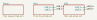
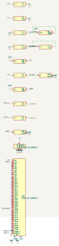
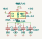
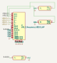

# ESP32-S3 Reference Design

The ESP32-S3-WROOM-1 typical application circuit, authored from the datasheet rather than scraped: USB-C in, AP2112K-3.3 LDO, the module with its decoupling, power-on-reset RC, RESET/BOOT buttons, strapping plan and indicator LEDs. Every value carries a citation.

Generated by `scripts/build_examples.py` from `examples/esp32_s3_reference/design.py` — do not edit by hand.

## Gates

| gate | result |
|---|---|
| layout lint | clean |
| ERC | 0 errors, 65 warnings |
| schematic renders | 4 SVG via kicad-cli 10.0.4 |
| netlist export | `netlist.xml` |
| composer warnings | 0 |
| components | 25 |

## Schematic

### root



### MCU



### Power



### USB



## Bill of materials

| ref | value | lib_id | footprint | sheet |
|---|---|---|---|---|
| U1 | AP2112K-3.3 | `Regulator_Linear:AP2112K-3.3` | `Package_TO_SOT_SMD:SOT-23-5` | Power |
| C1 | 10uF | `Device:C` | `Capacitor_SMD:C_0805_2012Metric` | Power |
| C2 | 10uF | `Device:C` | `Capacitor_SMD:C_0805_2012Metric` | Power |
| C3 | 100nF | `Device:C` | `Capacitor_SMD:C_0402_1005Metric` | Power |
| C4 | 100nF | `Device:C` | `Capacitor_SMD:C_0402_1005Metric` | Power |
| U2 | ESP32-S3-WROOM-1 | `RF_Module:ESP32-S3-WROOM-1` | `RF_Module:ESP32-S3-WROOM-1` | MCU |
| C5 | 100nF | `Device:C` | `Capacitor_SMD:C_0402_1005Metric` | MCU |
| C6 | 22uF | `Device:C` | `Capacitor_SMD:C_0805_2012Metric` | MCU |
| R1 | 10k | `Device:R` | `Resistor_SMD:R_0402_1005Metric` | MCU |
| C7 | 1uF | `Device:C` | `Capacitor_SMD:C_0402_1005Metric` | MCU |
| SW1 | SW_Push | `Switch:SW_Push` | `Button_Switch_SMD:SW_SPST_TL3342` | MCU |
| R2 | 0R | `Device:R` | `Resistor_SMD:R_0402_1005Metric` | MCU |
| C8 | 100nF | `Device:C` | `Capacitor_SMD:C_0402_1005Metric` | MCU |
| R3 | 10k | `Device:R` | `Resistor_SMD:R_0402_1005Metric` | MCU |
| SW2 | SW_Push | `Switch:SW_Push` | `Button_Switch_SMD:SW_SPST_TL3342` | MCU |
| R4 | 0R | `Device:R` | `Resistor_SMD:R_0402_1005Metric` | MCU |
| R5 | 0R | `Device:R` | `Resistor_SMD:R_0402_1005Metric` | MCU |
| R6 | 750R | `Device:R` | `Resistor_SMD:R_0402_1005Metric` | MCU |
| D1 | RED | `Device:LED` | `LED_SMD:LED_0603_1608Metric` | MCU |
| R7 | 270R | `Device:R` | `Resistor_SMD:R_0402_1005Metric` | MCU |
| D2 | GREEN | `Device:LED` | `LED_SMD:LED_0603_1608Metric` | MCU |
| J1 | USB_C_Receptacle_USB2.0_16P | `Connector:USB_C_Receptacle_USB2.0_16P` | `Connector_USB:USB_C_Receptacle_GCT_USB4105-xx-A_16P_TopMnt_Horizontal` | USB |
| R8 | 0R | `Device:R` | `Resistor_SMD:R_0603_1608Metric` | USB |
| R9 | 5.1k | `Device:R` | `Resistor_SMD:R_0402_1005Metric` | USB |
| R10 | 5.1k | `Device:R` | `Resistor_SMD:R_0402_1005Metric` | USB |

## Nets

| net | sheet | pins |
|---|---|---|
| `+3V3` | mcu | C5:1, C6:1, R1:1, R3:1, R6:1, U2:2 |
| `BOOT` | mcu | R3:2, SW2:1, U2:27 |
| `EN` | mcu | C7:1, C8:1, R1:2, R2:1, U2:3 |
| `EN_SW` | mcu | R2:2, SW1:1 |
| `ESP_D+` | mcu | R4:1, U2:14 |
| `ESP_D-` | mcu | R5:1, U2:13 |
| `GND` | mcu | C5:2, C6:2, C7:2, C8:2, D1:1, D2:1, SW1:2, SW2:2, U2:1, U2:40, U2:41 |
| `LED_PWR_A` | mcu | D1:2, R6:2 |
| `LED_USER` | mcu | R7:1, U2:31 |
| `LED_USER_A` | mcu | D2:2, R7:2 |
| `USB_D+` | mcu | R4:2 |
| `USB_D-` | mcu | R5:2 |
| `+3V3` | power | C2:1, C4:1, U1:5 |
| `GND` | power | C1:2, C2:2, C3:2, C4:2, U1:2 |
| `VBUS` | power | C1:1, C3:1, U1:1, U1:3 |
| `CHASSIS` | usb | J1:SH, R8:1 |
| `GND` | usb | J1:A1, J1:A12, J1:B1, J1:B12, R10:1, R8:2, R9:1 |
| `USB_CC1` | usb | J1:A5, R9:2 |
| `USB_CC2` | usb | J1:B5, R10:2 |
| `USB_D+` | usb | J1:A6, J1:B6 |
| `USB_D-` | usb | J1:A7, J1:B7 |
| `VBUS` | usb | J1:A4, J1:A9, J1:B4, J1:B9 |

## ERC

`esp32_s3_reference.kicad_sch` — **0 error(s)**, 65 warning(s), 65 violation(s) total.

| severity / type | count |
|---|---|
| `warning/lib_symbol_issues` | 2 |
| `warning/lib_symbol_mismatch` | 63 |

## Layout issues

None — every sheet came out of the layout engine clean.

## Composer warnings

None.

## Wiring notes

- Power: USB-C VBUS through an AP2112K-3.3 LDO to +3V3.
- Rails (+3V3, GND, VBUS) cross sheets as KiCad global power symbols, so they need no hierarchical labels.
- USB_D+/USB_D- cross from the mcu sheet to the usb sheet as hierarchical labels wired through the root sheet.
- References renumbered project-wide (8 of 25): a KiCad hierarchy is one designator namespace, and sheets authored standalone each start at C1.

## Circuit block provenance

- **power/ldo_regulator:AP2112K-3.3**
  - source: Diodes/BCD AP2112 datasheet, DS39724 Rev. 2 - 2 (June 2017), section: "Typical Applications Circuit (Note 4)", p. 2 — an unnumbered drawing; the document contains no numbered figures, url: https://www.diodes.com/assets/Datasheets/AP2112.pdf
- **power/bypass_capacitor:VBUS:100nF**
  - source: Espressif ESP32-S3 Hardware Design Guidelines — Schematic Checklist, section: Power Supply (Analog Power Supply / Digital Power Supply), url: https://docs.espressif.com/projects/esp-hardware-design-guidelines/en/latest/esp32s3/schematic-checklist.html
- **power/bypass_capacitor:+3V3:100nF**
  - source: Espressif ESP32-S3 Hardware Design Guidelines — Schematic Checklist, section: Power Supply (Analog Power Supply / Digital Power Supply), url: https://docs.espressif.com/projects/esp-hardware-design-guidelines/en/latest/esp32s3/schematic-checklist.html
- **power/esd_diode_omitted**
  - source: Espressif ESP32-S3 Hardware Design Guidelines — Schematic Checklist, section: Power Supply, url: https://docs.espressif.com/projects/esp-hardware-design-guidelines/en/latest/esp32s3/schematic-checklist.html
- **mcu/decoupling:U1:+3V3**
  - source: Espressif ESP32-S3 Hardware Design Guidelines — Schematic Checklist, section: Power Supply (Analog Power Supply / Digital Power Supply), url: https://docs.espressif.com/projects/esp-hardware-design-guidelines/en/latest/esp32s3/schematic-checklist.html
- **mcu/bypass_capacitor:+3V3:22uF**
  - source: Espressif ESP32-S3 Hardware Design Guidelines — Schematic Checklist, section: Power Supply (Analog Power Supply / Digital Power Supply), url: https://docs.espressif.com/projects/esp-hardware-design-guidelines/en/latest/esp32s3/schematic-checklist.html
- **mcu/en_reset_rc:EN**
  - source: Espressif ESP32-S3 Hardware Design Guidelines — Schematic Checklist, section: Chip Power-up and Reset Timing, url: https://docs.espressif.com/projects/esp-hardware-design-guidelines/en/latest/esp32s3/schematic-checklist.html
- **mcu/push_button:EN**
  - source: Espressif ESP32-S3-DevKitC-1 V1.1 reference schematic, section: SW1 (BOOT → IO0) and SW2 (RST → CHIP_PU), url: https://dl.espressif.com/dl/schematics/SCH_ESP32-S3-DevKitC-1_V1.1_20220413.pdf
- **mcu/pull_resistor:BOOT:+3V3**
  - source: Espressif ESP32-S3 Hardware Design Guidelines — Schematic Checklist, section: Strapping Pins, url: https://docs.espressif.com/projects/esp-hardware-design-guidelines/en/latest/esp32s3/schematic-checklist.html
- **mcu/push_button:BOOT**
  - source: Espressif ESP32-S3-DevKitC-1 V1.1 reference schematic, section: SW1 (BOOT → IO0) and SW2 (RST → CHIP_PU), url: https://dl.espressif.com/dl/schematics/SCH_ESP32-S3-DevKitC-1_V1.1_20220413.pdf
- **mcu/usb_series:USB_D+**
  - source: Espressif ESP32-S3-WROOM-1/1U Datasheet v1.8, section: Section 9, Figure 9-1 'Peripheral Schematics' (the typical application circuit), url: https://documentation.espressif.com/esp32-s3-wroom-1_wroom-1u_datasheet_en.pdf
- **mcu/usb_series:USB_D-**
  - source: Espressif ESP32-S3-WROOM-1/1U Datasheet v1.8, section: Section 9, Figure 9-1 'Peripheral Schematics' (the typical application circuit), url: https://documentation.espressif.com/esp32-s3-wroom-1_wroom-1u_datasheet_en.pdf
- **mcu/indicator_led:+3V3:red**
  - source: Ohm's law; IEC 60063 E24 preferred number series, section: series-resistor computation (see Block.notes for the arithmetic)
- **mcu/indicator_led:LED_USER:green**
  - source: Ohm's law; IEC 60063 E24 preferred number series, section: series-resistor computation (see Block.notes for the arithmetic)
- **usb/shield_bridge**
  - source: USB Type-C Cable and Connector Specification, Release 2.0 (August 2019), section: receptacle shell / shield handling, url: https://www.usb.org/sites/default/files/USB%20Type-C%20Spec%20R2.0%20-%20August%202019.pdf
- **usb/usb_data_pairs**
  - source: USB Type-C Cable and Connector Specification, Release 2.0 (August 2019), section: Sec. 4.11.1, Table 4-25 'Sink CC Termination (Rd) Requirements', p. 236, url: https://www.usb.org/sites/default/files/USB%20Type-C%20Spec%20R2.0%20-%20August%202019.pdf
- **usb/pull_resistor:USB_CC1:GND**
  - source: USB Type-C Cable and Connector Specification, Release 2.0 (August 2019), section: Sec. 4.11.1, Table 4-25 'Sink CC Termination (Rd) Requirements', p. 236, url: https://www.usb.org/sites/default/files/USB%20Type-C%20Spec%20R2.0%20-%20August%202019.pdf
- **usb/pull_resistor:USB_CC2:GND**
  - source: USB Type-C Cable and Connector Specification, Release 2.0 (August 2019), section: Sec. 4.11.1, Table 4-25 'Sink CC Termination (Rd) Requirements', p. 236, url: https://www.usb.org/sites/default/files/USB%20Type-C%20Spec%20R2.0%20-%20August%202019.pdf

## Open it in KiCad

```bash
python scripts/build_examples.py --examples-only   # writes build/examples/esp32_s3_reference/
kicad build/examples/esp32_s3_reference/esp32_s3_reference.kicad_pro
```
