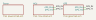
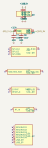
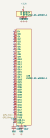
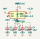

# GPS Tracker

ESP32-S3-WROOM-1 talking to a u-blox NEO-6M over UART, running off a battery through an LDO. The smallest design that exercises the whole spec -> typed model -> layout -> hierarchical schematic path.

Generated by `scripts/build_examples.py` from `examples/gps_tracker/design.py` — do not edit by hand.

## Gates

| gate | result |
|---|---|
| layout lint | clean |
| ERC | 0 errors, 51 warnings |
| schematic renders | 4 SVG via kicad-cli 10.0.4 |
| netlist export | `netlist.xml` |
| composer warnings | 1 |
| components | 11 |

## Schematic

### root



### GPS



### MCU



### Power



## Bill of materials

| ref | value | lib_id | footprint | sheet |
|---|---|---|---|---|
| U1 | AP2112K-3.3 | `Regulator_Linear:AP2112K-3.3` | `Package_TO_SOT_SMD:SOT-23-5` | Power |
| C1 | 10uF | `Device:C` | `Capacitor_SMD:C_0805_2012Metric` | Power |
| C2 | 10uF | `Device:C` | `Capacitor_SMD:C_0805_2012Metric` | Power |
| C3 | 100nF | `Device:C` | `Capacitor_SMD:C_0402_1005Metric` | Power |
| C4 | 10uF | `Device:C` | `Capacitor_SMD:C_0805_2012Metric` | Power |
| U2 | ESP32-S3-WROOM-1 | `RF_Module:ESP32-S3-WROOM-1` | `RF_Module:ESP32-S3-WROOM-1` | MCU |
| C5 | 100nF | `Device:C` | `Capacitor_SMD:C_0402_1005Metric` | MCU |
| C6 | 10uF | `Device:C` | `Capacitor_SMD:C_0805_2012Metric` | MCU |
| U3 | NEO-6M | `GPS_Module:NEO-6M` | `RF_GPS:ublox_NEO-6M` | GPS |
| C7 | 100nF | `Device:C` | `Capacitor_SMD:C_0402_1005Metric` | GPS |
| C8 | 10uF | `Device:C` | `Capacitor_SMD:C_0805_2012Metric` | GPS |

## Nets

| net | sheet | pins |
|---|---|---|
| `+3.3V` | gps | C7:1, C8:1, U3:11, U3:22 |
| `GND` | gps | C7:2, C8:2, U3:1, U3:12 |
| `GPS_RX` | gps | U3:21 |
| `GPS_TX` | gps | U3:20 |
| `+3.3V` | mcu | C5:1, C6:1, U2:2 |
| `GND` | mcu | C5:2, C6:2, U2:1, U2:40, U2:41 |
| `GPS_RX` | mcu | U2:37 |
| `GPS_TX` | mcu | U2:36 |
| `+3.3V` | power | C2:1, C3:1, C4:1, U1:5 |
| `GND` | power | C1:2, C2:2, C3:2, C4:2, U1:2 |
| `VBAT` | power | C1:1, U1:1, U1:3 |

## ERC

`gps_tracker.kicad_sch` — **0 error(s)**, 51 warning(s), 51 violation(s) total.

| severity / type | count |
|---|---|
| `warning/footprint_link_issues` | 7 |
| `warning/lib_symbol_issues` | 10 |
| `warning/lib_symbol_mismatch` | 34 |

## Layout issues

None — every sheet came out of the layout engine clean.

## Composer warnings

- No wiring pattern found for ESP32-S3 <-> NEO-6M (UART). Using default UART net names.

## Wiring notes

- Power: LDO regulator from battery to 3.3V
- MCU: ESP32-S3-WROOM-1 (ESP32-S3) with decoupling caps
- Peripheral 'GPS' (NEO-6M): wired using default UART net names (GPS_RX, GPS_TX)

## Circuit block provenance

This design does not use `src.ecad.circuits` blocks, so there is nothing to cite. Examples built from those blocks list every block's datasheet/app-note citation here.

## Open it in KiCad

```bash
python scripts/build_examples.py --examples-only   # writes build/examples/gps_tracker/
kicad build/examples/gps_tracker/gps_tracker.kicad_pro
```
